# Architecture

This document provides a visual overview of the integration's architecture, focusing on end-to-end data flow and caching layers.

For detailed implementation patterns, see [`AGENTS.md`](../../AGENTS.md).

---

## End-to-End Data Flow

```mermaid
flowchart TB
    %% External Systems
    TIBBER[("🌐 Tibber GraphQL API<br/>api.tibber.com")]
    HA[("🏠 Home Assistant<br/>Core")]

    %% Entry Point
    SETUP["__init__.py<br/>async_setup_entry()"]

    %% Core Components
    API["api.py<br/>TibberPricesApiClient<br/><br/>GraphQL queries"]
    COORD["coordinator.py<br/>TibberPricesDataUpdateCoordinator<br/><br/>Orchestrates updates every 15min"]

    %% Caching Layers
    CACHE_API["💾 API Cache<br/>coordinator/cache.py<br/><br/>HA Storage (persistent)<br/>User: 24h | Prices: until midnight"]
    CACHE_TRANS["💾 Transformation Cache<br/>coordinator/data_transformation.py<br/><br/>Memory (enriched prices)<br/>Until config change or midnight"]
    CACHE_PERIOD["💾 Period Cache<br/>coordinator/periods.py<br/><br/>Memory (calculated periods)<br/>Hash-based invalidation"]
    CACHE_CONFIG["💾 Config Cache<br/>coordinator/*<br/><br/>Memory (parsed options)<br/>Until config change"]
    CACHE_TRANS_TEXT["💾 Translation Cache<br/>const.py<br/><br/>Memory (UI strings)<br/>Until HA restart"]

    %% Processing Components
    TRANSFORM["coordinator/data_transformation.py<br/>DataTransformer<br/><br/>Enrich prices with statistics"]
    PERIODS["coordinator/periods.py<br/>PeriodCalculator<br/><br/>Calculate best/peak periods"]
    ENRICH["price_utils.py + average_utils.py<br/><br/>Calculate trailing/leading averages<br/>rating_level, differences"]

    %% Output Components
    SENSORS["sensor/<br/>TibberPricesSensor<br/><br/>120+ price/level/rating sensors"]
    BINARY["binary_sensor/<br/>TibberPricesBinarySensor<br/><br/>Period indicators"]
    SERVICES["services.py<br/><br/>Custom service endpoints<br/>(get_price, ApexCharts)"]

    %% Flow Connections
    TIBBER -->|"Query user data<br/>Query prices<br/>(yesterday/today/tomorrow)"| API

    API -->|"Raw GraphQL response"| COORD

    COORD -->|"Check cache first"| CACHE_API
    CACHE_API -.->|"Cache hit:<br/>Return cached"| COORD
    CACHE_API -.->|"Cache miss:<br/>Fetch from API"| API

    COORD -->|"Raw price data"| TRANSFORM
    TRANSFORM -->|"Check cache"| CACHE_TRANS
    CACHE_TRANS -.->|"Cache hit"| TRANSFORM
    CACHE_TRANS -.->|"Cache miss"| ENRICH
    ENRICH -->|"Enriched data"| TRANSFORM

    TRANSFORM -->|"Enriched price data"| COORD

    COORD -->|"Enriched data"| PERIODS
    PERIODS -->|"Check cache"| CACHE_PERIOD
    CACHE_PERIOD -.->|"Hash match:<br/>Return cached"| PERIODS
    CACHE_PERIOD -.->|"Hash mismatch:<br/>Recalculate"| PERIODS

    PERIODS -->|"Calculated periods"| COORD

    COORD -->|"Complete data<br/>(prices + periods)"| SENSORS
    COORD -->|"Complete data"| BINARY
    COORD -->|"Data access"| SERVICES

    SENSORS -->|"Entity states"| HA
    BINARY -->|"Entity states"| HA
    SERVICES -->|"Service responses"| HA

    %% Config access
    CACHE_CONFIG -.->|"Parsed options"| TRANSFORM
    CACHE_CONFIG -.->|"Parsed options"| PERIODS
    CACHE_TRANS_TEXT -.->|"UI strings"| SENSORS
    CACHE_TRANS_TEXT -.->|"UI strings"| BINARY

    SETUP -->|"Initialize"| COORD
    SETUP -->|"Register"| SENSORS
    SETUP -->|"Register"| BINARY
    SETUP -->|"Register"| SERVICES

    %% Styling
    classDef external fill:#e1f5ff,stroke:#0288d1,stroke-width:3px
    classDef cache fill:#fff3e0,stroke:#f57c00,stroke-width:2px
    classDef processing fill:#f3e5f5,stroke:#7b1fa2,stroke-width:2px
    classDef output fill:#e8f5e9,stroke:#388e3c,stroke-width:2px

    class TIBBER,HA external
    class CACHE_API,CACHE_TRANS,CACHE_PERIOD,CACHE_CONFIG,CACHE_TRANS_TEXT cache
    class TRANSFORM,PERIODS,ENRICH processing
    class SENSORS,BINARY,SERVICES output
```



### Flow Description

1. **Setup** (`__init__.py`)
   - Integration loads, creates coordinator instance
   - Registers entity platforms (sensor, binary_sensor)
   - Sets up custom services

2. **Data Fetch** (every 15 minutes)
   - Coordinator triggers update via `api.py`
   - API client checks **persistent cache** first (`coordinator/cache.py`)
   - If cache valid → return cached data
   - If cache stale → query Tibber GraphQL API
   - Store fresh data in persistent cache (survives HA restart)

3. **Price Enrichment**
   - Coordinator passes raw prices to `DataTransformer`
   - Transformer checks **transformation cache** (memory)
   - If cache valid → return enriched data
   - If cache invalid → enrich via `price_utils.py` + `average_utils.py`
     - Calculate 24h trailing/leading averages
     - Calculate price differences (% from average)
     - Assign rating levels (LOW/NORMAL/HIGH)
   - Store enriched data in transformation cache

4. **Period Calculation**
   - Coordinator passes enriched data to `PeriodCalculator`
   - Calculator computes **hash** from prices + config
   - If hash matches cache → return cached periods
   - If hash differs → recalculate best/peak price periods
   - Store periods with new hash

5. **Entity Updates**
   - Coordinator provides complete data (prices + periods)
   - Sensors read values via unified handlers
   - Binary sensors evaluate period states
   - Entities update on quarter-hour boundaries (00/15/30/45)

6. **Service Calls**
   - Custom services access coordinator data directly
   - Return formatted responses (JSON, ApexCharts format)

---

## Caching Architecture

### Overview

The integration uses **5 independent caching layers** for optimal performance:

| Layer | Location | Lifetime | Invalidation | Memory |
|-------|----------|----------|--------------|--------|
| **API Cache** | `coordinator/cache.py` | 24h (user)<br/>Until midnight (prices) | Automatic | 50KB |
| **Translation Cache** | `const.py` | Until HA restart | Never | 5KB |
| **Config Cache** | `coordinator/*` | Until config change | Explicit | 1KB |
| **Period Cache** | `coordinator/periods.py` | Until data/config change | Hash-based | 10KB |
| **Transformation Cache** | `coordinator/data_transformation.py` | Until midnight/config | Automatic | 60KB |

**Total cache overhead:** ~126KB per coordinator instance (main entry + subentries)

### Cache Coordination

```mermaid
flowchart LR
    USER[("User changes options")]
    MIDNIGHT[("Midnight turnover")]
    NEWDATA[("Tomorrow data arrives")]

    USER -->|"Explicit invalidation"| CONFIG["Config Cache<br/>❌ Clear"]
    USER -->|"Explicit invalidation"| PERIOD["Period Cache<br/>❌ Clear"]
    USER -->|"Explicit invalidation"| TRANS["Transformation Cache<br/>❌ Clear"]

    MIDNIGHT -->|"Date validation"| API["API Cache<br/>❌ Clear prices"]
    MIDNIGHT -->|"Date check"| TRANS

    NEWDATA -->|"Hash mismatch"| PERIOD

    CONFIG -.->|"Next access"| CONFIG_NEW["Reparse options"]
    PERIOD -.->|"Next access"| PERIOD_NEW["Recalculate"]
    TRANS -.->|"Next access"| TRANS_NEW["Re-enrich"]
    API -.->|"Next access"| API_NEW["Fetch from API"]

    classDef invalid fill:#ffebee,stroke:#c62828,stroke-width:2px
    classDef rebuild fill:#e8f5e9,stroke:#388e3c,stroke-width:2px

    class CONFIG,PERIOD,TRANS,API invalid
    class CONFIG_NEW,PERIOD_NEW,TRANS_NEW,API_NEW rebuild
```



**Key insight:** No cascading invalidations - each cache is independent and rebuilds on-demand.

For detailed cache behavior, see [Caching Strategy](./caching-strategy.md).

---

## Component Responsibilities

### Core Components

| Component | File | Responsibility |
|-----------|------|----------------|
| **API Client** | `api.py` | GraphQL queries to Tibber, retry logic, error handling |
| **Coordinator** | `coordinator.py` | Update orchestration, cache management, absolute-time scheduling with boundary tolerance |
| **Data Transformer** | `coordinator/data_transformation.py` | Price enrichment (averages, ratings, differences) |
| **Period Calculator** | `coordinator/periods.py` | Best/peak price period calculation with relaxation |
| **Sensors** | `sensor/` | 120+ entities for prices, levels, ratings, statistics |
| **Binary Sensors** | `binary_sensor/` | Period indicators (best/peak price active) |
| **Services** | `services.py` | Custom service endpoints (get_price, ApexCharts) |

### Helper Utilities

| Utility | File | Purpose |
|---------|------|---------|
| **Price Utils** | `price_utils.py` | Rating calculation, enrichment, level aggregation |
| **Average Utils** | `average_utils.py` | Trailing/leading 24h average calculations |
| **Sensor Helpers** | `sensor/helpers.py` | Interval detection with smart boundary tolerance (±2s) |
| **Entity Utils** | `entity_utils/` | Shared icon/color/attribute logic |
| **Translations** | `const.py` | Translation loading and caching |

---

## Key Patterns

### 1. Dual Translation System

- **Standard translations** (`/translations/*.json`): HA-compliant schema for entity names
- **Custom translations** (`/custom_translations/*.json`): Extended descriptions, usage tips
- Both loaded at integration setup, cached in memory
- Access via `get_translation()` helper function

### 2. Price Data Enrichment

All quarter-hourly price intervals get augmented:

```python
# Original from Tibber API
{
  "startsAt": "2025-11-03T14:00:00+01:00",
  "total": 0.2534,
  "level": "NORMAL"
}

# After enrichment (price_utils.py)
{
  "startsAt": "2025-11-03T14:00:00+01:00",
  "total": 0.2534,
  "level": "NORMAL",
  "trailing_avg_24h": 0.2312,    # ← Added: 24h trailing average
  "difference": 9.6,              # ← Added: % diff from trailing avg
  "rating_level": "NORMAL"        # ← Added: LOW/NORMAL/HIGH based on thresholds
}
```

### 3. Quarter-Hour Precision

- **API polling**: Every 15 minutes (coordinator fetch cycle)
- **Entity updates**: On 00/15/30/45-minute boundaries via `_schedule_quarter_hour_refresh()`
- **Timer scheduling**: Uses `async_track_utc_time_change(minute=[0, 15, 30, 45], second=0)`
  - HA may trigger ±few milliseconds before/after exact boundary
  - Smart boundary tolerance (±2 seconds) handles scheduling jitter
  - If HA schedules at 14:59:58 → rounds to 15:00:00 (shows new interval data)
  - If HA restarts at 14:59:30 → stays at 14:45:00 (shows current interval data)
- **Absolute time tracking**: Timer plans for **all future boundaries** (not relative delays)
  - Prevents double-updates (if triggered at 14:59:58, next trigger is 15:15:00, not 15:00:00)
- **Result**: Current price sensors update without waiting for next API poll

### 4. Unified Sensor Handlers

Sensors organized by **calculation method** (post-refactoring Nov 2025):

- **Interval-based**: `_get_interval_value(offset, type)` - current/next/previous
- **Rolling hour**: `_get_rolling_hour_value(offset, type)` - 5-interval windows
- **Daily stats**: `_get_daily_stat_value(day, stat_func)` - calendar day min/max/avg
- **24h windows**: `_get_24h_window_value(stat_func)` - trailing/leading statistics

Single implementation, minimal code duplication.

---

## Performance Characteristics

### API Call Reduction

- **Without caching:** 96 API calls/day (every 15 min)
- **With caching:** ~1-2 API calls/day (only when cache expires)
- **Reduction:** ~98%

### CPU Optimization

| Optimization | Location | Savings |
|--------------|----------|---------|
| Config caching | `coordinator/*` | ~50% on config checks |
| Period caching | `coordinator/periods.py` | ~70% on period recalculation |
| Lazy logging | Throughout | ~15% on log-heavy operations |
| Import optimization | Module structure | ~20% faster loading |

### Memory Usage

- **Per coordinator instance:** ~126KB cache overhead
- **Typical setup:** 1 main + 2 subentries = ~378KB total
- **Redundancy eliminated:** 14% reduction (10KB saved per coordinator)

---

## Related Documentation

- **[Timer Architecture](./timer-architecture.md)** - Timer system, scheduling, coordination (3 independent timers)
- **[Caching Strategy](./caching-strategy.md)** - Detailed cache behavior, invalidation, debugging
- **[Setup Guide](./setup.md)** - Development environment setup
- **[Testing Guide](./testing.md)** - How to test changes
- **[Release Management](./release-management.md)** - Release workflow and versioning
- **[AGENTS.md](../../AGENTS.md)** - Complete reference for AI development
