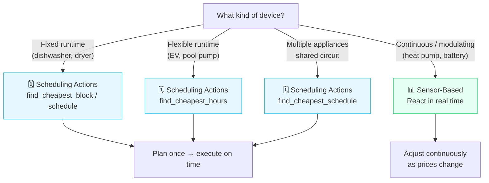
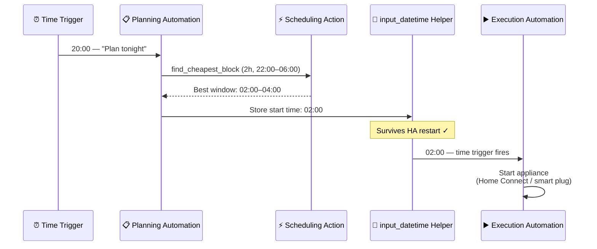
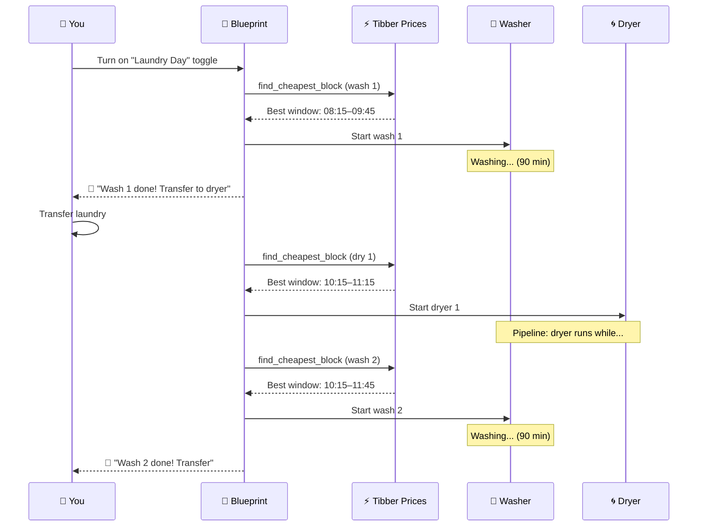

# Automation Examples

This guide shows you how to **practically use** all the features of the Tibber Prices integration — sensors, binary sensors, and scheduling actions — for real-world energy optimization.

:::tip Entity ID tip
`<home_name>` is a placeholder for your Tibber home display name in Home Assistant. Entity IDs are derived from the displayed name (localized), so the exact slug may differ. **Can't find a sensor?** Use the **[Entity Reference (All Languages)](sensor-reference.md)** to search by name in your language.
:::

:::caution Adapt before using
Replace all **Entity IDs** (e.g., `sensor.<home_name>_...`, `switch.dishwasher`) with IDs from your own setup. Adjust thresholds, temperatures, and device names to match your devices.
:::

---

## Two Approaches to Energy Optimization

The integration provides **two complementary ways** to save on electricity. Understanding when to use which is key:



### Scheduling Actions vs. Sensor-Based Automations

| | Scheduling Actions (`find_*`) | Sensor-Based (binary sensors + trends) |
|--|-------------------------------|---------------------------------------|
| **How it works** | Call action once → get exact start/end times | React when sensor state changes |
| **Best for** | Appliances with fixed runtime, precise planning | Continuous or modulating devices |
| **Typical devices** | Dishwasher, washing machine, dryer, EV | Heat pump, home battery, water heater |
| **Planning horizon** | Up to 48h ahead, with full cost estimate | Real-time, reacts as prices evolve |
| **Complexity** | Simple: one action call, clear result | Flexible: combine multiple sensors |
| **Multi-appliance** | Built-in overlap prevention | Manual coordination required |
| **HA restart** | Schedule survives via `input_datetime` pattern | Sensors auto-recover, no state lost |

:::tip Rule of thumb
**"I need to start my device at an exact time"** → Use a scheduling action.
**"I need my device to react as prices change throughout the day"** → Use sensors.
**"I want both"** → Combine them (see [Advanced Combinations](#combining-sensors-and-actions)).
:::

---

## Appliance Scheduling with Actions

Use scheduling actions when you know **how long** a device needs to run and want the integration to find the **cheapest window** for it.

### The Restart-Safe Pattern

All action-based automations in this guide use `input_datetime` helpers to store the planned start time. This ensures the schedule **survives HA restarts** — unlike `delay` which is lost when HA restarts.

**Setup:** Create an `input_datetime` helper per appliance in **Settings → Devices & Services → Helpers → Create Helper → Date and/or time** (choose "Date and time").



### Dishwasher: Find Cheapest 2-Hour Window Tonight

The classic use case. Every evening at 20:00, the automation plans when to start the dishwasher overnight.

:::info Blueprint available
These blueprints are **automatically installed** with the integration. Find them under **Settings → Automations → Blueprints**. You can also import them manually:

| Variant | Import |
|---------|--------|
| **Smart Plug** | [](https://my.home-assistant.io/redirect/blueprint_import/?blueprint_url=https%3A%2F%2Fgithub.com%2Fjpawlowski%2Fhass.tibber_prices%2Fblob%2Fmain%2Fcustom_components%2Ftibber_prices%2Fblueprints%2Fautomation%2Ftibber_prices%2Fdishwasher.yaml) |
| **Home Connect** | [](https://my.home-assistant.io/redirect/blueprint_import/?blueprint_url=https%3A%2F%2Fgithub.com%2Fjpawlowski%2Fhass.tibber_prices%2Fblob%2Fmain%2Fcustom_components%2Ftibber_prices%2Fblueprints%2Fautomation%2Ftibber_prices%2Fdishwasher_home_connect.yaml) |
| **Home Connect Alt** | [](https://my.home-assistant.io/redirect/blueprint_import/?blueprint_url=https%3A%2F%2Fgithub.com%2Fjpawlowski%2Fhass.tibber_prices%2Fblob%2Fmain%2Fcustom_components%2Ftibber_prices%2Fblueprints%2Fautomation%2Ftibber_prices%2Fdishwasher_home_connect_alt.yaml) |
:::

**Prerequisite:** Create an `input_datetime` helper named `input_datetime.dishwasher_start` (type: Date and time).

<details>
<summary>Show YAML: Dishwasher — Plan + Execute (2 automations)</summary>

```yaml
automation:
    # Automation 1: Plan the cheapest time (runs every evening)
    - alias: "Dishwasher - Plan Cheapest Start Time"
      trigger:
          - platform: time
            at: "20:00:00"
      action:
          - service: tibber_prices.find_cheapest_block
            data:
                duration: "02:00:00"
                search_start_time: "22:00:00"
                search_end_time: "06:00:00"
                search_end_day_offset: 1
            response_variable: result
          - if: "{{ result.window_found }}"
            then:
                - service: input_datetime.set_datetime
                  target:
                      entity_id: input_datetime.dishwasher_start
                  data:
                      datetime: "{{ result.window.start }}"
                - service: notify.mobile_app
                  data:
                      title: "🍽️ Dishwasher Planned"
                      message: >
                          Start at {{ result.window.start | as_datetime | as_local
                          | as_timestamp | timestamp_custom('%H:%M') }}.
                          Avg price: {{ result.window.price_mean | round(1) }}
                          {{ result.price_unit }}.

    # Automation 2: Execute at the planned time
    - alias: "Dishwasher - Start at Planned Time"
      trigger:
          - platform: time
            at: input_datetime.dishwasher_start
      action:
          - service: switch.turn_on
            target:
                entity_id: switch.dishwasher_smart_plug
```

</details>

**How it works:**

1. At 20:00, calls `find_cheapest_block` to find the cheapest contiguous 2h window between 22:00 and 06:00
2. Stores the start time in an `input_datetime` helper (survives HA restarts)
3. A second automation triggers at the stored time and starts the appliance

:::tip Home Connect appliances
For **Bosch/Siemens** appliances with Home Connect, use the dedicated **Home Connect blueprints** above instead — they handle `StartInRelative` / `FinishInRelative` automatically. You can also import a blueprint and use **"Take Control"** in the automation editor to customize it.
:::

### Washing Machine: Cheapest Window Overnight

Same pattern as the dishwasher — change the `duration` to match your program (ECO 40-60 ~1:30h, Cotton 60°C ~2:00h) and swap the entity IDs.

:::info Blueprint available
These blueprints are **automatically installed** with the integration. Find them under **Settings → Automations → Blueprints**. You can also import them manually:

| Variant | Import |
|---------|--------|
| **Smart Plug** | [](https://my.home-assistant.io/redirect/blueprint_import/?blueprint_url=https%3A%2F%2Fgithub.com%2Fjpawlowski%2Fhass.tibber_prices%2Fblob%2Fmain%2Fcustom_components%2Ftibber_prices%2Fblueprints%2Fautomation%2Ftibber_prices%2Fwashing_machine.yaml) |
| **Home Connect** | [](https://my.home-assistant.io/redirect/blueprint_import/?blueprint_url=https%3A%2F%2Fgithub.com%2Fjpawlowski%2Fhass.tibber_prices%2Fblob%2Fmain%2Fcustom_components%2Ftibber_prices%2Fblueprints%2Fautomation%2Ftibber_prices%2Fwashing_machine_home_connect.yaml) |
| **Home Connect Alt** | [](https://my.home-assistant.io/redirect/blueprint_import/?blueprint_url=https%3A%2F%2Fgithub.com%2Fjpawlowski%2Fhass.tibber_prices%2Fblob%2Fmain%2Fcustom_components%2Ftibber_prices%2Fblueprints%2Fautomation%2Ftibber_prices%2Fwashing_machine_home_connect_alt.yaml) |
:::

**Prerequisite:** Create an `input_datetime` helper named `input_datetime.washing_machine_start` (type: Date and time).

The YAML is identical to the [dishwasher example above](#dishwasher-find-cheapest-2-hour-window-tonight) — just adjust `duration`, helper name, and switch entity. Use the blueprints above for a one-click setup, including Home Connect support.

### Dryer: Cheapest Window Overnight

Same pattern again — dryer programs are typically shorter (45 min–1:15h depending on load and program).

:::info Blueprint available
These blueprints are **automatically installed** with the integration. Find them under **Settings → Automations → Blueprints**. You can also import them manually:

| Variant | Import |
|---------|--------|
| **Smart Plug** | [](https://my.home-assistant.io/redirect/blueprint_import/?blueprint_url=https%3A%2F%2Fgithub.com%2Fjpawlowski%2Fhass.tibber_prices%2Fblob%2Fmain%2Fcustom_components%2Ftibber_prices%2Fblueprints%2Fautomation%2Ftibber_prices%2Fdryer.yaml) |
| **Home Connect** | [](https://my.home-assistant.io/redirect/blueprint_import/?blueprint_url=https%3A%2F%2Fgithub.com%2Fjpawlowski%2Fhass.tibber_prices%2Fblob%2Fmain%2Fcustom_components%2Ftibber_prices%2Fblueprints%2Fautomation%2Ftibber_prices%2Fdryer_home_connect.yaml) |
| **Home Connect Alt** | [](https://my.home-assistant.io/redirect/blueprint_import/?blueprint_url=https%3A%2F%2Fgithub.com%2Fjpawlowski%2Fhass.tibber_prices%2Fblob%2Fmain%2Fcustom_components%2Ftibber_prices%2Fblueprints%2Fautomation%2Ftibber_prices%2Fdryer_home_connect_alt.yaml) |
:::

**Prerequisite:** Create an `input_datetime` helper named `input_datetime.dryer_start` (type: Date and time).

The YAML is identical to the [dishwasher example above](#dishwasher-find-cheapest-2-hour-window-tonight) — just change `duration` to `"01:00:00"`, helper name, and switch entity.

### Two Independent Appliances: No Overlap, Each at Its Cheapest

When running multiple **independent** appliances overnight (e.g., dishwasher + dryer that don't depend on each other), `find_cheapest_schedule` ensures they don't overlap and each gets its own cheapest slot.

**Prerequisite:** Create `input_datetime.dishwasher_start` and `input_datetime.dryer_start` helpers.

<details>
<summary>Show YAML: Multi-Appliance Overnight Schedule</summary>

```yaml
automation:
    - alias: "Kitchen + Laundry - Plan Overnight Schedule"
      description: "Schedule dishwasher + dryer overnight without overlap"
      trigger:
          - platform: time
            at: "21:00:00"
      action:
          - service: tibber_prices.find_cheapest_schedule
            data:
                tasks:
                    - name: dishwasher
                      duration: "02:00:00"
                    - name: dryer
                      duration: "01:00:00"
                gap_minutes: 15
                search_start_time: "22:00:00"
                search_end_time: "07:00:00"
                search_end_day_offset: 1
            response_variable: schedule
          - if: "{{ schedule.all_tasks_scheduled }}"
            then:
                - service: input_datetime.set_datetime
                  target:
                      entity_id: input_datetime.dishwasher_start
                  data:
                      datetime: >
                          {{ schedule.tasks | selectattr('name', 'eq', 'dishwasher')
                          | map(attribute='start') | first }}
                - service: input_datetime.set_datetime
                  target:
                      entity_id: input_datetime.dryer_start
                  data:
                      datetime: >
                          {{ schedule.tasks | selectattr('name', 'eq', 'dryer')
                          | map(attribute='start') | first }}
                - service: notify.mobile_app
                  data:
                      title: "🧺 Appliances Planned"
                      message: >
                          Dishwasher: {{ (schedule.tasks | selectattr('name', 'eq', 'dishwasher')
                          | map(attribute='start') | first) | as_datetime | as_local
                          | as_timestamp | timestamp_custom('%H:%M') }}
                          Dryer: {{ (schedule.tasks | selectattr('name', 'eq', 'dryer')
                          | map(attribute='start') | first) | as_datetime | as_local
                          | as_timestamp | timestamp_custom('%H:%M') }}
                          Total cost: ~{{ schedule.total_estimated_cost | round(1) }}
                          {{ schedule.currency }}

    # Execution automations (one per appliance)
    - alias: "Dishwasher - Start at Planned Time"
      trigger:
          - platform: time
            at: input_datetime.dishwasher_start
      action:
          # For Home Connect, use the dedicated blueprints instead
          - service: switch.turn_on
            target:
                entity_id: switch.dishwasher_smart_plug

    - alias: "Dryer - Start at Planned Time"
      trigger:
          - platform: time
            at: input_datetime.dryer_start
      action:
          - service: switch.turn_on
            target:
                entity_id: switch.dryer_smart_plug
```

</details>

**Why `find_cheapest_schedule` instead of separate `find_cheapest_block` calls?**
If you call `find_cheapest_block` separately for each appliance, they might both pick the **same** cheap window. `find_cheapest_schedule` reserves each slot exclusively — the dryer gets the next-cheapest window after the dishwasher claims its slot, with a 15-minute gap between them.

:::tip `sequential: true` for ordered workflows
By default, `find_cheapest_schedule` optimizes purely for price — the dryer might be scheduled **before** the dishwasher. This is fine for independent appliances. For sequential workflows (e.g., washing machine → dryer), add `sequential: true` — see the next example.
:::

### Washing Machine → Dryer: Sequential Scheduling

When the dryer **must** run after the washing machine, use `sequential: true` to guarantee declaration-order scheduling. The scheduler places each task after the previous one finishes (plus gap).

**Prerequisite:** Create `input_datetime.washing_machine_start` and `input_datetime.dryer_start` helpers.

<details>
<summary>Show YAML: Sequential Washer → Dryer</summary>

```yaml
automation:
    - alias: "Laundry - Plan Sequential Wash + Dry"
      description: "Washing machine first, then dryer — guaranteed order"
      trigger:
          - platform: time
            at: "21:00:00"
      action:
          - service: tibber_prices.find_cheapest_schedule
            data:
                sequential: true
                gap_minutes: 15
                search_start_time: "22:00:00"
                search_end_time: "08:00:00"
                search_end_day_offset: 1
                tasks:
                    # Order matters! Washer runs first, dryer after.
                    - name: washing_machine
                      duration: "01:30:00"
                    - name: dryer
                      duration: "01:00:00"
            response_variable: schedule

          - if: "{{ schedule.all_tasks_scheduled }}"
            then:
                - service: input_datetime.set_datetime
                  target:
                      entity_id: input_datetime.washing_machine_start
                  data:
                      datetime: "{{ schedule.tasks[0].start }}"
                - service: input_datetime.set_datetime
                  target:
                      entity_id: input_datetime.dryer_start
                  data:
                      datetime: "{{ schedule.tasks[1].start }}"
                - service: notify.mobile_app
                  data:
                      title: "🧺 Laundry Planned"
                      message: >
                          Washing: {{ schedule.tasks[0].start | as_datetime
                          | as_local | as_timestamp
                          | timestamp_custom('%H:%M') }}–{{ schedule.tasks[0].end
                          | as_datetime | as_local | as_timestamp
                          | timestamp_custom('%H:%M') }}
                          ({{ schedule.tasks[0].price_mean | round(1) }}
                          {{ schedule.price_unit }})
                          Dryer: {{ schedule.tasks[1].start | as_datetime
                          | as_local | as_timestamp
                          | timestamp_custom('%H:%M') }}–{{ schedule.tasks[1].end
                          | as_datetime | as_local | as_timestamp
                          | timestamp_custom('%H:%M') }}
                          ({{ schedule.tasks[1].price_mean | round(1) }}
                          {{ schedule.price_unit }})
                          Total: {{ schedule.total_estimated_cost | round(2) }}
                          {{ schedule.price_unit }}

    # Execution automations
    - alias: "Washing Machine - Start at Planned Time"
      trigger:
          - platform: time
            at: input_datetime.washing_machine_start
      action:
          # For Home Connect, use the dedicated blueprints instead
          - service: switch.turn_on
            target:
                entity_id: switch.washing_machine_smart_plug

    - alias: "Dryer - Start at Planned Time"
      trigger:
          - platform: time
            at: input_datetime.dryer_start
      action:
          # For Home Connect, use the dedicated blueprints instead
          - service: switch.turn_on
            target:
                entity_id: switch.dryer_smart_plug
```

</details>

**How it works:**

1. With `sequential: true`, the scheduler places the washing machine first at its cheapest window
2. The dryer's search window starts **after the washer ends + 15 min gap** — guaranteed order
3. The 15-minute gap gives you time to transfer laundry (adjust or remove as needed)

### Laundry Day Pipeline: Multiple Loads with Price Optimization

When you have a full laundry day (2–3 loads that each need washing and drying), managing the timing manually is tedious. The **Laundry Day Pipeline** blueprint automates the entire process:



**What the blueprint handles:**

- **Price optimization**: Each cycle is scheduled at the cheapest available window
- **Pipeline mode** (optional): Next wash starts while the dryer runs, cutting total time significantly
- **Transfer reminders**: Notifications when each wash finishes
- **Automatic completion**: Toggle turns off when all loads are done
- **Cancellation**: Turn off the toggle at any time to stop the pipeline

**What you need:**

| Helper | Type | Settings |
|--------|------|----------|
| `input_boolean.laundry_day` | Toggle | Starts/stops laundry day |
| `input_number.laundry_loads` | Number | Min: 1, Max: 5, Step: 1 |

**Choose your variant and import:**

The blueprint comes in three variants depending on how you control your appliances. Pick the one that matches your setup:

| Variant | Control Method | Import |
|---------|---------------|--------|
| **Smart Plug** | Smart plug switches (any brand) | [](https://my.home-assistant.io/redirect/blueprint_import/?blueprint_url=https%3A%2F%2Fgithub.com%2Fjpawlowski%2Fhass.tibber_prices%2Fblob%2Fmain%2Fcustom_components%2Ftibber_prices%2Fblueprints%2Fautomation%2Ftibber_prices%2Flaundry_day_pipeline.yaml) |
| **Home Connect** | HA Core Home Connect integration | [](https://my.home-assistant.io/redirect/blueprint_import/?blueprint_url=https%3A%2F%2Fgithub.com%2Fjpawlowski%2Fhass.tibber_prices%2Fblob%2Fmain%2Fcustom_components%2Ftibber_prices%2Fblueprints%2Fautomation%2Ftibber_prices%2Flaundry_day_pipeline_home_connect.yaml) |
| **Home Connect Alt** | [HC Alt HACS integration](https://github.com/ekutner/home-connect-hass) | [](https://my.home-assistant.io/redirect/blueprint_import/?blueprint_url=https%3A%2F%2Fgithub.com%2Fjpawlowski%2Fhass.tibber_prices%2Fblob%2Fmain%2Fcustom_components%2Ftibber_prices%2Fblueprints%2Fautomation%2Ftibber_prices%2Flaundry_day_pipeline_home_connect_alt.yaml) |

**After importing:**

1. Create the two helpers (`input_boolean` + `input_number`)
2. Create an automation from the blueprint
3. Configure your appliances, program durations, and deadline
4. On laundry day: set the load count, turn on the toggle, and let the blueprint handle the rest

:::info Pipeline mode vs. sequential
**Without pipeline** (default): Each wash + dry cycle completes fully before the next one starts. Safe for all setups.

**With pipeline**: The next wash starts immediately after the dryer begins. This overlaps washer and dryer operation, saving roughly one dryer cycle per load. Only enable this when your **wash duration ≥ dryer duration** — otherwise the dryer from the previous load might still be running when the next dryer needs to start.

**Example with 3 loads** (wash 90 min, dry 60 min, 15 min transfer):
- Sequential: ~8h 45min
- Pipeline: ~6h 15min — saves 2.5 hours!
:::

:::caution About program durations
The blueprint uses **estimated durations** (not real-time appliance feedback). Set your durations based on typical program times and add a small buffer (~5 min). If your actual program finishes earlier or later, the timing will drift slightly — this is acceptable for price optimization purposes.
:::

### EV Charging: Cheapest 4 Hours Overnight

For EV charging, you usually don't need one contiguous block — the charger can pause and resume. `find_cheapest_hours` picks the cheapest individual intervals.

:::info Blueprint available
This blueprint is **automatically installed** with the integration. You can also import it manually: [](https://my.home-assistant.io/redirect/blueprint_import/?blueprint_url=https%3A%2F%2Fgithub.com%2Fjpawlowski%2Fhass.tibber_prices%2Fblob%2Fmain%2Fcustom_components%2Ftibber_prices%2Fblueprints%2Fautomation%2Ftibber_prices%2Fev_charging.yaml)
:::

**Prerequisite:** Create `input_datetime.ev_charge_start` helper. For multi-segment charging, see the note below.

<details>
<summary>Show YAML: EV Charging — Cheapest 4 Hours</summary>

```yaml
automation:
    - alias: "EV - Plan Cheapest Charging Overnight"
      trigger:
          - platform: time
            at: "18:00:00"
      condition:
          - condition: numeric_state
            entity_id: sensor.ev_battery_level
            below: 80
      action:
          - service: tibber_prices.find_cheapest_hours
            data:
                duration: "04:00:00"
                min_segment_duration: "00:30:00"
                search_start_time: "18:00:00"
                search_end_time: "07:00:00"
                search_end_day_offset: 1
            response_variable: result
          - if: "{{ result.intervals_found }}"
            then:
                # Store start of first segment as charging start
                - service: input_datetime.set_datetime
                  target:
                      entity_id: input_datetime.ev_charge_start
                  data:
                      datetime: "{{ result.schedule.segments[0].start }}"
                - service: notify.mobile_app
                  data:
                      title: "🔌 EV Charging Planned"
                      message: >
                          {{ result.schedule.segment_count }} charging sessions:
                          
                          • {{ seg.start | as_datetime | as_local | as_timestamp
                          | timestamp_custom('%H:%M') }}–{{ seg.end | as_datetime | as_local
                          | as_timestamp | timestamp_custom('%H:%M') }}
                          ({{ seg.price_mean | round(1) }} {{ result.price_unit }})
                          
                          Savings vs. peak: {{ result.price_comparison.price_difference
                          | round(1) }} {{ result.price_unit }}
```

</details>

:::tip Simple alternative for EV charging
If your EV charger can't pause/resume or you prefer simplicity, use `find_cheapest_block` instead — it finds one contiguous window, just like the dishwasher example above.
:::

### Peak Price Warning: Know When NOT to Run Appliances

Get a morning warning about the most expensive period today:

<details>
<summary>Show YAML: Peak Price Warning</summary>

```yaml
automation:
    - alias: "Peak Price - Morning Warning"
      trigger:
          - platform: time
            at: "07:00:00"
      action:
          - service: tibber_prices.find_most_expensive_block
            data:
                duration: "02:00:00"
                search_scope: today
            response_variable: peak
          - if: "{{ peak.window_found }}"
            then:
                - service: notify.mobile_app
                  data:
                      title: "⚡ Expensive Period Today"
                      message: >
                          Avoid heavy loads between
                          {{ peak.window.start | as_datetime | as_local
                          | as_timestamp | timestamp_custom('%H:%M') }}
                          and {{ peak.window.end | as_datetime | as_local
                          | as_timestamp | timestamp_custom('%H:%M') }}.
                          Average price: {{ peak.window.price_mean | round(1) }}
                          {{ peak.price_unit }}
```

</details>

---

## Real-Time Optimization with Sensors

Use sensors for devices that run **continuously** and can **modulate** their power draw — like heat pumps that adjust target temperature, or home batteries that switch between charging and discharging.

### Heat Pump: Temperature Based on Price Level

The simplest real-time approach: adjust the heat pump target temperature based on the current price rating.

:::info Blueprint available
This blueprint is **automatically installed** with the integration. You can also import it manually: [](https://my.home-assistant.io/redirect/blueprint_import/?blueprint_url=https%3A%2F%2Fgithub.com%2Fjpawlowski%2Fhass.tibber_prices%2Fblob%2Fmain%2Fcustom_components%2Ftibber_prices%2Fblueprints%2Fautomation%2Ftibber_prices%2Fheat_pump_price_level.yaml)
:::

<details>
<summary>Show YAML: Heat Pump — Price-Based Temperature</summary>

```yaml
automation:
    - alias: "Heat Pump - Adjust Temperature by Price"
      description: "Higher target when cheap, lower when expensive"
      mode: restart
      trigger:
          # Triggers every 15 minutes when price updates
          - platform: state
            entity_id: sensor.<home_name>_current_electricity_price
      action:
          - variables:
              level: >
                  {{ state_attr('sensor.<home_name>_current_electricity_price',
                  'rating_level') }}
          - choose:
                - conditions: "{{ level in ['VERY_CHEAP'] }}"
                  sequence:
                      - service: climate.set_temperature
                        target:
                            entity_id: climate.heat_pump
                        data:
                            temperature: 23
                - conditions: "{{ level in ['CHEAP'] }}"
                  sequence:
                      - service: climate.set_temperature
                        target:
                            entity_id: climate.heat_pump
                        data:
                            temperature: 22
                - conditions: "{{ level in ['EXPENSIVE', 'VERY_EXPENSIVE'] }}"
                  sequence:
                      - service: climate.set_temperature
                        target:
                            entity_id: climate.heat_pump
                        data:
                            temperature: 19
            default:
                - service: climate.set_temperature
                  target:
                      entity_id: climate.heat_pump
                  data:
                      temperature: 20.5
```

</details>

### Heat Pump: Smart Boost with Trend Awareness

A more sophisticated approach: combine the best price period with trend sensors to **boost during the full cheap window**, not just the detected period.

:::info Blueprint available
This blueprint is **automatically installed** with the integration. You can also import it manually: [](https://my.home-assistant.io/redirect/blueprint_import/?blueprint_url=https%3A%2F%2Fgithub.com%2Fjpawlowski%2Fhass.tibber_prices%2Fblob%2Fmain%2Fcustom_components%2Ftibber_prices%2Fblueprints%2Fautomation%2Ftibber_prices%2Fheat_pump_smart_boost.yaml)
:::

**Why?** On [V-shaped price days](concepts.md#v-shaped-and-u-shaped-price-days), the Best Price Period may cover only 1–2 hours, but prices remain favorable for 4–6 hours. By checking the price level and trend, you can extend the boost.


<details>
<summary>Show YAML: Heat Pump — Extended Cheap Window Boost</summary>

```yaml
automation:
    - alias: "Heat Pump - Boost During Full Cheap Window"
      description: "Run heat pump boost during cheap period, even beyond the detected best price period"
      mode: restart
      trigger:
          # Start: Best price period begins
          - platform: state
            entity_id: binary_sensor.<home_name>_best_price_period
            to: "on"
          # Re-evaluate: Every 15 minutes when price updates
          - platform: state
            entity_id: sensor.<home_name>_current_electricity_price
      condition:
          # Continue while EITHER is true:
          - condition: or
            conditions:
                # Path 1: Inside a best price period
                - condition: state
                  entity_id: binary_sensor.<home_name>_best_price_period
                  state: "on"
                # Path 2: Price is still cheap AND trend is stable or falling
                - condition: and
                  conditions:
                      - condition: template
                        value_template: >
                            {{ state_attr('sensor.<home_name>_current_electricity_price',
                            'rating_level') in ['VERY_CHEAP', 'CHEAP'] }}
                      - condition: template
                        value_template: >
                            {{ state_attr('sensor.<home_name>_price_outlook_1h',
                            'trend_value') | int(0) <= 0 }}
      action:
          - service: climate.set_temperature
            target:
                entity_id: climate.heat_pump
            data:
                temperature: 22

    - alias: "Heat Pump - Return to Normal"
      description: "Reset heat pump when cheap window ends"
      trigger:
          - platform: state
            entity_id: sensor.<home_name>_current_electricity_price
      condition:
          # Only reset when NOT in cheap conditions
          - condition: template
            value_template: >
                {{ not is_state('binary_sensor.<home_name>_best_price_period', 'on')
                and state_attr('sensor.<home_name>_current_electricity_price',
                'rating_level') not in ['VERY_CHEAP', 'CHEAP'] }}
      action:
          - service: climate.set_temperature
            target:
                entity_id: climate.heat_pump
            data:
                temperature: 20.5
```

</details>

:::tip Why "rising" means "act now"
A common misconception: **"rising" does NOT mean "too late"**. The Price Outlook sensors compare your current price to the future average. `rising` means your current price is **lower** than the future average — so now is actually a good time to consume. See [Trend Sensors](sensors-trends.md#how-to-use-trend-sensors-for-decisions) for details.
:::

### Home Battery: Charge Cheap, Discharge Expensive

Use the best price period for charging and the peak price period for discharging:

:::info Blueprint available
This blueprint is **automatically installed** with the integration. You can also import it manually: [](https://my.home-assistant.io/redirect/blueprint_import/?blueprint_url=https%3A%2F%2Fgithub.com%2Fjpawlowski%2Fhass.tibber_prices%2Fblob%2Fmain%2Fcustom_components%2Ftibber_prices%2Fblueprints%2Fautomation%2Ftibber_prices%2Fhome_battery.yaml)
:::

<details>
<summary>Show YAML: Home Battery — Charge/Discharge Cycle</summary>

```yaml
automation:
    - alias: "Battery - Charge During Best Price"
      trigger:
          - platform: state
            entity_id: binary_sensor.<home_name>_best_price_period
            to: "on"
      condition:
          # Only if volatility makes it worthwhile
          - condition: template
            value_template: >
                {{ state_attr('binary_sensor.<home_name>_best_price_period',
                'volatility') != 'low' }}
          - condition: numeric_state
            entity_id: sensor.home_battery_soc
            below: 90
      action:
          - service: switch.turn_on
            target:
                entity_id: switch.battery_grid_charging

    - alias: "Battery - Discharge During Peak Price"
      trigger:
          - platform: state
            entity_id: binary_sensor.<home_name>_peak_price_period
            to: "on"
      condition:
          - condition: numeric_state
            entity_id: sensor.home_battery_soc
            above: 20
      action:
          - service: switch.turn_on
            target:
                entity_id: switch.battery_grid_discharge

    - alias: "Battery - Stop Charge/Discharge Outside Periods"
      trigger:
          - platform: state
            entity_id: binary_sensor.<home_name>_best_price_period
            to: "off"
          - platform: state
            entity_id: binary_sensor.<home_name>_peak_price_period
            to: "off"
      action:
          - service: switch.turn_off
            target:
                entity_id:
                    - switch.battery_grid_charging
                    - switch.battery_grid_discharge
```

</details>

### Water Heater: Pre-Heat Before the Cheapest Window Ends

Heat your water tank during the cheap window so it's ready when prices rise:

:::info Blueprint available
This blueprint is **automatically installed** with the integration. You can also import it manually: [](https://my.home-assistant.io/redirect/blueprint_import/?blueprint_url=https%3A%2F%2Fgithub.com%2Fjpawlowski%2Fhass.tibber_prices%2Fblob%2Fmain%2Fcustom_components%2Ftibber_prices%2Fblueprints%2Fautomation%2Ftibber_prices%2Fwater_heater.yaml)
:::

<details>
<summary>Show YAML: Water Heater — Pre-Heat During Cheap Prices</summary>

```yaml
automation:
    - alias: "Water Heater - Boost During Best Price"
      trigger:
          - platform: state
            entity_id: binary_sensor.<home_name>_best_price_period
            to: "on"
      action:
          - service: water_heater.set_temperature
            target:
                entity_id: water_heater.boiler
            data:
                temperature: 60

    - alias: "Water Heater - Return to Eco After Period"
      trigger:
          - platform: state
            entity_id: binary_sensor.<home_name>_best_price_period
            to: "off"
      action:
          - service: water_heater.set_temperature
            target:
                entity_id: water_heater.boiler
            data:
                temperature: 45
```

</details>

---

## Combining Sensors and Actions

The most powerful automations combine **planning with actions** and **real-time awareness with sensors**. Here are patterns for when you need both.

### Volatility-Aware Appliance Scheduling

Only schedule an appliance at a specific cheap time if price variations are meaningful. On days with flat prices, just run whenever convenient.

<details>
<summary>Show YAML: Volatility-Aware Dishwasher Scheduling</summary>

```yaml
automation:
    - alias: "Dishwasher - Smart Scheduling with Volatility Check"
      trigger:
          - platform: time
            at: "20:00:00"
      condition:
          - condition: state
            entity_id: switch.dishwasher_smart_plug
            state: "off"
      action:
          - variables:
              volatility: >
                  {{ state_attr('sensor.<home_name>_today_s_price_volatility',
                  'price_volatility') }}
          - choose:
                # Meaningful price variation → find the cheapest window
                - conditions: "{{ volatility != 'low' }}"
                  sequence:
                      - service: tibber_prices.find_cheapest_block
                        data:
                            duration: "02:00:00"
                            search_start_time: "22:00:00"
                            search_end_time: "06:00:00"
                            search_end_day_offset: 1
                        response_variable: result
                      - if: "{{ result.window_found }}"
                        then:
                            - service: input_datetime.set_datetime
                              target:
                                  entity_id: input_datetime.dishwasher_start
                              data:
                                  datetime: "{{ result.window.start }}"
                            - service: notify.mobile_app
                              data:
                                  message: >
                                      Dishwasher planned for
                                      {{ result.window.start | as_datetime | as_local
                                      | as_timestamp | timestamp_custom('%H:%M') }}
                                      (saving ~{{ result.price_comparison.price_difference
                                      | round(1) }} {{ result.price_unit }} vs. worst time).
            # Low volatility → prices are flat, just start at 22:00
            default:
                - service: input_datetime.set_datetime
                  target:
                      entity_id: input_datetime.dishwasher_start
                  data:
                      datetime: "{{ today_at('22:00') }}"
                - service: notify.mobile_app
                  data:
                      message: >
                          Prices are flat today — dishwasher starting at 22:00
                          (scheduling wouldn't save much).
```

</details>

### EV Charging: Action-Planned with Sensor Fallback

Plan overnight charging with `find_cheapest_hours`. If the plan fails or the EV arrives home late, fall back to sensor-based charging during any best price period.

<details>
<summary>Show YAML: EV Charging — Planned + Fallback</summary>

```yaml
automation:
    # Primary: Plan optimal charging when arriving home
    - alias: "EV - Plan Charging on Arrival"
      trigger:
          - platform: state
            entity_id: device_tracker.ev
            to: "home"
      condition:
          - condition: numeric_state
            entity_id: sensor.ev_battery_level
            below: 80
      action:
          - service: tibber_prices.find_cheapest_hours
            data:
                duration: "04:00:00"
                min_segment_duration: "00:30:00"
                search_start_offset_minutes: 0
                search_end_time: "07:00:00"
                search_end_day_offset: 1
            response_variable: plan
          - if: "{{ plan.intervals_found }}"
            then:
                # Store first segment start for the charger control automation
                - service: input_datetime.set_datetime
                  target:
                      entity_id: input_datetime.ev_charge_start
                  data:
                      datetime: "{{ plan.schedule.segments[0].start }}"
                - service: input_boolean.turn_on
                  target:
                      entity_id: input_boolean.ev_charging_planned

    # Fallback: Charge during any best price period if no plan exists
    - alias: "EV - Fallback Charging During Best Price"
      trigger:
          - platform: state
            entity_id: binary_sensor.<home_name>_best_price_period
            to: "on"
      condition:
          - condition: state
            entity_id: input_boolean.ev_charging_planned
            state: "off"
          - condition: numeric_state
            entity_id: sensor.ev_battery_level
            below: 80
          - condition: state
            entity_id: device_tracker.ev
            state: "home"
      action:
          - service: switch.turn_on
            target:
                entity_id: switch.ev_charger

    - alias: "EV - Stop Fallback Charging"
      trigger:
          - platform: state
            entity_id: binary_sensor.<home_name>_best_price_period
            to: "off"
      condition:
          - condition: state
            entity_id: input_boolean.ev_charging_planned
            state: "off"
      action:
          - service: switch.turn_off
            target:
                entity_id: switch.ev_charger
```

</details>

### Multi-Window Trend Strategy for Continuous Devices

Combine short-term and long-term outlook sensors for nuanced decisions. Useful for heat pumps and other devices where you want to decide: **boost now, wait for cheaper prices, or reduce consumption?**

| Short-term (1h) | Long-term (6h) | Interpretation | Action |
|---|---|---|---|
| `rising` | `rising` | Prices only go up from here | **Boost now** — this is the cheapest it gets |
| `falling` | `rising` | Brief dip coming, then up | **Wait** — a dip is imminent |
| any | `falling` | Cheaper hours ahead | **Reduce** — save energy for later |
| `stable` | `stable` | Flat prices, no urgency | **Normal** — no benefit to shifting |

<details>
<summary>Show YAML: Multi-Window Trend Strategy</summary>

```yaml
automation:
    - alias: "Heat Pump - Multi-Window Trend Boost"
      description: >
          Rising = current price is LOWER than future average = act now.
          Falling = current price is HIGHER than future average = wait.
      mode: restart
      trigger:
          - platform: state
            entity_id: sensor.<home_name>_price_outlook_1h
          - platform: state
            entity_id: sensor.<home_name>_price_outlook_6h
      condition:
          # Skip if best price period is active (separate automation handles that)
          - condition: state
            entity_id: binary_sensor.<home_name>_best_price_period
            state: "off"
      action:
          - variables:
              t1: "{{ state_attr('sensor.<home_name>_price_outlook_1h', 'trend_value') | int(0) }}"
              t6: "{{ state_attr('sensor.<home_name>_price_outlook_6h', 'trend_value') | int(0) }}"
          - choose:
                # Both rising → prices only go up, boost NOW
                - conditions: "{{ t1 >= 1 and t6 >= 1 }}"
                  sequence:
                      - service: climate.set_temperature
                        target:
                            entity_id: climate.heat_pump
                        data:
                            temperature: 22
                # Short-term falling + long-term rising → brief dip, wait
                - conditions: "{{ t1 <= -1 and t6 >= 1 }}"
                  sequence:
                      - service: climate.set_temperature
                        target:
                            entity_id: climate.heat_pump
                        data:
                            temperature: 20
                # Long-term falling → cheaper hours ahead, reduce
                - conditions: "{{ t6 <= -1 }}"
                  sequence:
                      - service: climate.set_temperature
                        target:
                            entity_id: climate.heat_pump
                        data:
                            temperature: 19
            # Stable on both → maintain normal
            default:
                - service: climate.set_temperature
                  target:
                      entity_id: climate.heat_pump
                  data:
                      temperature: 20.5
```

</details>

---

## Volatility-Aware Automations

On days with **flat prices**, the "cheapest" and "most expensive" hours may differ by fractions of a cent. These patterns help you **avoid unnecessary actions** when price variations don't matter.

### Best Practice: Check Volatility Before Acting

<details>
<summary>Show YAML: EV Charging — Volatility + Absolute Price Check</summary>

```yaml
automation:
    - alias: "EV Charging - Smart Strategy"
      description: "Trust best price classification on volatile days, use absolute price on flat days"
      trigger:
          - platform: state
            entity_id: binary_sensor.<home_name>_best_price_period
            to: "on"
      condition:
          - condition: numeric_state
            entity_id: sensor.ev_battery_level
            below: 80
          # Strategy: Meaningful volatility OR genuinely cheap price
          - condition: or
            conditions:
                # Volatile day → trust the Best Price detection
                - condition: template
                  value_template: >
                      {{ state_attr('sensor.<home_name>_today_s_price_volatility',
                      'price_volatility') != 'low' }}
                # Flat day → charge if price is below absolute threshold
                - condition: numeric_state
                  entity_id: sensor.<home_name>_current_electricity_price
                  below: 0.18
      action:
          - service: switch.turn_on
            target:
                entity_id: switch.ev_charger
```

</details>

**Why this works:**

- On **volatile days**: Charges during detected best price periods (meaningful savings)
- On **flat days**: Charges whenever price drops below your personal threshold (e.g., 18 ct/kWh) — no point optimizing for 0.5 ct difference
- The `price_volatility` attribute is language-independent (values: `low`, `moderate`, `high`, `very_high`)

:::tip Simplest volatility check
You can also check the `volatility` attribute directly on the `best_price_period` binary sensor. This is especially useful for periods that span across midnight:

```yaml
condition:
    - condition: template
      value_template: >
          {{ state_attr('binary_sensor.<home_name>_best_price_period',
          'volatility') != 'low' }}
```
:::

### Using `min_distance_from_avg` in Scheduling Actions

The scheduling actions have a **built-in volatility check**: the `min_distance_from_avg` parameter. It ensures the found window is meaningfully cheaper (or more expensive) than average:

<details>
<summary>Show YAML: Scheduling with Minimum Distance</summary>

```yaml
automation:
    - alias: "Dishwasher - Only Schedule If Meaningful Savings"
      trigger:
          - platform: time
            at: "20:00:00"
      action:
          - service: tibber_prices.find_cheapest_block
            data:
                duration: "02:00:00"
                search_start_time: "22:00:00"
                search_end_time: "06:00:00"
                search_end_day_offset: 1
                min_distance_from_avg: 10.0
            response_variable: result
          - if: "{{ result.window_found }}"
            then:
                - service: input_datetime.set_datetime
                  target:
                      entity_id: input_datetime.dishwasher_start
                  data:
                      datetime: "{{ result.window.start }}"
            else:
                # Prices are too flat — no meaningful savings
                # Just set a convenient default time
                - service: input_datetime.set_datetime
                  target:
                      entity_id: input_datetime.dishwasher_start
                  data:
                      datetime: "{{ today_at('22:00') + timedelta(days=0) }}"
```

</details>

---

## Notification Patterns

### Daily Scheduling Summary

Send one notification with the full picture for the next day:

<details>
<summary>Show YAML: Daily Summary Notification</summary>

```yaml
automation:
    - alias: "Daily Price Summary"
      trigger:
          - platform: time
            at: "18:00:00"
      action:
          # Find cheapest and most expensive windows
          - service: tibber_prices.find_cheapest_block
            data:
                duration: "02:00:00"
                search_scope: remaining_today
            response_variable: cheap
          - service: tibber_prices.find_most_expensive_block
            data:
                duration: "02:00:00"
                search_scope: remaining_today
            response_variable: expensive
          - service: notify.mobile_app
            data:
                title: "⚡ Tonight's Price Summary"
                message: >
                    
                    Cheapest 2h: {{ cheap.window.start | as_datetime | as_local
                    | as_timestamp | timestamp_custom('%H:%M') }}–{{ cheap.window.end
                    | as_datetime | as_local | as_timestamp | timestamp_custom('%H:%M') }}
                    ({{ cheap.window.price_mean | round(1) }} {{ cheap.price_unit }})
                    
                    
                    Most expensive 2h: {{ expensive.window.start | as_datetime | as_local
                    | as_timestamp | timestamp_custom('%H:%M') }}–{{ expensive.window.end
                    | as_datetime | as_local | as_timestamp | timestamp_custom('%H:%M') }}
                    ({{ expensive.window.price_mean | round(1) }} {{ expensive.price_unit }})
                    
                    
                    Price spread: {{ (expensive.window.price_mean - cheap.window.price_mean)
                    | round(1) }} {{ cheap.price_unit }}
                    
```

</details>

### Notify When Best Price Period Starts

<details>
<summary>Show YAML: Cheap Window Notification</summary>

```yaml
automation:
    - alias: "Notify - Best Price Period Started"
      trigger:
          - platform: state
            entity_id: binary_sensor.<home_name>_best_price_period
            to: "on"
      action:
          - service: notify.mobile_app
            data:
                title: "⚡ Cheap Electricity Now!"
                message: >
                    Best price period started.
                    Price: {{ states('sensor.<home_name>_current_electricity_price') }}
                    {{ state_attr('sensor.<home_name>_current_electricity_price',
                    'unit_of_measurement') }}.
                    Duration: {{ state_attr('binary_sensor.<home_name>_best_price_period',
                    'duration_minutes') }} min.
                    Period avg: {{ state_attr('binary_sensor.<home_name>_best_price_period',
                    'price_mean') }}
                    {{ state_attr('sensor.<home_name>_current_electricity_price',
                    'unit_of_measurement') }}.
```

</details>

---

## Quick Reference

### When to Use Which Approach

| Scenario | Best approach | Why |
|----------|--------------|-----|
| Dishwasher tonight | `find_cheapest_block` | Fixed 2h runtime, needs exact start time |
| Washer → dryer (must be sequential) | `find_cheapest_schedule` | `sequential: true` + `gap_minutes` for guaranteed order |
| Dishwasher + dryer (independent) | `find_cheapest_schedule` | Multiple appliances, prevent overlap |
| EV charging by morning | `find_cheapest_hours` | Flexible, can split into segments |
| Heat pump all day | Sensors (rating_level) | Continuous, adjusts every 15 min |
| Home battery | Sensors (best/peak period) | Reacts to detected cheap/expensive windows |
| Water heater boost | Sensors (best_price_period) | Simple on/off during cheap period |
| "Should I start the dryer now?" | `find_cheapest_block` with `remaining_today` | Ad-hoc: "Is there a cheaper time left today?" |
| Pool pump 4h daily | `find_cheapest_hours` | Flexible, doesn't need continuity |
| Seasonal heat pump tuning | Runtime override entities | Adjust flex/thresholds via automation |

### Sensor Combination Quick Reference

| What You Want | What to Check |
|---|---|
| **"Is it cheap right now?"** | `rating_level` attribute on price sensor (`VERY_CHEAP`, `CHEAP`) |
| **"Am I in a cheap/expensive period?"** | `binary_sensor.<home_name>_best_price_period` / `peak_price_period` state |
| **"Will prices go up or down?"** | Price Outlook sensor state (`rising`, `falling`, `stable`) |
| **"Is the price variation meaningful?"** | `price_volatility` attribute on volatility sensor (or `volatility` on period sensor) |
| **"When is the next cheap window?"** | `find_cheapest_block` with `search_scope: remaining_today` |
| **"Find the cheapest time for my 2h appliance"** | `find_cheapest_block` with `duration: "02:00:00"` |
| **"When should I NOT run my appliance?"** | `find_most_expensive_block` |

### Scheduling Actions — Choosing the Right One

| Your Situation | Action | Key Parameter |
|----------------|--------|---------------|
| One appliance, must run uninterrupted | `find_cheapest_block` | `duration` |
| One appliance, can pause/resume | `find_cheapest_hours` | `duration`, `min_segment_duration` |
| Multiple independent appliances, no overlap | `find_cheapest_schedule` | `tasks`, `gap_minutes` |
| Sequential chain (A must finish before B) | `find_cheapest_schedule` | `sequential: true`, `gap_minutes` |
| Find the worst time (avoid it) | `find_most_expensive_block` | `duration` |

**→ [Scheduling Actions — Full Guide](scheduling-actions.md)** for all parameters, response formats, and advanced options (power profiles, relaxation, outlier smoothing).

---

## Charts & Visualizations

> **Looking for chart configurations?** See the **[Chart Examples Guide](chart-examples.md)** for ApexCharts card configurations, rolling window modes, and more.
