# Automation Examples

> **Tip:** For dashboard examples with dynamic icons and colors, see the **[Dynamic Icons Guide](dynamic-icons.md)** and **[Dynamic Icon Colors Guide](icon-colors.md)**.

## Table of Contents

-   [Price-Based Automations](#price-based-automations)
-   [Volatility-Aware Automations](#volatility-aware-automations)
-   [Best Hour Detection](#best-hour-detection)
-   [Scheduling Actions](#scheduling-actions)
-   [Charts & Visualizations](#charts--visualizations)

---

> **Important Note:** The following examples are intended as templates to illustrate the logic. They are **not** suitable for direct copy & paste without adaptation.
>
> Please make sure you:
> 1.  Replace the **Entity IDs** (e.g., `sensor.<home_name>_...`, `switch.pool_pump`) with the IDs of your own devices and sensors.
> 2.  Adapt the logic to your specific devices (e.g., heat pump, EV, water boiler).
>
> These examples provide a good starting point but must be tailored to your individual Home Assistant setup.
>
:::tip Entity ID tip
`<home_name>` is a placeholder for your Tibber home display name in Home Assistant. Entity IDs are derived from the displayed name (localized), so the exact slug may differ. **Can't find a sensor?** Use the **[Entity Reference (All Languages)](sensor-reference.md)** to search by name in your language.
:::

## Price-Based Automations

### Understanding V-Shaped Price Days

Some days have a **V-shaped** or **U-shaped** price curve: prices drop to very cheap levels (often rated VERY_CHEAP) for an extended period, then rise again. This is common during sunny midday hours (solar surplus) or low-demand nights.

**The challenge:** The Best Price Period might only cover 1–2 hours (the absolute cheapest window), but prices could remain favorable for 4–6 hours. If you only rely on the Best Price Period binary sensor, you miss out on the surrounding cheap hours.

**The solution:** Combine multiple sensors to ride the full cheap wave:

```mermaid
gantt
    title V-Shaped Price Day — Best Price vs Full Cheap Window
    dateFormat HH:mm
    axisFormat %H:%M

    section Price Level
    NORMAL              :done,    n1, 06:00, 2h
    CHEAP               :active,  c1, 08:00, 2h
    VERY CHEAP          :crit,    vc, 10:00, 2h
    CHEAP               :active,  c2, 12:00, 2h
    NORMAL              :done,    n2, 14:00, 2h
    EXPENSIVE           :         e1, 16:00, 2h

    section Detected
    Best Price Period   :crit,    bp, 10:00, 2h

    section Your Goal
    Run while cheap + trend OK :active, goal, 08:00, 6h
```



> **Key insight:** The Best Price Period covers only the absolute minimum (2h). By combining the period sensor with price level and trend, you can extend device runtime to the full 6h cheap window.

### Use Case: Ride the Full Cheap Wave

This automation starts a flexible load when the best price period begins, but keeps it running as long as prices remain favorable — even after the period ends.

<details>
<summary>Show YAML: Heat pump — extended cheap period</summary>

```yaml
automation:
    - alias: "Heat Pump - Extended Cheap Period"
      description: "Run heat pump during the full cheap price window, not just best-price period"
      mode: restart

      trigger:
          # Start: Best price period begins
          - platform: state
            entity_id: binary_sensor.<home_name>_best_price_period
            to: "on"
            id: best_price_on
          # Re-evaluate: Every 15 minutes while running
          - platform: state
            entity_id: sensor.<home_name>_current_electricity_price
            id: price_update

      condition:
          # Continue running while EITHER condition is true:
          - condition: or
            conditions:
                # Path 1: We're in a best price period
                - condition: state
                  entity_id: binary_sensor.<home_name>_best_price_period
                  state: "on"
                # Path 2: Price is still cheap AND trend is not rising
                - condition: and
                  conditions:
                      - condition: template
                        value_template: >
                            
                            {{ level in ['VERY_CHEAP', 'CHEAP'] }}
                      - condition: template
                        value_template: >
                            
                            {{ trend <= 0 }}

      action:
          - service: climate.set_temperature
            target:
                entity_id: climate.heat_pump
            data:
                temperature: 22
```

</details>

**How it works:**

1. Starts when the best price period triggers
2. On each price update, rechecks conditions
3. Keeps running while prices are CHEAP or VERY_CHEAP **and** the trend is not rising
4. Stops when either prices climb above CHEAP or the trend turns to rising

### Use Case: Pre-Emptive Start Before Best Price

Use the trend to start slightly before the cheapest period — useful for appliances with warm-up time:

<details>
<summary>Show YAML: Water heater — pre-heat before cheapest window</summary>

```yaml
automation:
    - alias: "Water Heater - Pre-Heat Before Cheapest"
      trigger:
          - platform: state
            entity_id: sensor.<home_name>_current_electricity_price
      condition:
          # Conditions: Prices are falling AND we're approaching cheap levels
          - condition: template
            value_template: >
                
                
                {{ trend_value <= -1 and level in ['CHEAP', 'NORMAL'] }}
          # AND: The next 3 hours will be cheaper on average
          - condition: template
            value_template: >
                
                
                {{ future_avg < current }}
      action:
          - service: water_heater.set_temperature
            target:
                entity_id: water_heater.boiler
            data:
                temperature: 60
```

</details>

### Use Case: Protect Against Rising Prices

Stop or reduce consumption when prices are climbing:

<details>
<summary>Show YAML: EV charger — stop when prices rising</summary>

```yaml
automation:
    - alias: "EV Charger - Stop When Prices Rising"
      trigger:
          - platform: template
            value_template: >
                {{ state_attr('sensor.<home_name>_current_price_trend', 'trend_value') | int(0) >= 1 }}
      condition:
          # Only stop if price is already above typical level
          - condition: template
            value_template: >
                
                {{ level in ['NORMAL', 'EXPENSIVE', 'VERY_EXPENSIVE'] }}
      action:
          - service: switch.turn_off
            target:
                entity_id: switch.ev_charger
          - service: notify.mobile_app
            data:
                message: >
                    EV charging paused — prices are {{ states('sensor.<home_name>_current_price_trend') }}
                    and currently at {{ states('sensor.<home_name>_current_electricity_price') }}
                    {{ state_attr('sensor.<home_name>_current_electricity_price', 'unit_of_measurement') }}.
                    Next trend change in ~{{ state_attr('sensor.<home_name>_next_price_trend_change', 'minutes_until_change') }} minutes.
```

</details>

### Use Case: Multi-Window Trend Strategy for Flexible Loads

Combine short-term and long-term trend sensors for smarter decisions. This example manages a heat pump boost:

- If **both** windows say `rising` → prices only go up from here, boost now
- If short-term is `falling` but long-term is `rising` → brief dip coming, wait for it then boost
- If **both** say `falling` → prices are dropping, definitely wait
- If long-term says `falling` → cheaper hours ahead, no rush

<details>
<summary>Show YAML: Heat pump — multi-window trend strategy</summary>

```yaml
automation:
    - alias: "Heat Pump - Smart Boost Using Multi-Window Trends"
      description: >
          Combines 1h (short-term) and 6h (long-term) trend windows.
          Rising = current price is LOWER than future average = act now.
          Falling = current price is HIGHER than future average = wait.
      trigger:
          - platform: state
            entity_id: sensor.<home_name>_price_outlook_1h
          - platform: state
            entity_id: sensor.<home_name>_price_outlook_6h
      condition:
          # Only consider if best price period is NOT active
          # (if it IS active, a separate automation handles it)
          - condition: state
            entity_id: binary_sensor.<home_name>_best_price_period
            state: "off"
      action:
          - choose:
                # Case 1: Both rising → prices only go up, boost NOW
                - conditions:
                      - condition: template
                        value_template: >
                            
                            
                            {{ t1 >= 1 and t6 >= 1 }}
                  sequence:
                      - service: climate.set_temperature
                        target:
                            entity_id: climate.heat_pump
                        data:
                            temperature: 22
                # Case 2: 1h falling + 6h rising → brief dip, wait then act
                - conditions:
                      - condition: template
                        value_template: >
                            
                            
                            {{ t1 <= -1 and t6 >= 1 }}
                  sequence:
                      # Short-term dip — wait for it to bottom out
                      - service: climate.set_temperature
                        target:
                            entity_id: climate.heat_pump
                        data:
                            temperature: 20
                # Case 3: 6h falling → cheaper hours ahead, reduce now
                - conditions:
                      - condition: template
                        value_template: >
                            
                            {{ t6 <= -1 }}
                  sequence:
                      - service: climate.set_temperature
                        target:
                            entity_id: climate.heat_pump
                        data:
                            temperature: 19
            # Default: stable on both → maintain normal operation
            default:
                - service: climate.set_temperature
                  target:
                      entity_id: climate.heat_pump
                  data:
                      temperature: 20.5
```

</details>

:::tip Why "rising" means "act now"
A common misconception: **"rising" does NOT mean "too late"**. It means your current price is **lower** than the future average — so right now is actually a good time. See [How to Use Trend Sensors for Decisions](sensors-trends.md#how-to-use-trend-sensors-for-decisions) in the sensor documentation for details.
:::

### Sensor Combination Quick Reference

| What You Want | Sensors to Combine |
|---|---|
| **"Is it cheap right now?"** | `rating_level` attribute (VERY_CHEAP, CHEAP) |
| **"Will prices go up or down?"** | <EntityRef id="current_price_trend" noStrong>`current_price_trend`</EntityRef> state |
| **"When will the trend change?"** | <EntityRef id="next_price_trend_change" noStrong>`next_price_trend_change`</EntityRef> state |
| **"How cheap will it get?"** | `next_Nh_avg` attribute on trend sensors |
| **"Is the price drop meaningful?"** | <EntityRef id="today_volatility" noStrong>`today_s_price_volatility`</EntityRef> |
| **"Ride the full cheap wave"** | `rating_level` + `current_price_trend` + `best_price_period` |

---

## Volatility-Aware Automations

These examples show how to create robust automations that only act when price differences are meaningful, avoiding unnecessary actions on days with flat prices.

### Use Case: Only Act on Meaningful Price Variations

On days with low price variation, the difference between "cheap" and "expensive" periods can be just a fraction of a cent. This automation charges a home battery only when the volatility is high enough to result in actual savings.

**Best Practice:** Instead of checking a numeric percentage, this automation checks the sensor's classified state. This makes the automation simpler and respects the volatility thresholds you have configured centrally in the integration's options.

<details>
<summary>Show YAML: Home battery — charge on best price (volatility-aware)</summary>

```yaml
automation:
    - alias: "Home Battery - Charge During Best Price (Moderate+ Volatility)"
      description: "Charge home battery during Best Price periods, but only on days with meaningful price differences"
      trigger:
          - platform: state
            entity_id: binary_sensor.<home_name>_best_price_period
            to: "on"
      condition:
          # Best Practice: Check the classified volatility level.
          # This ensures the automation respects the thresholds you set in the config options.
          # We use the 'price_volatility' attribute for a language-independent check.
          # 'low' means minimal savings, so we only run if it's NOT low.
          - condition: template
            value_template: >
                {{ state_attr('sensor.<home_name>_today_s_price_volatility', 'price_volatility') != 'low' }}
          # Only charge if battery has capacity
          - condition: numeric_state
            entity_id: sensor.home_battery_level
            below: 90
      action:
          - service: switch.turn_on
            target:
                entity_id: switch.home_battery_charge
          - service: notify.mobile_app
            data:
                message: >
                  Home battery charging started. Price: {{ states('sensor.<home_name>_current_electricity_price') }} {{ state_attr('sensor.<home_name>_current_electricity_price', 'unit_of_measurement') }}.
                  Today's volatility is {{ state_attr('sensor.<home_name>_today_s_price_volatility', 'price_volatility') }}.

```

</details>

**Why this works:**

-   The automation only runs if volatility is `moderate`, `high`, or `very_high`.
-   If you adjust your volatility thresholds in the future, this automation adapts automatically without any changes.
-   It uses the `price_volatility` attribute, ensuring it works correctly regardless of your Home Assistant's display language.

### Use Case: Combined Volatility and Absolute Price Check

This is the most robust approach. It trusts the "Best Price" classification on volatile days but adds a backup absolute price check for low-volatility days. This handles situations where prices are globally low, even if the daily variation is minimal.

<details>
<summary>Show YAML: EV charging — combined volatility + absolute price strategy</summary>

```yaml
automation:
    - alias: "EV Charging - Smart Strategy"
      description: "Charge EV using volatility-aware logic"
      trigger:
          - platform: state
            entity_id: binary_sensor.<home_name>_best_price_period
            to: "on"
      condition:
          # Check battery level
          - condition: numeric_state
            entity_id: sensor.ev_battery_level
            below: 80
          # Strategy: Moderate+ volatility OR the price is genuinely cheap
          - condition: or
            conditions:
                # Path 1: Volatility is not 'low', so we trust the 'Best Price' period classification.
                - condition: template
                  value_template: >
                      {{ state_attr('sensor.<home_name>_today_s_price_volatility', 'price_volatility') != 'low' }}
                # Path 2: Volatility is low, but we charge anyway if the price is below an absolute cheapness threshold.
                - condition: numeric_state
                  entity_id: sensor.<home_name>_current_electricity_price
                  below: 0.18
      action:
          - service: switch.turn_on
            target:
                entity_id: switch.ev_charger
          - service: notify.mobile_app
            data:
                message: >
                    EV charging started. Price: {{ states('sensor.<home_name>_current_electricity_price') }} {{ state_attr('sensor.<home_name>_current_electricity_price', 'unit_of_measurement') }}.
                    Today's volatility is {{ state_attr('sensor.<home_name>_today_s_price_volatility', 'price_volatility') }}.
```

</details>

**Why this works:**

-   On days with meaningful price swings, it charges during any `Best Price` period.
-   On days with flat prices, it still charges if the price drops below your personal "cheap enough" threshold (e.g., 0.18 €/kWh or 18 ct/kWh).
-   This gracefully handles midnight period flips, as the absolute price check will likely remain true if prices stay low.

### Use Case: Using the Period's Own Volatility Attribute

For maximum simplicity, you can use the attributes of the `best_price_period` sensor itself. It contains the volatility classification for the day the period belongs to. This is especially useful for periods that span across midnight.

<details>
<summary>Show YAML: Heat pump — smart heating using period volatility attribute</summary>

```yaml
automation:
    - alias: "Heat Pump - Smart Heating Using Period's Volatility"
      trigger:
          - platform: state
            entity_id: binary_sensor.<home_name>_best_price_period
            to: "on"
      condition:
          # Best Practice: Check if the period's own volatility attribute is not 'low'.
          # This correctly handles periods that start today but end tomorrow.
          - condition: template
            value_template: >
                {{ state_attr('binary_sensor.<home_name>_best_price_period', 'volatility') != 'low' }}
      action:
          - service: climate.set_temperature
            target:
                entity_id: climate.heat_pump
            data:
                temperature: 22 # Boost temperature during cheap period
```

</details>

**Why this works:**

-   Each detected period has its own `volatility` attribute (`low`, `moderate`, etc.).
-   This is the simplest way to check for meaningful savings for that specific period.
-   The attribute name on the binary sensor is `volatility` (lowercase) and its value is also lowercase.
-   It also contains other useful attributes like `price_mean`, `price_spread`, and the `price_coefficient_variation_%` for that period.

---

## Best Hour Detection

### Use Case: Find the Best Time to Run an Appliance

Use future average sensors to determine the cheapest upcoming window for a timed appliance (e.g., dishwasher with 2-hour ECO program):

<details>
<summary>Show YAML: Dishwasher — schedule for cheapest 2h window</summary>

```yaml
automation:
    - alias: "Dishwasher - Schedule for Cheapest 2h Window"
      trigger:
          # Check when tomorrow's data arrives (typically 13:00-14:00)
          - platform: state
            entity_id: sensor.<home_name>_price_tomorrow
            attribute: price_mean
      condition:
          # Only if tomorrow data is available
          - condition: template
            value_template: >
                {{ state_attr('sensor.<home_name>_price_tomorrow', 'price_mean') is not none }}
      action:
          # Compare different future windows to find cheapest start
          - variables:
              next_2h: "{{ state_attr('sensor.<home_name>_price_outlook_2h', 'next_2h_avg') | float(999) }}"
              next_4h: "{{ state_attr('sensor.<home_name>_price_outlook_4h', 'next_4h_avg') | float(999) }}"
              daily_avg: "{{ state_attr('sensor.<home_name>_price_today', 'price_median') | float(999) }}"
          - service: notify.mobile_app
            data:
                title: "Dishwasher Scheduling"
                message: >
                    Next 2h avg: {{ next_2h }} ct/kWh
                    Next 4h avg: {{ next_4h }} ct/kWh
                    Today's typical: {{ daily_avg }} ct/kWh
                    
                    → Now is a great time to start!
                    
                    → Consider waiting for a cheaper window.
                    
```

</details>

### Use Case: Notify When Cheapest Window Starts

Get a push notification when the best price period begins:

<details>
<summary>Show YAML: Notification — when cheap window starts</summary>

```yaml
automation:
    - alias: "Notify - Cheap Window Started"
      trigger:
          - platform: state
            entity_id: binary_sensor.<home_name>_best_price_period
            to: "on"
      action:
          - service: notify.mobile_app
            data:
                title: "⚡ Cheap Electricity Now!"
                message: >
                    Best price period started.
                    Current price: {{ states('sensor.<home_name>_current_electricity_price') }}
                    {{ state_attr('sensor.<home_name>_current_electricity_price', 'unit_of_measurement') }}.
                    Duration: {{ state_attr('binary_sensor.<home_name>_best_price_period', 'duration_minutes') }} minutes.
                    Average period price: {{ state_attr('binary_sensor.<home_name>_best_price_period', 'price_mean') }}
                    {{ state_attr('sensor.<home_name>_current_electricity_price', 'unit_of_measurement') }}.
```

</details>

---

## Scheduling Actions

> **Looking for scheduling actions?** The **[Scheduling Actions Guide](scheduling-actions.md)** covers `find_cheapest_block`, `find_cheapest_hours`, `find_cheapest_schedule`, and their "most expensive" counterparts — ideal for automations that need to find optimal time windows dynamically (e.g., EV charging, heat pump scheduling, appliance timing).

---

## Charts & Visualizations

> **Looking for chart configurations?** See the **[Chart Examples Guide](chart-examples.md)** for ApexCharts card configurations, rolling window modes, and more.
