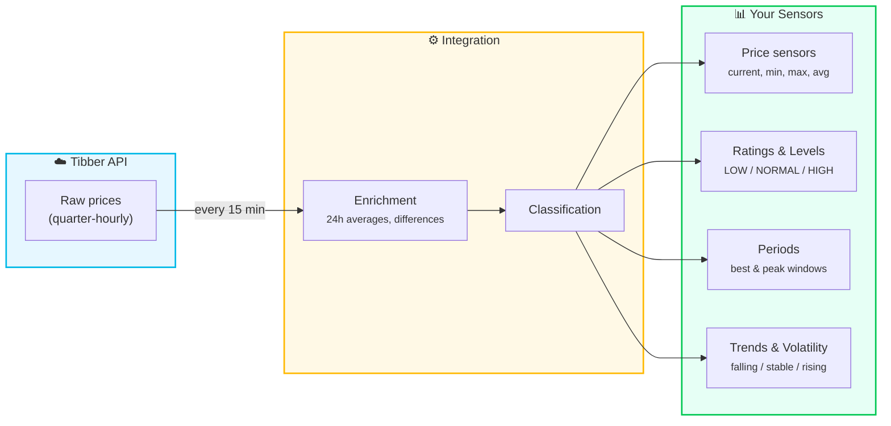

# Core Concepts

Understanding the fundamental concepts behind the Tibber Prices integration.

## How Data Flows

The integration fetches raw quarter-hourly prices from Tibber, enriches them with statistical context (averages, differences), and exposes the results as sensors you can use in automations and dashboards.

## Price Intervals

The integration works with **quarter-hourly intervals** (15 minutes):

- Each interval has a start time (e.g., 14:00, 14:15, 14:30, 14:45)
- Prices are fixed for the entire interval
- Synchronized with Tibber's smart meter readings

## Price Ratings

Prices are automatically classified into **rating levels**:

- **VERY_CHEAP** - Exceptionally low prices (great for energy-intensive tasks)
- **CHEAP** - Below average prices (good for flexible loads)
- **NORMAL** - Around average prices (regular consumption)
- **EXPENSIVE** - Above average prices (reduce consumption if possible)
- **VERY_EXPENSIVE** - Exceptionally high prices (avoid heavy loads)

Rating is based on **statistical analysis** comparing current price to:
- Daily average
- Trailing 24-hour average
- User-configured thresholds

## Price Periods

**Best Price Periods** and **Peak Price Periods** are automatically detected time windows:

- **Best Price Period** - Consecutive intervals with favorable prices (for scheduling energy-heavy tasks)
- **Peak Price Period** - Time windows with highest prices (to avoid or shift consumption)

Periods can:
- Span multiple hours
- Cross midnight boundaries
- Adapt based on your configuration (flex, min_distance, rating levels)

See [Period Calculation](period-calculation.md) for detailed configuration.

## Statistical Analysis

The integration enriches every interval with context:

- **Trailing 24h Average** - Average price over the last 24 hours
- **Leading 24h Average** - Average price over the next 24 hours
- **Price Difference** - How much current price deviates from average (in %)
- **Volatility** - Price stability indicator (LOW, MEDIUM, HIGH)

This helps you understand if current prices are exceptional or typical.

## V-Shaped and U-Shaped Price Days

Some days show distinctive price curve shapes:

- **V-shaped**: Prices drop sharply, hit a brief minimum, then rise sharply again (common during short midday solar surplus)
- **U-shaped**: Prices drop to a low level and stay there for an extended period before rising (common during nighttime or extended low-demand periods)

**Why this matters:** On these days, the Best Price Period may be short (1–2 hours, covering only the absolute minimum), but prices can remain favorable for 4–6 hours. By combining [trend sensors](sensors-trends.md) with [price levels](sensors-ratings-levels.md) in automations, you can ride the full cheap wave instead of only using the detected period.

See [Automation Examples → V-Shaped Days](automation-examples.md#understanding-v-shaped-price-days) for practical patterns.

## Multi-Home Support

You can add multiple Tibber homes to track prices for:
- Different locations
- Different electricity contracts
- Comparison between regions

Each home gets its own set of sensors with unique entity IDs.

---

💡 **Next Steps:**
- [Glossary](glossary.md) - Detailed term definitions
- [Sensors Overview](sensors-overview.md) - How to use sensor data
- [Automation Examples](automation-examples.md) - Practical use cases
