# Configuration

:::tip Entity ID tip
`<home_name>` is a placeholder for your Tibber home display name in Home Assistant. Entity IDs are derived from the displayed name (localized), so the exact slug may differ. **Can't find a sensor?** Use the **[Entity Reference (All Languages)](sensor-reference.md)** to search by name in your language.
:::

## Initial Setup

After [installing](installation.md) the integration:

1. Go to **Settings → Devices & Services**
2. Click **+ Add Integration**
3. Search for **Tibber Price Information & Ratings**
4. **Enter your API token** from [developer.tibber.com](https://developer.tibber.com/settings/access-token)
5. **Select your Tibber home** from the dropdown (if you have multiple)
6. Click **Submit** — the integration starts fetching price data

The integration will immediately create sensors for your home. Data typically arrives within 1–2 minutes.

### Adding Additional Homes

If you have multiple Tibber homes (e.g., different locations):

1. Go to **Settings → Devices & Services → Tibber Prices**
2. Click **Configure** → **Add another home**
3. Select the additional home from the dropdown
4. Each home gets its own set of sensors with unique entity IDs

## Options Flow (Configuration Wizard)

After initial setup, configure the integration through a multi-step wizard:

**Settings → Devices & Services → Tibber Prices → Configure**

```mermaid
flowchart LR
    S1["① General"] --> S2["② Currency"]
    S2 --> S3["③ Ratings"]
    S3 --> S4["④ Levels"]
    S4 --> S5["⑤ Volatility"]
    S5 --> S6["⑥ Best Price"]
    S6 --> S7["⑦ Peak Price"]
    S7 --> S8["⑧ Trends"]
    S8 --> S9["⑨ Chart"]

    style S1 fill:#e6f7ff,stroke:#00b9e7,stroke-width:2px
    style S6 fill:#e6fff5,stroke:#00c853,stroke-width:2px
    style S7 fill:#fff0f0,stroke:#ff5252,stroke-width:2px
```



All steps have sensible defaults — you can click through without changes and fine-tune later.

### Step 1: General Settings

- **Extended entity descriptions**: Show `description`, `long_description`, and `usage_tips` attributes on all sensors (useful for learning, can be disabled later to reduce attribute clutter)
- **Average sensor display**: Choose **Median** (typical price, spike-resistant) or **Mean** (mathematical average for cost calculations)

### Step 2: Currency Display

- **Base currency**: Shows prices as €/kWh, kr/kWh (e.g., 0.25 €/kWh)
- **Subunit**: Shows prices as ct/kWh, øre/kWh (e.g., 25.00 ct/kWh)
- Smart defaults: EUR → subunit (cents), NOK/SEK/DKK → base currency (kroner)

### Step 3: Price Rating Thresholds

Configure how the integration classifies prices relative to the 24-hour trailing average:

| Setting | Default | Description |
|---------|---------|-------------|
| **Low threshold** | -10% | Prices this much below average → **LOW** rating |
| **High threshold** | +10% | Prices this much above average → **HIGH** rating |
| **Hysteresis** | 2% | Prevents flickering at threshold boundaries |
| **Gap tolerance** | 1 | Smooth isolated rating blocks (e.g., lone NORMAL between two LOWs) |

### Step 4: Price Level Gap Tolerance

- **Gap tolerance** for Tibber's API-provided levels (VERY_CHEAP through VERY_EXPENSIVE)
- Smooths isolated level flickers: a single NORMAL surrounded by CHEAP → corrected to CHEAP
- Default: 1 interval tolerance

### Step 5: Price Volatility Thresholds

Configure the Coefficient of Variation (CV) boundaries:

| Level | Default | Meaning |
|-------|---------|---------|
| **Moderate** | 15% | Noticeable price variation, some optimization potential |
| **High** | 30% | Significant price swings, good for timing optimization |
| **Very High** | 50% | Extreme volatility, maximum optimization benefit |

### Step 6: Best Price Period

Configure detection of favorable price windows. Three collapsible sections:

**Period Settings:**
- Minimum period length (default: 60 min)
- Maximum price level to include (default: CHEAP)
- Gap tolerance: how many expensive intervals to bridge (default: 1)

**Flexibility Settings:**
- Flex percentage (default: 15%): how far above the daily minimum a price can be to qualify
- Minimum distance from daily average (default: 5%): ensures periods are meaningfully cheaper

**Relaxation & Target:**
- Enable minimum period target (default: on)
- Target periods per day (default: 2)
- Relaxation attempts (default: 11): steps to loosen criteria if target not met

See [Period Calculation](period-calculation.md) for an in-depth explanation.

### Step 7: Peak Price Period

Mirrors Best Price configuration but for expensive windows. Detects periods to **avoid** consumption.

### Step 8: Price Trend Thresholds

Configure when trend sensors report rising/falling:

| Setting | Default | Description |
|---------|---------|-------------|
| **Rising** | 3% | Future average this much above current → "rising" |
| **Strongly rising** | 9% | Future average far above current → "strongly_rising" |
| **Falling** | -3% | Future average this much below current → "falling" |
| **Strongly falling** | -9% | Future average far below current → "strongly_falling" |

Thresholds are [volatility-adaptive](sensors-trends.md): automatically widened on volatile days to prevent constant state changes.

### Step 9: Chart Data Export (Legacy)

Information page for the legacy chart data export sensor. For new setups, use the [get_chartdata action](chart-actions.md) instead.

## Configuration Options

### Average Sensor Display Settings

**Location:** Settings → Devices & Services → Tibber Prices → Configure → **General Settings**

The integration allows you to choose how average price sensors display their values. This setting affects all average sensors (daily, 24h rolling, hourly smoothed, and future forecasts).

#### Display Modes

**Median (Default):**
- Shows the "middle value" when all prices are sorted
- **Resistant to extreme spikes** - one expensive hour doesn't skew the result
- Best for understanding **typical price levels**
- Example: "What was the typical price today?"

**Arithmetic Mean:**
- Shows the mathematical average of all prices
- **Includes effect of spikes** - reflects actual cost if consuming evenly
- Best for **cost calculations and budgeting**
- Example: "What was my average cost per kWh today?"

#### Why This Matters

Consider a day with these hourly prices:
```
10, 12, 13, 15, 80 ct/kWh
```

- **Median = 13 ct/kWh** ← "Typical" price (middle value, ignores spike)
- **Mean = 26 ct/kWh** ← Average cost (spike pulls it up)

The median tells you the price was **typically** around 13 ct/kWh (4 out of 5 hours). The mean tells you if you consumed evenly, your **average cost** was 26 ct/kWh.

#### Automation-Friendly Design

**Both values are always available as attributes**, regardless of your display choice:

<details>
<summary>Show YAML example (median and mean attributes)</summary>

```yaml
# These attributes work regardless of display setting:
{{ state_attr('sensor.<home_name>_price_today', 'price_median') }}
{{ state_attr('sensor.<home_name>_price_today', 'price_mean') }}
```

</details>

This means:
- ✅ You can change the display anytime without breaking automations
- ✅ Automations can use both values for different purposes
- ✅ No need to create template sensors for the "other" value

#### Affected Sensors

This setting applies to:
- Daily average sensors (today, tomorrow)
- 24-hour rolling averages (trailing, leading)
- Hourly smoothed prices (current hour, next hour)
- Future forecast sensors (next 1h, 2h, 3h, ... 12h)

See the **[Average Sensors](sensors-average.md)** for detailed examples.

#### Choosing Your Display

**Choose Median if:**
- 👥 You show prices to users ("What's today like?")
- 📊 You want dashboard values that represent typical conditions
- 🎯 You compare price levels across days
- 🔍 You analyze volatility (comparing typical vs extremes)

**Choose Mean if:**
- 💰 You calculate costs and budgets
- 📈 You forecast energy expenses
- 🧮 You need mathematical accuracy for financial planning
- 📊 You track actual average costs over time

**Pro Tip:** Most users prefer **Median** for displays (more intuitive), but use `price_mean` attribute in cost calculation automations.

## Runtime Configuration Entities

The integration provides optional configuration entities that allow you to override period calculation settings at runtime through automations. These entities are **disabled by default** and can be enabled individually as needed.

### Available Configuration Entities

When enabled, these entities override the corresponding Options Flow settings:

#### Best Price Period Settings

| Entity | Type | Range | Description |
|--------|------|-------|-------------|
| <EntityRef id="best_price_flex_override">Best Price: Flexibility</EntityRef> | Number | 0-50% | Maximum above daily minimum for "best price" intervals |
| <EntityRef id="best_price_min_distance_override">Best Price: Minimum Distance</EntityRef> | Number | -50-0% | Required distance below daily average |
| <EntityRef id="best_price_min_period_length_override">Best Price: Minimum Period Length</EntityRef> | Number | 15-180 min | Shortest period duration to consider |
| <EntityRef id="best_price_min_periods_override">Best Price: Minimum Periods</EntityRef> | Number | 1-10 | Target number of periods per day |
| <EntityRef id="best_price_relaxation_attempts_override">Best Price: Relaxation Attempts</EntityRef> | Number | 1-12 | Steps to try when relaxing criteria |
| <EntityRef id="best_price_gap_tolerance_override">Best Price: Gap Tolerance</EntityRef> | Number | 0-8 | Consecutive intervals allowed above threshold |
| <EntityRef id="best_price_achieve_min_count_override">Best Price: Achieve Minimum Count</EntityRef> | Switch | On/Off | Enable relaxation algorithm |

#### Peak Price Period Settings

| Entity | Type | Range | Description |
|--------|------|-------|-------------|
| <EntityRef id="peak_price_flex_override">Peak Price: Flexibility</EntityRef> | Number | -50-0% | Maximum below daily maximum for "peak price" intervals |
| <EntityRef id="peak_price_min_distance_override">Peak Price: Minimum Distance</EntityRef> | Number | 0-50% | Required distance above daily average |
| <EntityRef id="peak_price_min_period_length_override">Peak Price: Minimum Period Length</EntityRef> | Number | 15-180 min | Shortest period duration to consider |
| <EntityRef id="peak_price_min_periods_override">Peak Price: Minimum Periods</EntityRef> | Number | 1-10 | Target number of periods per day |
| <EntityRef id="peak_price_relaxation_attempts_override">Peak Price: Relaxation Attempts</EntityRef> | Number | 1-12 | Steps to try when relaxing criteria |
| <EntityRef id="peak_price_gap_tolerance_override">Peak Price: Gap Tolerance</EntityRef> | Number | 0-8 | Consecutive intervals allowed below threshold |
| <EntityRef id="peak_price_achieve_min_count_override">Peak Price: Achieve Minimum Count</EntityRef> | Switch | On/Off | Enable relaxation algorithm |

### How Runtime Overrides Work

1. **Disabled (default):** The Options Flow setting is used
2. **Enabled:** The entity value overrides the Options Flow setting
3. **Value changes:** Trigger immediate period recalculation
4. **HA restart:** Entity values are restored automatically

### Viewing Entity Descriptions

Each configuration entity includes a detailed description attribute explaining what the setting does - the same information shown in the Options Flow.

**Note:** For **Number entities**, Home Assistant displays a history graph by default, which hides the attributes panel. To view the `description` attribute:

1. Go to **Developer Tools → States**
2. Search for the entity (e.g., `number.<home_name>_best_price_flexibility`)
3. Expand the attributes section to see the full description

**Switch entities** display their attributes normally in the entity details view.

### Example: Seasonal Automation

<details>
<summary>Show YAML example (seasonal runtime override)</summary>

```yaml
automation:
  - alias: "Winter: Stricter Best Price Detection"
    trigger:
      - platform: time
        at: "00:00:00"
    condition:
      - condition: template
        value_template: "{{ now().month in [11, 12, 1, 2] }}"
    action:
      - service: number.set_value
        target:
          entity_id: number.<home_name>_best_price_flexibility
        data:
          value: 10  # Stricter than default 15%
```

</details>

### Recorder Optimization (Optional)

These configuration entities are designed to minimize database impact:
- **EntityCategory.CONFIG** - Excluded from Long-Term Statistics
- All attributes excluded from history recording
- Only state value changes are recorded

If you frequently adjust these settings via automations or want to track configuration changes over time, the default behavior is fine.

However, if you prefer to **completely exclude** these entities from the recorder (no history graph, no database entries), add this to your `configuration.yaml`:

<details>
<summary>Show YAML example (exclude runtime config entities from recorder)</summary>

```yaml
recorder:
  exclude:
    entity_globs:
      # Exclude all Tibber Prices configuration entities
      - number.*_best_price_*
      - number.*_peak_price_*
      - switch.*_best_price_*
      - switch.*_peak_price_*
```

    </details>

This is especially useful if:
- You rarely change these settings
- You want the smallest possible database footprint
- You don't need to see the history graph for these entities

#### Price Sensor Statistics

The integration also minimizes long-term statistics growth for price sensors. Only 3 sensors write to the HA statistics database (which is never auto-purged):

- **Current Electricity Price** — Long-term price trend over weeks/months
- **Current Electricity Price (Energy Dashboard)** — Required for Energy Dashboard integration
- **Today's Average Price** — Seasonal price comparison

All other price sensors (forecasts, rolling averages, daily min/max, future averages) have long-term statistics disabled. Their **state history** (the step chart in the History panel) still works normally for ~10 days — only the smooth statistics line-chart on the entity detail page is absent for these sensors.

No configuration changes are needed — this optimization is built into the integration.
