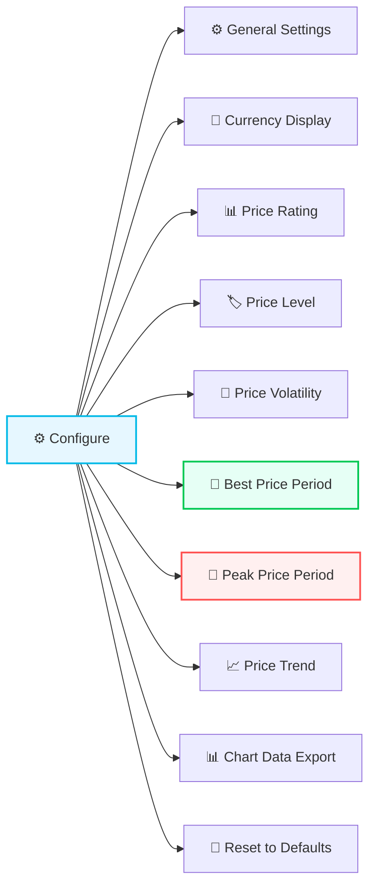

# Configuration

:::tip Entity ID tip
`<home_name>` is a placeholder for your Tibber home display name in Home Assistant. Entity IDs are derived from the displayed name (localized), so the exact slug may differ. **Can't find a sensor?** Use the **[Entity Reference (All Languages)](sensor-reference.md)** to search by name in your language.
:::

## Initial Setup

After [installing](installation.md) the integration:

1. Go to **Settings → Devices & Services**
2. Click **+ Add Integration**
3. Search for **Tibber Price Information & Ratings**
4. **Enter your API token** from [developer.tibber.com](https://developer.tibber.com/settings/access-token)
5. **Select your Tibber home** from the dropdown (if you have multiple)
6. Click **Submit** — the integration starts fetching price data

The integration will immediately create sensors for your home. Data typically arrives within 1–2 minutes.

### Adding Additional Homes

If you have multiple Tibber homes (e.g., different locations):

1. Go to **Settings → Devices & Services → Tibber Prices**
2. Click **Configure** → **Add another home**
3. Select the additional home from the dropdown
4. Each home gets its own set of sensors with unique entity IDs

## Options Menu

After initial setup, open the configuration menu at:

**Settings → Devices & Services → Tibber Prices → Configure**

A menu appears with all configuration sections. Pick any section, adjust settings, then return to the menu — there is no required order. All sections have sensible defaults and can be revisited independently at any time.

| Section | What you configure |
|---------|-------------------|
| [⚙️ General Settings](config-general.md) | Extended descriptions, average sensor display mode (Median / Mean) |
| [💱 Currency Display](config-currency.md) | Base currency vs. subunit display, price precision |
| [📊 Price Rating](config-price-rating.md) | LOW / HIGH thresholds, hysteresis, gap tolerance |
| [🏷️ Price Level](config-price-level.md) | Gap tolerance for Tibber's API-provided level classifications |
| [💨 Price Volatility](config-volatility.md) | CV thresholds for Moderate / High / Very High volatility |
| [💚 Best Price Period](config-best-price.md) | Cheap window detection: flex, distance, relaxation, runtime overrides |
| [🔴 Peak Price Period](config-peak-price.md) | Expensive window detection: same settings, opposite direction |
| [📈 Price Trend](config-price-trend.md) | Rising / Falling thresholds for trend sensors |
| [📊 Chart Data Export](config-chart-export.md) | Legacy chart export sensor (new setups: use [Chart Actions](chart-actions.md)) |

Advanced: [🔁 Runtime Override Entities](config-runtime-overrides.md) — number and switch entities for automating configuration changes at runtime.
