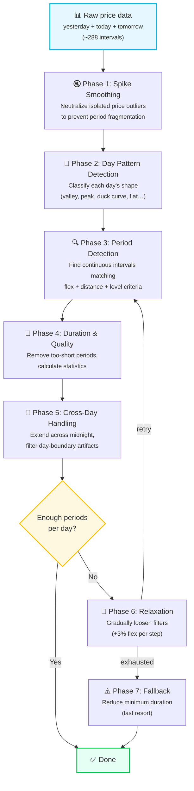
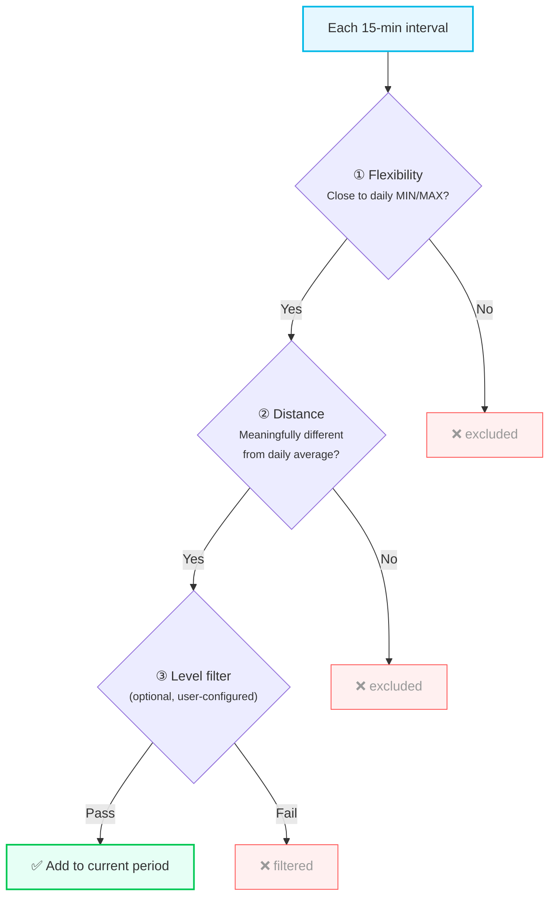
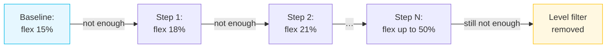

# Period Calculation

Learn how Best Price and Peak Price periods work, and how to configure them for your needs.

:::tip Entity ID tip
`<home_name>` is a placeholder for your Tibber home display name in Home Assistant. Entity IDs are derived from the displayed name (localized), so the exact slug may differ. **Can't find a sensor?** Use the **[Entity Reference (All Languages)](sensor-reference.md)** to search by name in your language.
:::

## Table of Contents

-   [Quick Start](#quick-start)
-   [How It Works](#how-it-works) — Algorithm overview, all 7 phases explained
-   [Configuration Guide](#configuration-guide)
-   [Understanding Relaxation](#understanding-relaxation) → [Full Guide](period-relaxation.md)
-   [Common Scenarios](#common-scenarios)
-   [Troubleshooting](#troubleshooting)
-   [Advanced Topics](#advanced-topics)

---

## Quick Start

### What Are Price Periods?

The integration finds time windows when electricity is especially **cheap** (Best Price) or **expensive** (Peak Price):

-   <EntityRef id="best_price_period">Best Price Periods</EntityRef> 🟢 - When to run your dishwasher, charge your EV, or heat water
-   <EntityRef id="peak_price_period">Peak Price Periods</EntityRef> 🔴 - When to reduce consumption or defer non-essential loads

### Default Behavior

Out of the box, the integration:

1. **Best Price**: Finds cheapest 1-hour+ windows that are at least 5% below the daily average
2. **Peak Price**: Finds most expensive 30-minute+ windows that are at least 5% above the daily average
3. **Relaxation**: Automatically loosens filters if not enough periods are found

**Most users don't need to change anything!** The defaults work well for typical use cases.

<details>
<summary>ℹ️ Why do Best Price and Peak Price have different defaults?</summary>

The integration sets different **initial defaults** because the features serve different purposes:

**Best Price (60 min, 15% flex):**
- Longer duration ensures appliances can complete their cycles
- Stricter flex (15%) focuses on genuinely cheap times
- Use case: Running dishwasher, EV charging, water heating

**Peak Price (30 min, 20% flex):**
- Shorter duration acceptable for early warnings
- More flexible (20%) catches price spikes earlier
- Use case: Alerting to expensive periods, even brief ones

**You can adjust all these values** in the configuration if the defaults don't fit your use case. The asymmetric defaults simply provide good starting points for typical scenarios.
</details>

### Example Timeline

```mermaid
gantt
    title Typical Day — Best Price & Peak Price Periods
    dateFormat HH:mm
    axisFormat %H:%M
    tickInterval 2hour

    section Best Price
    Cheap prices (00:00–04:00)     :active, 00:00, 04:00

    section Normal
    Normal prices (04:00–08:00)    :        04:00, 08:00

    section Peak Price
    Expensive prices (08:00–12:00) :crit,   08:00, 12:00

    section Normal
    Normal prices (12:00–16:00)    :        12:00, 16:00

    section Peak Price
    Expensive prices (16:00–20:00) :crit,   16:00, 20:00

    section Best Price
    Cheap prices (20:00–00:00)     :active, 20:00, 24:00
```

---

## How It Works

### The Basic Idea

Each day, the integration analyzes all 96 quarter-hourly price intervals and identifies **continuous time ranges** that meet specific criteria.

:::info What "Best Price" means
A Best Price Period is the **cheapest contiguous block** of time — a stretch of consecutive intervals where prices stay close to the daily minimum. It is **not** a fixed-length sliding window that shifts to center around the minimum.

On a V-shaped day (prices drop sharply to a minimum, then rise again), the period therefore starts **at** the low point, not before it — because the intervals leading up to the minimum did not yet meet the price criteria. Only the intervals near the bottom of the V qualify as a coherent cheap block.

**For flexible loads** (e.g., heat pump, battery charging): you can easily ride the full cheap wave by combining the period sensor with the price level and trend sensors. See [V-Shaped Price Days in Automation Examples](./automation-examples.md#understanding-v-shaped-price-days).
:::

### Algorithm Overview

The period calculation is a multi-phase pipeline. Each phase builds on the previous one, progressively refining the result:



**Why this order?**

| Phase | What it does | Why it's needed |
|-------|-------------|-----------------|
| **1. Spike Smoothing** | Replaces isolated price spikes with trend predictions | A single 15-minute spike would split a 4-hour cheap period into two short fragments |
| **2. Day Patterns** | Classifies each day's price shape (valley, peak, duck curve, flat…) | Enables geometric flex bonuses — periods in a detected valley/peak zone get extra margin |
| **3. Period Detection** | Scans all intervals through flex, distance, and level filters | Core logic: finds contiguous blocks where prices are close to the daily min (or max) |
| **4. Duration & Quality** | Removes periods shorter than the configured minimum, calculates statistics | A 15-minute "period" isn't useful for running an appliance |
| **5. Cross-Day Handling** | Extends late-evening periods across midnight, filters day-boundary artifacts | Without this, a cheap period at 23:00-00:00 can't continue into 00:00-02:00 even if prices stay low |
| **6. Relaxation** | Loosens filters step by step (+3% flex) until enough periods are found | On some days, the configured flex isn't enough to find 2 periods — relaxation adapts automatically |
| **7. Fallback** | Progressively reduces minimum duration (60→45→30 min) | Last resort for days where even full relaxation finds zero periods |

The following sections explain each phase in detail.

### Phase 1: Spike Smoothing (Preprocessing)

Before any period detection begins, isolated price spikes are detected and smoothed. This prevents a single expensive 15-minute interval from splitting what should be one long cheap period into two short fragments.

<details>
<summary>Show example: Automatic Price Spike Smoothing</summary>

```
Original prices: 18, 19, 35, 20, 19 ct   ← 35 ct is an isolated outlier
Smoothed:        18, 19, 19, 20, 19 ct   ← Spike replaced with trend prediction

Result: Continuous period 00:00-01:15 instead of split periods
```

</details>

**How it works:** The algorithm looks at 3 intervals before and after each price point, calculates an expected trend, and flags prices that deviate significantly. On flat days (low price variation), smoothing is more conservative; on volatile days, it's more aggressive. Daily minimum and maximum prices are never smoothed — they serve as reference points for period detection.

**Important:**
-   Original prices are always preserved in all statistics (min/max/avg show real values)
-   Smoothing only affects which intervals are combined into periods
-   The attribute `period_interval_smoothed_count` shows how many intervals were smoothed

### Phase 2: Day Pattern Detection

The integration classifies each day's price shape to optimize period detection for different market conditions:

| Pattern | Shape | Description |
|---------|-------|-------------|
| `valley` | ∪ | Single cheap window (e.g., solar midday dip) |
| `peak` | ∩ | Single expensive window (e.g., evening demand) |
| `double_dip` | W | Two cheap windows (e.g., cheap morning + cheap midday) |
| `duck_curve` | M | Two expensive peaks (e.g., morning + evening demand, named after the energy industry's [duck curve](https://en.wikipedia.org/wiki/Duck_curve)) |
| `flat` | ─ | Little variation throughout the day |
| `rising` | / | Prices climb steadily |
| `falling` | \ | Prices drop steadily |

**Why this matters:** On a detected valley day, the period detection gets a geometric flex bonus for intervals within the valley zone — making it easier to capture the full cheap window even if some intervals are slightly above the normal flex threshold. On flat days, the target number of periods is automatically reduced to 1 (see [Flat Day Detection](#fewer-periods-than-configured)).

Day patterns are also exposed as dedicated sensors — see [Price Phases & Day Pattern](./sensors-price-phases.md) for details.

### Phase 3: Period Detection (Core Logic)

This is the heart of the algorithm. Each smoothed interval is tested against three filters. Only consecutive intervals that pass **all three** form a period:



#### ① Flexibility (Search Range)

**Best Price:** How much MORE than the daily minimum can a price be?

<details>
<summary>Show example: Search Range Flexibility</summary>

```
Daily MIN: 20 ct/kWh
Flexibility: 15% (default)
→ Search for times ≤ 23 ct/kWh (20 + 15%)
```

</details>

**Peak Price:** How much LESS than the daily maximum can a price be?

<details>
<summary>Show example: Peak Price Flexibility</summary>

```
Daily MAX: 40 ct/kWh
Flexibility: -15% (default)
→ Search for times ≥ 34 ct/kWh (40 - 15%)
```

</details>

**Why flexibility?** Prices rarely stay at exactly MIN/MAX. Flexibility lets you capture realistic time windows. At high flex values (>20%), the distance filter is automatically scaled down to prevent conflicting constraints.

#### ② Distance from Average (Quality Gate)

Periods must be meaningfully different from the daily average:

<details>
<summary>Show example: Distance from Average</summary>

```
Daily AVG: 30 ct/kWh
Minimum distance: 5% (default)

Best Price: Must be ≤ 28.5 ct/kWh (30 - 5%)
Peak Price: Must be ≥ 31.5 ct/kWh (30 + 5%)
```

</details>

**Why?** This prevents marking mediocre times as "best" just because they're slightly below average.

#### ③ Level Filter (Optional)

You can optionally require intervals to have a specific Tibber price level (e.g., `CHEAP` or `EXPENSIVE`). With gap tolerance, a few "mediocre" intervals within an otherwise good period are allowed — preventing unnecessary splits.

### Phase 4: Duration & Quality

Consecutive intervals that passed all three filters are grouped into candidate periods. Short candidates are discarded:

<details>
<summary>Show example: Minimum Period Duration</summary>

```
Default: 60 minutes minimum

45-minute period → Discarded (too short to be useful)
90-minute period → Kept ✓
```

</details>

For each surviving period, the integration calculates statistics: mean, median, min, max, price spread, coefficient of variation, and volatility classification. Periods with very heterogeneous prices (CV > 25%) are flagged as low quality.

### Phase 5: Cross-Day Handling

Since the integration processes yesterday + today + tomorrow together, periods can naturally span midnight. This phase ensures correct behavior at day boundaries:

**Cross-midnight extension:**
Late-evening periods (starting after 20:00) are extended into the next day if prices remain favorable. Three safety limits apply:
- Maximum 4 hours of extension
- Extension can't exceed 2× the original period length
- Extension stops if prices deviate more than 15% from the original period's mean

**Day-boundary artifact filtering:**
Each day has its own min/max/avg — so the same absolute price can qualify as "cheap" on one day but not the next. The integration catches misleading artifacts with several automatic checks:
- **Peak periods** near midnight must qualify against **both** adjacent days' statistics
- **Peak periods** must exceed the daily average by at least 10% (overnight periods use the higher average of both days)
- Early-morning "peaks" that are significantly weaker than yesterday's late-evening peak are recognized as artifacts and filtered out

These checks run automatically — no configuration needed.

### Phase 6: Relaxation (Adaptive)

If the baseline detection didn't find enough periods per day, the integration gradually loosens filters:



- Each step increases flex by 3% and retries period detection
- Each day is evaluated independently — a day that already has enough periods is skipped
- On **flat days** (price variation < 10%), the target is automatically reduced to 1 period
- Hard limit: flex never exceeds 50%
- The `relaxation_active` and `relaxation_level` attributes show if and how relaxation was applied

**See [Relaxation Guide](period-relaxation.md)** for a deep dive.

### Phase 7: Fallback (Last Resort)

If all relaxation steps are exhausted and some days still have **zero** periods:

- Minimum duration is progressively reduced: 60 → 45 → 30 minutes
- All other filters are maximally relaxed (50% flex, no distance or level filter)
- Periods found this way are marked with `duration_fallback_active: true`

This ensures that every day has at least one period, even under extreme market conditions.

### Visual Example

**Timeline for a typical day:**

Daily MIN: 18 ct | Daily MAX: 35 ct | Daily AVG: 26 ct

| Hour | Price | Best Price threshold<br/>≤ 20.7 ct (15% flex) | Peak Price threshold<br/>≥ 29.75 ct (15% flex) |
|------|------:|:---:|:---:|
| 00:00 | **18 ct** | ✅ Best Price | |
| 01:00 | **19 ct** | ✅ Best Price | |
| 02:00 | **20 ct** | ✅ Best Price | |
| 03:00 | 28 ct | | |
| 04:00 | 29 ct | | |
| 05:00 | 29 ct | | |
| 06:00 | **35 ct** | | 🔴 Peak Price |
| 07:00 | **34 ct** | | 🔴 Peak Price |
| 08:00 | **33 ct** | | 🔴 Peak Price |
| 09:00 | **32 ct** | | 🔴 Peak Price |
| 10:00 | **30 ct** | | 🔴 Peak Price |
| 11:00 | 28 ct | | |
| 12:00 | 25 ct | | |
| 13:00 | 24 ct | | |
| 14:00 | 26 ct | | |
| 15:00 | 28 ct | | |
| 16:00 | 30 ct | | 🔴 Peak Price |
| 17:00 | 32 ct | | 🔴 Peak Price |
| 18:00 | 31 ct | | 🔴 Peak Price |
| 19:00 | **22 ct** | | |
| 20:00 | **20 ct** | ✅ Best Price | |
| 21:00 | **19 ct** | ✅ Best Price | |
| 22:00 | **19 ct** | ✅ Best Price | |
| 23:00 | **18 ct** | ✅ Best Price | |

**Result:** Two Best Price periods (00:00–03:00 and 19:00–00:00) and two Peak Price periods (06:00–11:00 and 16:00–19:00).

---

## Configuration Guide

### Basic Settings

#### Flexibility

**What:** How far from MIN/MAX to search for periods
**Default:** 15% (Best Price), -15% (Peak Price)
**Range:** 0-100%

<details>
<summary>Show YAML: Flexibility</summary>

```yaml
best_price_flex: 15 # Can be up to 15% more expensive than daily MIN
peak_price_flex: -15 # Can be up to 15% less expensive than daily MAX
```

</details>

**When to adjust:**

-   **Increase (20-25%)** → Find more/longer periods
-   **Decrease (5-10%)** → Find only the very best/worst times

**💡 Tip:** Very high flexibility (>30%) is rarely useful. **Recommendation:** Start with 15-20% and enable relaxation – it adapts automatically to each day's price pattern.

#### Minimum Period Length

**What:** How long a period must be to show it
**Default:** 60 minutes (Best Price), 30 minutes (Peak Price)
**Range:** 15-240 minutes

<details>
<summary>Show YAML: Minimum Period Length</summary>

```yaml
best_price_min_period_length: 60
peak_price_min_period_length: 30
```

</details>

**When to adjust:**

-   **Increase (90-120 min)** → Only show longer periods (e.g., for heat pump cycles)
-   **Decrease (30-45 min)** → Show shorter windows (e.g., for quick tasks)

#### Distance from Average

**What:** How much better than average a period must be
**Default:** 5%
**Range:** 0-20%

<details>
<summary>Show YAML: Distance from Average</summary>

```yaml
best_price_min_distance_from_avg: 5
peak_price_min_distance_from_avg: 5
```

</details>

**When to adjust:**

-   **Increase (5-10%)** → Only show clearly better times
-   **Decrease (0-1%)** → Show any time below/above average

**ℹ️ Note:** Both flexibility and distance filters must be satisfied. When using high flexibility values (>30%), the distance filter may become the limiting factor. For best results, use moderate flexibility (15-20%) with relaxation enabled.

### Optional Filters

#### Level Filter (Absolute Quality)

**What:** Only show periods with CHEAP/EXPENSIVE intervals (not just below/above average)
**Default:** `any` (disabled)
**Options:** `any` | `cheap` | `very_cheap` (Best Price) | `expensive` | `very_expensive` (Peak Price)

<details>
<summary>Show YAML: Level Filter</summary>

```yaml
best_price_max_level: any      # Show any period below average
best_price_max_level: cheap    # Only show if at least one interval is CHEAP
```

</details>

**Use case:** "Only notify me when prices are objectively cheap/expensive"

**ℹ️ Volatility Thresholds:** The level filter also supports volatility-based levels (`volatility_low`, `volatility_medium`, `volatility_high`). These use **fixed internal thresholds** (LOW < 10%, MEDIUM < 20%, HIGH ≥ 20%) that are separate from the sensor volatility thresholds you configure in the UI. This separation ensures that changing sensor display preferences doesn't affect period calculation behavior.

#### Gap Tolerance (for Level Filter)

**What:** Allow some "mediocre" intervals within an otherwise good period
**Default:** 0 (strict)
**Range:** 0-10

<details>
<summary>Show YAML: Gap Tolerance</summary>

```yaml
best_price_max_level: cheap
best_price_max_level_gap_count: 2 # Allow up to 2 NORMAL intervals per period
```

</details>

**Use case:** "Don't split periods just because one interval isn't perfectly CHEAP"

### Tweaking Strategy: What to Adjust First?

When you're not happy with the default behavior, adjust settings in this order:

#### 1. **Start with Relaxation (Easiest)**

If you're not finding enough periods:

<details>
<summary>Show YAML: Relaxation Defaults</summary>

```yaml
enable_min_periods_best: true   # Already default!
min_periods_best: 2             # Already default!
relaxation_attempts_best: 11    # Already default!
```

</details>

**Why start here?** Relaxation automatically finds the right balance for each day. Much easier than manual tuning.

#### 2. **Adjust Period Length (Simple)**

If periods are too short/long for your use case:

<details>
<summary>Show YAML: Longer or Shorter Periods</summary>

```yaml
best_price_min_period_length: 90  # Increase from 60 for longer periods
# OR
best_price_min_period_length: 45  # Decrease from 60 for shorter periods
```

</details>

**Safe to change:** This only affects duration, not price selection logic.

#### 3. **Fine-tune Flexibility (Moderate)**

If you consistently want more/fewer periods:

<details>
<summary>Show YAML: Flexibility Tuning</summary>

```yaml
best_price_flex: 20  # Increase from 15% for more periods
# OR
best_price_flex: 10  # Decrease from 15% for stricter selection
```

</details>

**⚠️ Watch out:** Values >25% may conflict with distance filter. Use relaxation instead.

#### 4. **Adjust Distance from Average (Advanced)**

Only if periods seem "mediocre" (not really cheap/expensive):

<details>
<summary>Show YAML: Distance from Average</summary>

```yaml
best_price_min_distance_from_avg: 10  # Increase from 5% for stricter quality
```

</details>

**⚠️ Careful:** High values (>10%) can make it impossible to find periods on flat price days.

#### 5. **Enable Level Filter (Expert)**

Only if you want absolute quality requirements:

<details>
<summary>Show YAML: Strict Level Filter</summary>

```yaml
best_price_max_level: cheap  # Only show objectively CHEAP periods
```

</details>

**⚠️ Very strict:** Many days may have zero qualifying periods. **Always enable relaxation when using this!**

### Common Mistakes to Avoid

❌ **Don't increase flexibility to >30% manually** → Use relaxation instead
❌ **Don't combine high distance (>10%) with strict level filter** → Too restrictive
❌ **Don't disable relaxation with strict filters** → You'll get zero periods on some days
❌ **Don't change all settings at once** → Adjust one at a time and observe results

✅ **Do use defaults + relaxation** → Works for 90% of cases
✅ **Do adjust one setting at a time** → Easier to understand impact
✅ **Do check sensor attributes** → Shows why periods were/weren't found

---

## Understanding Relaxation

As described in [Phase 6](#phase-6-relaxation-adaptive), relaxation automatically loosens filters until a minimum number of periods is found — enabled by default.

**Key benefits:**
- Each day gets exactly the flexibility it needs (per-day independence)
- Uses a matrix approach: N flex levels × 2 filter combinations
- Stops as soon as enough periods are found

**→ [Full Relaxation Guide](period-relaxation.md)** — How it works, the adaptive matrix, choosing attempts, and diagnostics.

---

## Common Scenarios

:::tip V-shaped price days
On days with a sharp price dip (e.g. solar midday surplus), the Best Price Period covers only the absolute minimum. The surrounding cheap hours are intentional — the integration shows you the cheapest contiguous block, not a fixed-length window centered on the minimum. To run a device during the full cheap window, see [Understanding V-Shaped Price Days](./automation-examples.md#understanding-v-shaped-price-days) in the Automation Examples.
:::

### Scenario 1: Simple Best Price (Default)

**Goal:** Find the cheapest time each day to run dishwasher

**Configuration:**

<details>
<summary>Show YAML: Simple Best Price</summary>

```yaml
# Use defaults - no configuration needed!
best_price_flex: 15 # (default)
best_price_min_period_length: 60 # (default)
best_price_min_distance_from_avg: 5 # (default)
```

</details>

**What you get:**

-   1-3 periods per day with prices ≤ MIN + 15%
-   Each period at least 1 hour long
-   All periods at least 5% cheaper than daily average

**Automation example:**

<details>
<summary>Show YAML: Dishwasher in Best Price Period</summary>

```yaml
automation:
    - trigger:
          - platform: state
            entity_id: binary_sensor.<home_name>_best_price_period
            to: "on"
      action:
          - service: switch.turn_on
            target:
                entity_id: switch.dishwasher
```

</details>

---

## Troubleshooting

### Fewer Periods Than Configured

**Symptom:** You configured `min_periods_best: 2` or `min_periods_peak: 2` but the sensor shows fewer periods on some days, and the attributes contain `flat_days_detected: 1` or `relaxation_incomplete: true`.

**If `flat_days_detected` is present:**

This is **expected behavior** on days with very uniform electricity prices. When prices vary by less than ~10% across the day (e.g. on sunny spring days with high solar generation), there is no meaningful second "cheap window" or second "expensive peak" – all hours are equally priced. The integration automatically reduces the target to 1 period for that day. This applies to both Best Price and Peak Price periods.

<details>
<summary>Show YAML: Flat Day Detection</summary>

```yaml
# Best Price example:
min_periods_configured: 2
period_count_today: 1
flat_days_detected: 1    # Uniform prices today → 1 period is the right answer

# Peak Price example:
min_periods_configured: 2
period_count_today: 1
flat_days_detected: 1    # No distinct peaks today → 1 period is the right answer
```

</details>

You don't need to change anything. This is the integration protecting you from artificial periods.

**If `relaxation_incomplete` is present (without `flat_days_detected`):**

Relaxation tried all configured attempts but couldn't reach your target. Options:

1. **Increase relaxation attempts** (tries more flexibility levels before giving up)
  <details>
  <summary>Show YAML example (increase relaxation attempts)</summary>

   ```yaml
   relaxation_attempts_best: 12  # Default: 11
   ```

  </details>

2. **Reduce minimum period count**
  <details>
  <summary>Show YAML example (reduce min periods)</summary>

   ```yaml
   min_periods_best: 1  # Only require 1 period per day
   ```

  </details>

3. **Check filter settings** – very strict `best_price_min_distance_from_avg` values block relaxation

---

### No Periods Found

**Symptom:** `binary_sensor.<home_name>_best_price_period` never turns "on"

**Common Solutions:**

1. **Check if relaxation is enabled**
  <details>
  <summary>Show YAML example (relaxation enabled)</summary>

   ```yaml
   enable_min_periods_best: true  # Should be true (default)
   min_periods_best: 2  # Try to find at least 2 periods
   ```

  </details>

2. **If still no periods, check filters**
   - Look at sensor attributes: `relaxation_active` and `relaxation_level`
   - If relaxation exhausted all attempts: Filters too strict or flat price day

3. **Try increasing flexibility slightly**
  <details>
  <summary>Show YAML example (increase flexibility)</summary>

   ```yaml
   best_price_flex: 20  # Increase from default 15%
   ```

  </details>

4. **Or reduce period length requirement**
  <details>
  <summary>Show YAML example (reduce period length)</summary>

   ```yaml
   best_price_min_period_length: 45  # Reduce from default 60 minutes
   ```

  </details>

### Periods Split Into Small Pieces

**Symptom:** Many short periods instead of one long period

**Common Solutions:**

1. **If using level filter, add gap tolerance**
  <details>
  <summary>Show YAML example (level gap tolerance)</summary>

   ```yaml
   best_price_max_level: cheap
   best_price_max_level_gap_count: 2  # Allow 2 NORMAL intervals
   ```

  </details>

2. **Slightly increase flexibility**
  <details>
  <summary>Show YAML example (wider flexibility)</summary>

   ```yaml
   best_price_flex: 20  # From 15% → captures wider price range
   ```

  </details>

3. **Check for price spikes**
   - Automatic smoothing should handle this
   - Check attribute: `period_interval_smoothed_count`
   - If 0: Not isolated spikes, but real price levels

### Understanding Sensor Attributes

**Key attributes to check:**

<details>
<summary>Show YAML: Key attributes to check</summary>

```yaml
# Entity: binary_sensor.<home_name>_best_price_period

# When "on" (period active):
start: "2025-11-11T02:00:00+01:00"  # Period start time
end: "2025-11-11T05:00:00+01:00"    # Period end time
duration_minutes: 180                # Duration in minutes
price_mean: 18.5                     # Arithmetic mean price in the period
price_median: 18.3                   # Median price in the period
rating_level: "LOW"                  # All intervals have LOW rating

# Relaxation info (shows if filter loosening was needed):
relaxation_active: true              # This day needed relaxation
relaxation_level: "price_diff_18.0%+level_any"  # Found at 18% flex, level filter removed

# Calculation summary (always shown – diagnostic overview of this calculation run):
min_periods_configured: 2           # What you configured as target
period_count_today: 2               # How many periods are scheduled today
period_count_tomorrow: 2            # How many periods are scheduled tomorrow (when data available)

# Optional (only shown when relevant):
period_interval_smoothed_count: 2    # Number of price spikes smoothed
period_interval_level_gap_count: 1   # Number of "mediocre" intervals tolerated
flat_days_detected: 1               # Days where prices were so flat that 1 period is enough
relaxation_incomplete: true         # Some days couldn't reach the configured target
```

</details>

#### What the diagnostic attributes mean

**`min_periods_configured` / `period_count_today`**

These two values together quickly show whether the calculation achieved its goal:

<details>
<summary>Show YAML: Configured Target vs Found Periods</summary>

```yaml
min_periods_configured: 2   # You asked for 2 periods per day
period_count_today: 2       # ✅ Today: target reached
period_count_tomorrow: 2    # ✅ Tomorrow: target reached
```

```yaml
min_periods_configured: 2
period_count_today: 1       # ⚠️ Today: only 1 period found
period_count_tomorrow: 2    # ✅ Tomorrow: target reached
```

</details>

**`flat_days_detected`**

This is the most important diagnostic for days with very uniform prices (e.g. sunny spring/summer days with high solar generation):

<details>
<summary>Show YAML: Flat Days Detected Attribute</summary>

```yaml
min_periods_configured: 2
period_count_today: 1
flat_days_detected: 1       # ← This explains why you got 1 instead of 2
```

</details>

When prices barely change across the day – typically a variation of less than 10% – the integration automatically reduces the target from your configured value to 1. There is no meaningful second "best price window" when all prices are essentially equal.

**This is expected and correct behavior**, not a problem. It prevents the sensor from generating artificial periods that don't represent genuinely cheaper windows.

**`relaxation_incomplete`**

This flag appears when even after all relaxation attempts, at least one day could not reach the configured minimum number of periods:

<details>
<summary>Show YAML: Relaxation Incomplete Attribute</summary>

```yaml
min_periods_configured: 2
period_count_today: 1
relaxation_incomplete: true  # ← Relaxation tried everything, still short
```

</details>

This is most common on very flat days (see above) or with very strict filter settings. If you see this repeatedly on normal days, consider:
- Reducing `min_periods_best` to 1
- Increasing `relaxation_attempts_best`
- Checking if your `best_price_min_distance_from_avg` is too high

### Midnight Price Classification Changes

**Symptom:** A Best Price period at 23:45 changes classification at 00:00 (or vice versa), even though the absolute price barely changed.

**Why This Happens:**

Each day has its own price statistics (min, max, avg) calculated independently from its 96 intervals. Periods are classified based on their **position within the day's price range**, not absolute prices. This means the same absolute price can be "cheap" on one day and "average" on the next.

**Example:**

<details>
<summary>Show YAML: Midnight Price Classification Changes</summary>

```yaml
# Day 1 (low volatility, narrow range)
Price range: 18-22 ct/kWh (4 ct span)
Daily average: 20 ct/kWh
23:45: 18.5 ct/kWh → 7.5% below average → BEST PRICE ✅

# Day 2 (low volatility, narrow range)
Price range: 17-21 ct/kWh (4 ct span)
Daily average: 19 ct/kWh
00:00: 18.6 ct/kWh → 2.1% below average → NORMAL ❌

# Absolute price barely changed (18.5 → 18.6 ct)
# But relative position changed because Day 2 has a different price range
```

</details>

**How the Integration Handles This:**

The [cross-day handling](#phase-5-cross-day-handling) automatically prevents misleading period boundaries at midnight:

- **Peak periods** near midnight are validated against **both** adjacent days' statistics
- **Peak periods** must exceed the daily average by at least 10%, with overnight periods checked against the higher average of both days
- **Cross-day extensions** are capped in length and stop when prices deviate significantly

These checks run automatically and require no configuration. They ensure that midnight period boundaries reflect genuine price differences, not just day-boundary artifacts.

**Additional Strategies for Automations:**

For extra robustness, you can also make your automations aware of the price environment:

<details>
<summary>Show YAML: Volatility-Aware Automation</summary>

```yaml
# Option 1: Only act on high-volatility days (meaningful price differences)
automation:
  - alias: "Dishwasher - Best Price (High Volatility Only)"
    trigger:
      - platform: state
        entity_id: binary_sensor.<home_name>_best_price_period
        to: "on"
    condition:
      - condition: numeric_state
        entity_id: sensor.<home_name>_today_s_price_volatility
        above: 15  # Only act if volatility > 15%
    action:
      - service: switch.turn_on
        entity_id: switch.dishwasher

# Option 2: Use absolute price threshold instead of classification
automation:
  - alias: "Heat Water - Cheap Enough"
    trigger:
      - platform: state
        entity_id: binary_sensor.<home_name>_best_price_period
        to: "on"
    condition:
      - condition: numeric_state
        entity_id: sensor.<home_name>_current_electricity_price
        below: 20  # Absolute threshold: < 20 ct/kWh
    action:
      - service: switch.turn_on
        entity_id: switch.water_heater
```

</details>

**Summary:**
- ✅ **Expected behavior:** Each day has independent price statistics — midnight is a natural boundary
- ✅ **Automatic handling:** Cross-day quality checks prevent misleading period artifacts
- ✅ **Extra safety:** Use volatility sensors or absolute price thresholds in automations for additional robustness

---

## Advanced Topics

For advanced configuration patterns and technical deep-dive, see:

-   [Automation Examples](./automation-examples.md) - Real-world automation patterns
-   [Chart Actions](./chart-actions.md) - Using the `tibber_prices.get_chartdata` action for custom visualizations

### Quick Reference

**Configuration Parameters:**

| Parameter                          | Default | Range            | Purpose                        |
| ---------------------------------- | ------- | ---------------- | ------------------------------ |
| `best_price_flex`                  | 15%     | 0-100%           | Search range from daily MIN    |
| `best_price_min_period_length`     | 60 min  | 15-240           | Minimum duration               |
| `best_price_min_distance_from_avg` | 5%      | 0-20%            | Quality threshold              |
| `best_price_max_level`             | any     | any/cheap/vcheap | Absolute quality               |
| `best_price_max_level_gap_count`   | 0       | 0-10             | Gap tolerance                  |
| `enable_min_periods_best`          | true    | true/false       | Enable relaxation              |
| `min_periods_best`                 | 2       | 1-10             | Target periods per day         |
| `relaxation_attempts_best`         | 11      | 1-12             | Flex levels (attempts) per day |

**Peak Price:** Same parameters with `peak_price_*` prefix (defaults: flex=-15%, same otherwise)

### Price Levels Reference

The Tibber API provides price levels for each 15-minute interval:

**Levels (based on trailing 24h average):**

-   `VERY_CHEAP` - Significantly below average
-   `CHEAP` - Below average
-   `NORMAL` - Around average
-   `EXPENSIVE` - Above average
-   `VERY_EXPENSIVE` - Significantly above average
