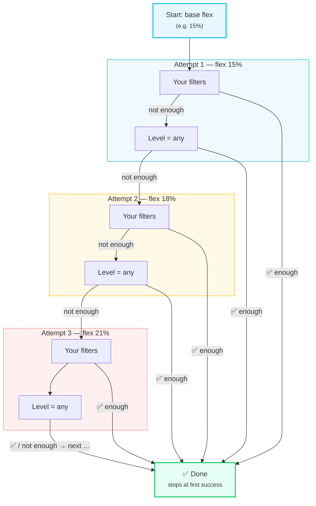

# Understanding Relaxation

:::tip Entity ID tip
`<home_name>` is a placeholder for your Tibber home display name in Home Assistant. Entity IDs are derived from the displayed name (localized), so the exact slug may differ. **Can't find a sensor?** Use the **[Entity Reference (All Languages)](sensor-reference.md)** to search by name in your language.
:::

Relaxation is the automatic filter-loosening mechanism that ensures your [Best/Peak Price periods](period-calculation.md) always find results — even on days with unusual price patterns.

---

## What Is Relaxation?

Sometimes, strict filters find too few periods (or none). **Relaxation automatically loosens filters** until a minimum number of periods is found.

## How to Enable

```yaml
enable_min_periods_best: true
min_periods_best: 2 # Try to find at least 2 periods per day
relaxation_attempts_best: 11 # Flex levels to test (default: 11 steps = 22 filter combinations)
```

**Good news:** Relaxation is **enabled by default** with sensible settings. Most users don't need to change anything here!

Set the matching `relaxation_attempts_peak` value when tuning Peak Price periods. Both sliders accept 1-12 attempts, and the default of 11 flex levels translates to 22 filter-combination tries (11 flex levels × 2 filter combos) for each of Best and Peak calculations. Lower it for quick feedback, or raise it when either sensor struggles to hit the minimum-period target on volatile days.

## Why Relaxation Is Better Than Manual Tweaking

**Problem with manual settings:**
- You set flex to 25% → Works great on Monday (volatile prices)
- Same 25% flex on Tuesday (flat prices) → Finds "best price" periods that aren't really cheap
- You're stuck with one setting for all days

**Solution with relaxation:**
- Monday (volatile): Uses flex 15% (original) → Finds 2 perfect periods ✓
- Tuesday (flat): Escalates to flex 21% → Finds 2 decent periods ✓
- Wednesday (mixed): Uses flex 18% → Finds 2 good periods ✓

**Each day gets exactly the flexibility it needs!**

## How It Works (Adaptive Matrix)

Relaxation uses a **matrix approach** - trying _N_ flexibility levels (your configured **relaxation attempts**) with 2 filter combinations per level. With the default of 11 attempts, that means 11 flex levels × 2 filter combinations = **22 total filter-combination tries per day**; fewer attempts mean fewer flex increases, while more attempts extend the search further before giving up.

**Important:** The flexibility increment is **fixed at 3% per step** (hard-coded for reliability). This means:
- Base flex 15% → 18% → 21% → 24% → ... → 48% (with 11 attempts)
- Base flex 20% → 23% → 26% → 29% → ... → 50% (with 11 attempts)

### Phase Matrix

For each day, the system tries:



Each attempt adds +3% flexibility and tries two filter combinations. The system **stops as soon as enough periods are found** — it doesn't keep trying the full matrix.

## Choosing the Number of Attempts

-   **Default (11 attempts)** balances speed and completeness for most grids (22 combinations per day for both Best and Peak)
-   **Lower (4-8 attempts)** if you only want mild relaxation and keep processing time minimal (reaches ~27-39% flex)
-   **Higher (12 attempts)** for extremely volatile days when you must reach near the 50% maximum (24 combinations)
-   Remember: each additional attempt adds two more filter combinations because every new flex level still runs both filter overrides (original + level=any)

## Per-Day Independence

**Critical:** Each day relaxes **independently**:

```
Day 1: Finds 2 periods with flex 15% (original) → No relaxation needed
Day 2: Needs flex 21% + level=any → Uses relaxed settings
Day 3: Finds 2 periods with flex 15% (original) → No relaxation needed
```

**Why?** Price patterns vary daily. Some days have clear cheap/expensive windows (strict filters work), others don't (relaxation needed).

## Diagnosing Relaxation Behavior

Check the period sensor attributes to understand what happened:

```yaml
# Entity: binary_sensor.<home_name>_best_price_period

relaxation_active: true                           # This day needed relaxation
relaxation_level: "price_diff_18.0%+level_any"    # Found at 18% flex, level filter removed
min_periods_configured: 2                         # Your target
periods_found_total: 3                            # What was actually found
```

| Attribute | Meaning |
|-----------|---------|
| `relaxation_active: false` | Original filters were sufficient |
| `relaxation_active: true` | Filters were loosened to find enough periods |
| `relaxation_level` | Shows exactly which flex% and filter combo succeeded |
| `relaxation_incomplete: true` | All attempts exhausted, still short of target |
| `flat_days_detected: 1` | Uniform prices → target reduced to 1 (expected) |

**See also:** [Period Calculation — Troubleshooting](period-calculation.md#troubleshooting) for more diagnostic guidance.
