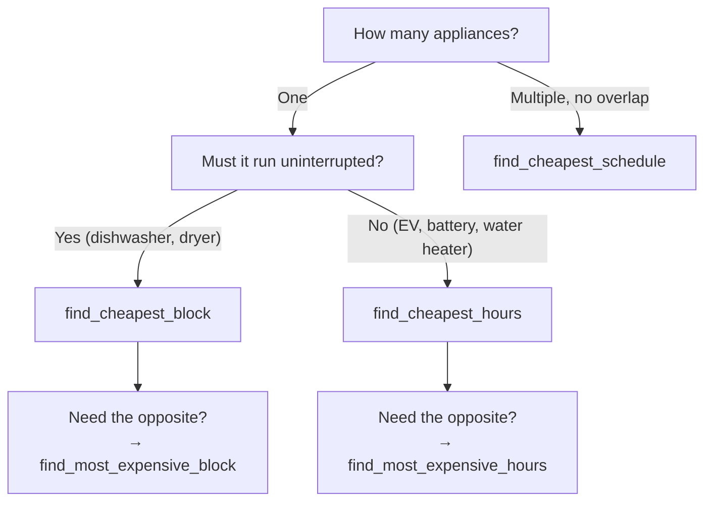

# Scheduling Actions

Find the cheapest (or most expensive) time windows for your appliances — automatically. These actions analyze real Tibber price data and return optimal scheduling recommendations.

:::tip Entity ID tip
`<home_name>` is a placeholder for your Tibber home display name in Home Assistant. Entity IDs are derived from the displayed name (localized), so the exact slug may differ. **Can't find a sensor?** Use the **[Entity Reference (All Languages)](sensor-reference.md)** to search by name in your language.
:::

## Overview

| Action | What It Does | Best For |
|--------|-------------|----------|
| [`find_cheapest_block`](#find-cheapest-block) | Finds the cheapest **contiguous** time window | Dishwasher, washing machine, dryer |
| [`find_cheapest_hours`](#find-cheapest-hours) | Finds the cheapest intervals (can be **non-contiguous**) | EV charging, battery storage, water heater |
| [`find_cheapest_schedule`](#find-cheapest-schedule) | Schedules **multiple appliances** without overlap | Dishwasher + washing machine + dryer overnight |
| [`find_most_expensive_block`](#find-most-expensive-block) | Finds the most expensive contiguous window | Avoid running appliances during peak prices |
| [`find_most_expensive_hours`](#find-most-expensive-hours) | Finds the most expensive intervals | Battery discharge optimization, peak avoidance |

## Choosing the Right Action



**Rules of thumb:**

- **Dishwasher, washing machine, dryer** → `find_cheapest_block` (must run X hours straight)
- **EV charging, battery, pool pump** → `find_cheapest_hours` (total runtime matters, not continuity)
- **Multiple independent appliances** → `find_cheapest_schedule` (prevents overlap + manages gaps)
- **Sequential chain (A must finish before B)** → 2× `find_cheapest_block` (use A's end as B's search start)
- **"When should I NOT run this?"** → `find_most_expensive_block` or `find_most_expensive_hours`

---

## Search Range

All scheduling actions share the same flexible search range options. You can define _when_ to look for cheap prices in several ways:

### Quick Scopes

The simplest approach — use `search_scope` for common time ranges:

| Scope | Start | End |
|-------|-------|-----|
| `today` | 00:00 today | 00:00 tomorrow |
| `tomorrow` | 00:00 tomorrow | 00:00 day after tomorrow |
| `remaining_today` | Now | 00:00 tomorrow |
| `next_24h` | Now | Now + 24 hours |
| `next_48h` | Now | Now + 48 hours |

<details>
<summary>Show YAML: Quick Scopes</summary>

```yaml
service: tibber_prices.find_cheapest_block
data:
  duration: "02:00:00"
  search_scope: tomorrow
```

</details>

### Explicit Start/End

For full control, specify exact datetime values:

<details>
<summary>Show YAML: Explicit Start and End</summary>

```yaml
service: tibber_prices.find_cheapest_block
data:
  duration: "02:00:00"
  search_start: "2026-04-11T22:00:00+02:00"
  search_end: "2026-04-12T06:00:00+02:00"
```

</details>

### Time-of-Day with Day Offset

Schedule relative to today using time + day offset:

<details>
<summary>Show YAML: Time of Day with Offset</summary>

```yaml
service: tibber_prices.find_cheapest_block
data:
  duration: "02:00:00"
  search_start_time: "22:00:00"       # 22:00 today
  search_end_time: "06:00:00"
  search_end_day_offset: 1            # 06:00 tomorrow
```

</details>

### Minute Offsets from Now

For relative searches:

<details>
<summary>Show YAML: Relative Minute Offsets</summary>

```yaml
service: tibber_prices.find_cheapest_block
data:
  duration: "01:30:00"
  search_start_offset_minutes: 0      # Starting now
  search_end_offset_minutes: 480      # Next 8 hours
```

</details>

### Default Behavior

If you omit all range parameters, the search covers **now until the end of tomorrow** — the maximum window with available price data.

:::caution Don't mix scopes with explicit ranges
`search_scope` cannot be combined with explicit range parameters (`search_start`, `search_end`, etc.). Use one approach or the other.
:::

---

## Common Parameters

These parameters are available across all scheduling actions:

| Parameter | Description | Default |
|-----------|-------------|---------|
| `entry_id` | Config entry ID. Auto-selects if you only have one home. | Auto |
| `include_current_interval` | Include the currently running 15-minute interval in the search? | `true` |
| `min_price_level` | Only consider intervals at or above this Tibber level | — |
| `max_price_level` | Only consider intervals at or below this Tibber level | — |
| `smooth_outliers` | Smooth price outliers before searching (see [below](#outlier-smoothing)) | `true` |
| `min_distance_from_avg` | Require result to differ from average by X% (see [below](#minimum-distance-from-average)) | — |
| `allow_relaxation` | Progressively loosen filters to guarantee a result (see [below](#relaxation)) | `true` |
| `duration_flexibility_minutes` | Max minutes the duration may be shortened during relaxation (see [below](#relaxation)) | Auto |
| `power_profile` | Watt values per 15-min interval for accurate cost estimates | — |
| `use_base_unit` | Use base currency (EUR, NOK) instead of subunit (ct, øre) | `false` |

:::note `min_distance_from_avg` availability
`min_distance_from_avg` is available in `find_cheapest_block`, `find_most_expensive_block`, `find_cheapest_hours`, and `find_most_expensive_hours`. It is **not** available in `find_cheapest_schedule` (multi-task semantics make a single threshold ambiguous).
:::

### Price Level Filtering

Restrict the search to specific Tibber price levels. Levels from lowest to highest: `very_cheap`, `cheap`, `normal`, `expensive`, `very_expensive`.

<details>
<summary>Show YAML: Price Level Filtering</summary>

```yaml
# Only search within cheap or very cheap intervals
service: tibber_prices.find_cheapest_block
data:
  duration: "02:00:00"
  search_scope: next_24h
  max_price_level: cheap    # Exclude normal, expensive, very_expensive
```

</details>

### Power Profile

By default, cost estimates assume a constant 1 kW load. If your appliance has variable power draw, provide a power profile — **one watt value per 15-minute interval**:

<details>
<summary>Show YAML: Power Profile</summary>

```yaml
# Washing machine: high power for heating, then less
service: tibber_prices.find_cheapest_block
data:
  duration: "01:30:00"     # 6 intervals × 15 min
  power_profile:
    - 2200  # Interval 1: Heating water (2.2 kW)
    - 2200  # Interval 2: Heating continues
    - 800   # Interval 3: Washing cycle
    - 800   # Interval 4: Washing cycle
    - 1500  # Interval 5: Spin cycle
    - 500   # Interval 6: Final rinse
```

  </details>

The service then calculates `estimated_total_cost` using the actual power draw per interval instead of flat 1 kW, and adds `estimated_load_kwh` (total energy consumed) to the response.

:::info Duration and profile must match
The number of entries in `power_profile` must exactly match the number of 15-minute intervals in `duration`. A 2-hour duration needs 8 entries.
:::

### Outlier Smoothing

Enabled by default. A single extreme price spike (or dip) can pull the "cheapest" window away from a genuinely good period. With `smooth_outliers: true`, outlier intervals are temporarily replaced by the average of their neighbors before the search runs. **The response always shows original (unsmoothed) prices** — smoothing only affects _which_ window is selected.

Set `smooth_outliers: false` to disable:

```yaml
service: tibber_prices.find_cheapest_block
data:
  duration: "02:00:00"
  search_scope: next_24h
  smooth_outliers: false
```

### Minimum Distance from Average

Opt-in quality gate. Ensures the found result is meaningfully different from the search-range average — not just "the cheapest, but still close to average".

- **For cheapest:** the result must be at least X% _below_ the average.
- **For most expensive:** the result must be at least X% _above_ the average.

If the condition is not met, **no result is returned** and the `reason` field explains why (`window_above_distance_threshold` for blocks, `selection_above_distance_threshold` for hours — or `..._below_...` for most expensive).

```yaml
# Only return a result if it's at least 10% cheaper than average
service: tibber_prices.find_cheapest_block
data:
  duration: "02:00:00"
  search_scope: today
  min_distance_from_avg: 10.0
```

:::tip When to use `min_distance_from_avg`
On days with flat prices (all intervals nearly the same), the "cheapest" window may only be marginally cheaper than any other. Use `min_distance_from_avg` to avoid scheduling an appliance for negligible savings — and instead run it whenever convenient.
:::

### Coefficient of Variation

All scheduling action responses include a `coefficient_of_variation` field in their statistics. This measures the relative price spread within the found window (standard deviation ÷ mean, as a ratio). A low value (e.g., 0.05) means prices are very uniform; a high value (e.g., 0.30) means prices vary significantly within the window.

You can use this in automations to decide whether the found window is "good enough":

```yaml
# Only start if prices within the window are reasonably uniform
condition: template
value_template: >
  {{ action_response.window.coefficient_of_variation < 0.15 }}
```

### Relaxation

Enabled by default. Relaxation ensures you **always get a result**, even when your filters are too strict for the available price data. Without relaxation, a tight `max_price_level` or `min_distance_from_avg` could return nothing — leaving your automation without a plan. With relaxation, the service progressively loosens constraints until a window is found.

**How it works:**

Relaxation proceeds in three phases, stopping as soon as a result is found:

1. **Distance relaxation** — Halves `min_distance_from_avg`, then removes it entirely
2. **Level filter relaxation** — Gradually widens the allowed price level range (e.g., `very_cheap` → `cheap` → `normal` → any)
3. **Duration reduction** — Shortens the duration by one interval (15 min) per step, down to a minimum of 30 minutes

Each phase tries the least invasive change first. If phase 1 produces a result, phases 2 and 3 are never attempted.

:::tip When does relaxation activate?
Relaxation only activates when the original parameters return no result. If your filters already find a window, relaxation does nothing — there is zero overhead.
:::

**Parameters:**

| Parameter | Type | Default | Description |
|-----------|------|---------|-------------|
| `allow_relaxation` | boolean | `true` | Enable progressive filter relaxation. Set to `false` for strict mode (fail if nothing matches). |
| `duration_flexibility_minutes` | number | Auto | Maximum minutes the duration may be shortened (0–120, in 15-min steps). If omitted, calculated automatically based on the requested duration. |

```yaml
# Opt out of relaxation (strict mode)
service: tibber_prices.find_cheapest_block
data:
  duration: "02:00:00"
  search_scope: next_24h
  allow_relaxation: false
```

```yaml
# Allow up to 30 min shorter than requested
service: tibber_prices.find_cheapest_block
data:
  duration: "02:00:00"
  search_scope: next_24h
  duration_flexibility_minutes: 30
```

**Response metadata:**

When relaxation is applied, the response includes extra fields:

| Field | Description |
|-------|-------------|
| `relaxation_applied` | `true` if filters were relaxed to find the result, `false` if original parameters succeeded |
| `relaxation_steps` | Number of relaxation steps applied (only present when `relaxation_applied` is `true`) |
| `duration_minutes` | Effective duration (may be shorter than `duration_minutes_requested` if duration was reduced) |

If all relaxation steps are exhausted without finding a result, the response still indicates failure with `reason: "relaxation_exhausted"`.

```yaml
# Check if relaxation was needed in your automation
- if: "{{ result.window_found and not result.relaxation_applied }}"
  then:
    - service: notify.mobile_app
      data:
        message: "Found optimal window at original settings"
- if: "{{ result.window_found and result.relaxation_applied }}"
  then:
    - service: notify.mobile_app
      data:
        message: >
          Found window after {{ result.relaxation_steps }} relaxation steps.
          Effective duration: {{ result.duration_minutes }} min
          (requested: {{ result.duration_minutes_requested }} min)
```

:::note Schedule service differences
For `find_cheapest_schedule`, relaxation works slightly differently: phase 1 (distance) is skipped because the schedule service does not support `min_distance_from_avg`. Level filter relaxation and duration reduction apply to all tasks uniformly.
:::

---

## Find Cheapest Block

Finds the single cheapest **contiguous** time window of a given duration.

**Use when:** Your appliance must run uninterrupted for a fixed time.

### Basic Example

<details>
<summary>Show YAML: Find Cheapest Block</summary>

```yaml
service: tibber_prices.find_cheapest_block
data:
  duration: "02:00:00"
  search_scope: next_24h
response_variable: result
```

</details>

### Example with All Options

<details>
<summary>Show YAML: Cheapest Block with All Options</summary>

```yaml
service: tibber_prices.find_cheapest_block
data:
  duration: "02:00:00"
  search_scope: next_24h
  max_price_level: normal
  power_profile: [2200, 2200, 800, 800, 1500, 500, 400, 200]
  include_comparison_details: true
  include_current_interval: false
response_variable: result
```

</details>

### Response

<details>
<summary>Show JSON: Cheapest Block Example Response</summary>

```json
{
  "home_id": "abc-123",
  "search_start": "2026-04-11T14:00:00+02:00",
  "search_end": "2026-04-12T14:00:00+02:00",
  "duration_minutes_requested": 120,
  "duration_minutes": 120,
  "currency": "EUR",
  "price_unit": "ct/kWh",
  "window_found": true,
  "window": {
    "start": "2026-04-12T02:00:00+02:00",
    "end": "2026-04-12T04:00:00+02:00",
    "duration_minutes": 120,
    "interval_count": 8,
    "price_mean": 14.25,
    "price_median": 13.90,
    "price_min": 12.00,
    "price_max": 16.80,
    "price_spread": 4.80,
    "estimated_total_cost": 28.50,
    "intervals": [
      {
        "starts_at": "2026-04-12T02:00:00+02:00",
        "ends_at": "2026-04-12T02:15:00+02:00",
        "price": 12.00,
        "level": "very_cheap",
        "rating_level": "low"
      }
    ]
  },
  "price_comparison": {
    "comparison_price_mean": 32.10,
    "price_difference": 17.85,
    "comparison_window_start": "2026-04-11T18:00:00+02:00"
  }
}
```

</details>

**Key response fields:**

| Field | Description |
|-------|-------------|
| `window_found` | `true` if a window was found, `false` if no intervals match the criteria |
| `window.start` / `window.end` | When to start and stop the appliance |
| `window.price_mean` | Average price during the window |
| `window.estimated_total_cost` | Estimated cost (assumes 1 kW unless `power_profile` provided) |
| `price_comparison` | How this window compares to the most expensive alternative |
| `price_comparison.price_difference` | How much cheaper this window is vs. the most expensive option |
| `relaxation_applied` | `true` if [relaxation](#relaxation) was needed to find the result |
| `relaxation_steps` | Number of relaxation steps applied (only when `relaxation_applied` is `true`) |
| `duration_minutes` | Effective duration — may differ from `duration_minutes_requested` after relaxation |

### Use in Automations

**Prerequisite:** Create an `input_datetime.dishwasher_start` helper (type: Date and time) in **Settings → Helpers**.

<details>
<summary>Show YAML: Dishwasher Automation (Plan + Execute)</summary>

```yaml
automation:
  # Step 1: Plan the cheapest start time every evening
  - alias: "Dishwasher - Plan Cheapest Start"
    trigger:
      - platform: time
        at: "20:00:00"
    action:
      - service: tibber_prices.find_cheapest_block
        data:
          duration: "02:00:00"
          search_start_time: "20:00:00"
          search_end_time: "06:00:00"
          search_end_day_offset: 1
        response_variable: result
      - if: "{{ result.window_found }}"
        then:
          - service: input_datetime.set_datetime
            target:
              entity_id: input_datetime.dishwasher_start
            data:
              datetime: "{{ result.window.start }}"

  # Step 2: Start the dishwasher at the stored time (survives HA restarts)
  - alias: "Dishwasher - Start at Planned Time"
    trigger:
      - platform: time
        at: input_datetime.dishwasher_start
    action:
      # Option A: Smart appliance via Home Connect (see tip below)
      # Option B: Smart plug
      - service: switch.turn_on
        target:
          entity_id: switch.dishwasher_smart_plug
```

</details>

:::tip Home Connect instead of smart plugs
If you have a **Bosch/Siemens appliance with Home Connect**, you can start the program directly instead of using a smart plug. See [Automation Examples — Home Connect tip](automation-examples.md#dishwasher-find-cheapest-2-hour-window-tonight) for exact service call syntax for both the official and alternative integration.
:::

---

## Find Cheapest Hours

Finds the cheapest N minutes of intervals within a search range. Intervals **do not need to be contiguous** — the service picks the cheapest individual 15-minute slots and groups them into segments.

**Use when:** Your device can pause and resume freely (EV charger, battery storage, pool pump).

### Basic Example

<details>
<summary>Show YAML: Find Cheapest Hours</summary>

```yaml
service: tibber_prices.find_cheapest_hours
data:
  duration: "04:00:00"
  search_scope: next_24h
response_variable: result
```

</details>

### With Minimum Segment Duration

Some devices shouldn't cycle on/off too rapidly. Use `min_segment_duration` to ensure each contiguous run is at least a minimum length:

<details>
<summary>Show YAML: With Minimum Segment Duration</summary>

```yaml
# EV charger: 3 hours total, but each charging session at least 30 min
service: tibber_prices.find_cheapest_hours
data:
  duration: "03:00:00"
  min_segment_duration: "00:30:00"
  search_scope: next_24h
response_variable: result
```

</details>

### Response

<details>
<summary>Show JSON: Cheapest Hours Example Response</summary>

```json
{
  "home_id": "abc-123",
  "search_start": "2026-04-11T14:00:00+02:00",
  "search_end": "2026-04-12T14:00:00+02:00",
  "total_minutes_requested": 240,
  "total_minutes": 240,
  "currency": "EUR",
  "price_unit": "ct/kWh",
  "intervals_found": true,
  "schedule": {
    "total_minutes": 240,
    "interval_count": 16,
    "price_mean": 13.50,
    "price_median": 13.20,
    "price_min": 10.80,
    "price_max": 16.30,
    "price_spread": 5.50,
    "estimated_total_cost": 54.00,
    "segment_count": 3,
    "segments": [
      {
        "start": "2026-04-11T23:00:00+02:00",
        "end": "2026-04-12T00:30:00+02:00",
        "duration_minutes": 90,
        "interval_count": 6,
        "price_mean": 11.20,
        "intervals": []
      },
      {
        "start": "2026-04-12T02:00:00+02:00",
        "end": "2026-04-12T03:15:00+02:00",
        "duration_minutes": 75,
        "interval_count": 5,
        "price_mean": 12.80,
        "intervals": []
      },
      {
        "start": "2026-04-12T05:00:00+02:00",
        "end": "2026-04-12T06:15:00+02:00",
        "duration_minutes": 75,
        "interval_count": 5,
        "price_mean": 16.00,
        "intervals": []
      }
    ],
    "intervals": []
  },
  "price_comparison": {
    "comparison_price_mean": 28.50,
    "price_difference": 15.00
  }
}
```

</details>

**Key response fields:**

| Field | Description |
|-------|-------------|
| `intervals_found` | `true` if enough cheap intervals were found |
| `schedule.segment_count` | How many separate contiguous runs the schedule has |
| `schedule.segments[]` | Each continuous "on" period with its own start/end and price stats |
| `schedule.intervals[]` | All selected intervals in chronological order |
| `relaxation_applied` | `true` if [relaxation](#relaxation) was needed to find the result |
| `relaxation_steps` | Number of relaxation steps applied (only when `relaxation_applied` is `true`) |
| `total_minutes` | Effective total duration — may differ from `total_minutes_requested` after relaxation |

---

## Find Cheapest Schedule

Schedules **multiple appliances** within the same search range, ensuring they don't overlap. Each appliance gets its own cheapest contiguous time window.

**Use when:** You have multiple appliances sharing a circuit or you want to avoid running them at the same time (e.g., limited main fuse capacity).

### How It Works

1. Tasks are sorted by duration (longest first — harder to place)
2. The longest task claims the cheapest contiguous block
3. Those intervals are marked as **unavailable**
4. The next task finds the cheapest block in the **remaining** intervals
5. Optional gap between tasks ensures a pause (e.g., for shared plumbing or circuit recovery)

### Basic Example

<details>
<summary>Show YAML: Find Cheapest Schedule</summary>

```yaml
service: tibber_prices.find_cheapest_schedule
data:
  tasks:
    - name: dishwasher
      duration: "02:00:00"
    - name: washing_machine
      duration: "01:30:00"
  search_scope: next_24h
response_variable: result
```

</details>

### With Gap and Power Profiles

<details>
<summary>Show YAML: With Gap and Power Profiles</summary>

```yaml
service: tibber_prices.find_cheapest_schedule
data:
  tasks:
    - name: dishwasher
      duration: "02:00:00"
      power_profile: [2200, 2200, 800, 800, 1500, 500, 400, 200]
    - name: washing_machine
      duration: "01:30:00"
      power_profile: [2000, 2000, 800, 800, 1200, 500]
    - name: dryer
      duration: "01:00:00"
      power_profile: [2500, 2500, 2000, 1500]
  gap_minutes: 15
  search_start_time: "22:00:00"
  search_end_time: "07:00:00"
  search_end_day_offset: 1
response_variable: result
```

</details>

### Response

<details>
<summary>Show JSON: Cheapest Schedule Example Response</summary>

```json
{
  "home_id": "abc-123",
  "search_start": "2026-04-11T22:00:00+02:00",
  "search_end": "2026-04-12T07:00:00+02:00",
  "currency": "EUR",
  "price_unit": "ct/kWh",
  "all_tasks_scheduled": true,
  "unscheduled_tasks": null,
  "tasks": [
    {
      "name": "dishwasher",
      "start": "2026-04-12T00:00:00+02:00",
      "end": "2026-04-12T02:00:00+02:00",
      "duration_minutes_requested": 120,
      "duration_minutes": 120,
      "price_mean": 12.30,
      "price_median": 12.10,
      "price_min": 10.50,
      "price_max": 14.20,
      "price_spread": 3.70,
      "estimated_total_cost": 24.60,
      "intervals": []
    },
    {
      "name": "washing_machine",
      "start": "2026-04-12T02:15:00+02:00",
      "end": "2026-04-12T03:45:00+02:00",
      "duration_minutes_requested": 90,
      "duration_minutes": 90,
      "price_mean": 13.80,
      "price_median": 13.50,
      "price_min": 12.00,
      "price_max": 16.10,
      "price_spread": 4.10,
      "estimated_total_cost": 20.70,
      "intervals": []
    },
    {
      "name": "dryer",
      "start": "2026-04-12T04:00:00+02:00",
      "end": "2026-04-12T05:00:00+02:00",
      "duration_minutes_requested": 60,
      "duration_minutes": 60,
      "price_mean": 14.50,
      "price_median": 14.30,
      "price_min": 13.80,
      "price_max": 15.40,
      "price_spread": 1.60,
      "estimated_total_cost": 14.50,
      "intervals": []
    }
  ],
  "total_estimated_cost": 59.80
}
```

</details>

**Key response fields:**

| Field | Description |
|-------|-------------|
| `all_tasks_scheduled` | `true` if every task found a slot, `false` if some couldn't fit |
| `unscheduled_tasks` | List of task names that couldn't be placed (or `null` if all succeeded) |
| `tasks[]` | Each task with its assigned time window and price statistics |
| `tasks[].start` / `tasks[].end` | When to start and stop each appliance |
| `total_estimated_cost` | Combined cost across all tasks |
| `relaxation_applied` | `true` if [relaxation](#relaxation) was needed to schedule all tasks |
| `relaxation_steps` | Number of relaxation steps applied (only when `relaxation_applied` is `true`) |

### Why Not Just Call find_cheapest_block Multiple Times?

If you call `find_cheapest_block` separately for each appliance, they might all find the **same** cheap time window. `find_cheapest_schedule` solves this by tracking which intervals are already claimed — each appliance gets its own non-overlapping slot.

:::caution No ordering guarantee
`find_cheapest_schedule` optimizes purely for **price** — it does not guarantee task order. The dryer could be scheduled before the washing machine if that's cheaper. For sequential workflows (washing machine → dryer), use **two sequential `find_cheapest_block` calls** where the second call starts after the first result ends. See [Automation Examples — Sequential Scheduling](automation-examples.md#washing-machine--dryer-sequential-scheduling) for a complete example.
:::

### Gap Minutes

Use `gap_minutes` to add a mandatory pause between appliances:

- **Shared plumbing**: 15 min gap between dishwasher and washing machine
- **Circuit protection**: 30 min gap to let cables cool down
- **Heat pump compressor**: 15–30 min cool-down between cycles

The gap is rounded up to the nearest 15 minutes (quarter-hour granularity).

---

## Find Most Expensive Block

The opposite of `find_cheapest_block` — finds the most expensive contiguous window.

**Parameters:** Identical to `find_cheapest_block`.

**Response:** Same structure. The `price_comparison` compares against the cheapest block.

<details>
<summary>Show YAML: Find Most Expensive Block</summary>

```yaml
service: tibber_prices.find_most_expensive_block
data:
  duration: "02:00:00"
  search_scope: tomorrow
response_variable: peak
```

</details>

**Use cases:**
- "When should I definitely NOT run my washing machine?"
- Schedule battery discharge during peak prices
- Send notifications before expensive periods start

---

## Find Most Expensive Hours

The opposite of `find_cheapest_hours` — finds the most expensive intervals (non-contiguous).

**Parameters:** Identical to `find_cheapest_hours` (including `min_segment_duration`).

**Response:** Same structure. The `price_comparison` compares against the cheapest hours.

<details>
<summary>Show YAML: Find Most Expensive Hours</summary>

```yaml
service: tibber_prices.find_most_expensive_hours
data:
  duration: "04:00:00"
  search_scope: tomorrow
response_variable: peak
```

</details>

**Use cases:**
- Battery discharge optimization: sell stored energy during the most expensive 4 hours
- Demand response: reduce consumption during the most expensive periods
- Peak avoidance alerts: notify before expensive intervals start

---

## Practical Examples

:::tip Restart-safe automations
All examples below use `input_datetime` helpers to store planned start times. This ensures your schedule **survives HA restarts** — unlike `delay` or `wait_for_trigger` which are lost on restart.

**Setup:** Create an `input_datetime` helper per appliance in **Settings → Devices & Services → Helpers → Create Helper → Date and/or time** (choose "Date and time").
:::

### Overnight Appliance Scheduling

Schedule dishwasher + washing machine to run overnight at cheapest prices, with a 15-minute gap between them. These appliances are **independent** — either can run first.

:::tip Sequential appliances (e.g., washer → dryer)?
If one appliance **must** finish before another starts, don't use `find_cheapest_schedule` — it doesn't guarantee order. Use **two sequential `find_cheapest_block` calls** instead. See [Automation Examples — Sequential Scheduling](automation-examples.md#washing-machine--dryer-sequential-scheduling).
:::

**Prerequisites:** Create `input_datetime.dishwasher_start` and `input_datetime.washing_machine_start` helpers.

<details>
<summary>Show YAML: Overnight Appliance Scheduling (Plan + Execute)</summary>

```yaml
automation:
  # Planning automation — runs every evening
  - alias: "Laundry - Plan Overnight Schedule"
    trigger:
      - platform: time
        at: "21:00:00"
    action:
      - service: tibber_prices.find_cheapest_schedule
        data:
          tasks:
            - name: dishwasher
              duration: "02:00:00"
            - name: washing_machine
              duration: "01:30:00"
          gap_minutes: 15
          search_start_time: "22:00:00"
          search_end_time: "06:00:00"
          search_end_day_offset: 1
        response_variable: schedule
      - if: "{{ schedule.all_tasks_scheduled }}"
        then:
          # Store start times in helpers (survives HA restarts)
          - service: input_datetime.set_datetime
            target:
              entity_id: input_datetime.dishwasher_start
            data:
              datetime: >
                {{ schedule.tasks | selectattr('name', 'eq', 'dishwasher')
                | map(attribute='start') | first }}
          - service: input_datetime.set_datetime
            target:
              entity_id: input_datetime.washing_machine_start
            data:
              datetime: >
                {{ schedule.tasks | selectattr('name', 'eq', 'washing_machine')
                | map(attribute='start') | first }}
          - service: notify.mobile_app
            data:
              title: "🧺 Laundry Planned"
              message: >
                Dishwasher: {{ (schedule.tasks | selectattr('name', 'eq', 'dishwasher')
                | map(attribute='start') | first) | as_datetime | as_local
                | as_timestamp | timestamp_custom('%H:%M') }}
                Washing machine: {{ (schedule.tasks | selectattr('name', 'eq', 'washing_machine')
                | map(attribute='start') | first) | as_datetime | as_local
                | as_timestamp | timestamp_custom('%H:%M') }}
                Total cost: ~{{ schedule.total_estimated_cost | round(1) }}
                {{ schedule.currency }}

  # Execution automations — trigger at stored times
  - alias: "Dishwasher - Start at Planned Time"
    trigger:
      - platform: time
        at: input_datetime.dishwasher_start
    action:
      # Use Home Connect or smart plug — see automation-examples.md
      - service: switch.turn_on
        target:
          entity_id: switch.dishwasher_smart_plug

  - alias: "Washing Machine - Start at Planned Time"
    trigger:
      - platform: time
        at: input_datetime.washing_machine_start
    action:
      - service: switch.turn_on
        target:
          entity_id: switch.washing_machine_smart_plug
```

</details>

### EV Charging During Cheapest 4 Hours

**Prerequisite:** Create `input_datetime.ev_charge_start` helper.

<details>
<summary>Show YAML: EV Charging in Cheapest 4 Hours</summary>

```yaml
automation:
  - alias: "EV - Plan Cheapest Charging"
    trigger:
      - platform: time
        at: "18:00:00"
    condition:
      - condition: numeric_state
        entity_id: sensor.ev_battery_level
        below: 80
    action:
      - service: tibber_prices.find_cheapest_hours
        data:
          duration: "04:00:00"
          min_segment_duration: "00:30:00"
          search_start_time: "18:00:00"
          search_end_time: "07:00:00"
          search_end_day_offset: 1
        response_variable: charging
      - if: "{{ charging.intervals_found }}"
        then:
          # Store first segment start time
          - service: input_datetime.set_datetime
            target:
              entity_id: input_datetime.ev_charge_start
            data:
              datetime: "{{ charging.schedule.segments[0].start }}"
          - service: notify.mobile_app
            data:
              title: "🔌 EV Charging Planned"
              message: >
                {{ charging.schedule.segment_count }} sessions:
                
                • {{ seg.start | as_datetime | as_local
                | as_timestamp | timestamp_custom('%H:%M') }}–{{ seg.end
                | as_datetime | as_local | as_timestamp
                | timestamp_custom('%H:%M') }}
                ({{ seg.price_mean | round(1) }} {{ charging.price_unit }})
                
                Savings vs. peak: {{ charging.price_comparison.price_difference
                | round(1) }} {{ charging.price_unit }}
```

</details>

:::tip Simpler alternative for EV charging
If your charger can't pause/resume, use `find_cheapest_block` instead for one contiguous window. See the [Automation Examples](automation-examples.md#ev-charging-cheapest-4-hours-overnight) for a complete example.
:::

### Peak Price Warning

<details>
<summary>Show YAML: Peak Price Warning</summary>

```yaml
automation:
  - alias: "Peak Price - Morning Warning"
    trigger:
      - platform: time
        at: "07:00:00"
    action:
      - service: tibber_prices.find_most_expensive_block
        data:
          duration: "02:00:00"
          search_scope: today
        response_variable: peak
      - if: "{{ peak.window_found }}"
        then:
          - service: notify.mobile_app
            data:
              title: "⚡ Expensive Period Today"
              message: >
                Avoid heavy loads between
                {{ peak.window.start | as_datetime | as_local
                | as_timestamp | timestamp_custom('%H:%M') }}
                and {{ peak.window.end | as_datetime | as_local
                | as_timestamp | timestamp_custom('%H:%M') }}.
                Average price: {{ peak.window.price_mean | round(1) }}
                {{ peak.price_unit }}
```

</details>

---

## Technical Notes

### Duration Rounding

All durations are rounded **up** to the nearest 15 minutes because Tibber price data has quarter-hourly resolution. A 20-minute duration becomes 30 minutes (2 intervals). A 2-hour duration stays at 120 minutes (8 intervals).

### Comparison Details

Add `include_comparison_details: true` to `find_cheapest_block` or `find_cheapest_hours` to get extra fields in the comparison:

<details>
<summary>Show YAML: Comparison Details</summary>

```yaml
service: tibber_prices.find_cheapest_block
data:
  duration: "02:00:00"
  include_comparison_details: true
```

</details>

This adds `comparison_price_min`, `comparison_price_max`, and `comparison_window_end` to the `price_comparison` object.

### Response When No Window Found

If no intervals match your criteria (e.g., the search range is too short, all intervals are filtered out by price level), the response indicates failure:

- `find_cheapest_block`: `"window_found": false, "window": null`
- `find_cheapest_hours`: `"intervals_found": false, "schedule": null`
- `find_cheapest_schedule`: `"all_tasks_scheduled": false, "unscheduled_tasks": ["task_name"]`

The `reason` field contains a stable machine-readable code you can use in automations:

| Reason Code | Meaning |
|-------------|---------|
| `no_data_in_range` | No price data available for the search range |
| `no_intervals_matching_level_filter` | Level filter excluded all intervals |
| `insufficient_intervals_after_filter` | Not enough intervals left after filtering |
| `insufficient_intervals_for_constraints` | Enough intervals, but constraints (min segment) can't be met |
| `window_above_distance_threshold` | Block found, but not far enough below average (`min_distance_from_avg`) |
| `window_below_distance_threshold` | Most expensive block found, but not far enough above average |
| `selection_above_distance_threshold` | Hours found, but not far enough below average (`min_distance_from_avg`) |
| `selection_below_distance_threshold` | Most expensive hours found, but not far enough above average |
| `relaxation_exhausted` | All relaxation steps tried, still no result (only when `allow_relaxation: true`) |

Always check the failure fields in your automations before using the results.
