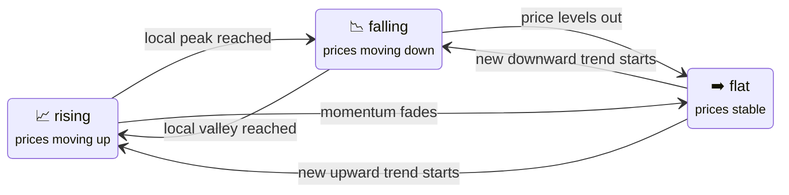

# Price Phase Sensors

:::tip Entity ID tip
`<home_name>` is a placeholder for your Tibber home display name in Home Assistant. Entity IDs are derived from the displayed name (localized), so the exact slug may differ. **Can't find a sensor?** Use the **[Entity Reference (All Languages)](sensor-reference.md)** to search by name in your language.
:::

Price Phase sensors tell you **where you are in the intra-day price curve** — whether prices are currently rising, falling, or flat, how long that phase lasts, and when specific phase types will occur next. They complement the [Trend Sensors](sensors-trends.md) (which compare current price against future averages) by giving you the structural shape of the day.

---

## Price Phases vs. Price Trends — What's the Difference?

Both sensor families answer "What are prices doing?" — but from different angles:

| | Price Phase Sensors | Trend Sensors |
|--|---------------------|--------------|
| **What they answer** | "Are we in a rising or falling stretch right now?" | "Is now cheaper or more expensive than the next N hours?" |
| **Based on** | Structural shape of the intra-day price curve | Comparison of current price vs. future window average |
| **Best for** | Understanding position in the day's price arc | Deciding whether to act now or wait |
| **Example** | "We're in a falling phase that ends at 15:30" | "Current price is 12% below the next 3h average" |

Think of price phases as the **skeleton of the day** and trend sensors as **real-time navigation**. Phases show you the map; trends show you which direction to drive.

---

## The Three Price Phases

Prices within a day are split into consecutive monotone segments — stretches where the direction is consistently one of:



**Exactly one phase is always active.** The three [binary sensors](#binary-phase-sensors) mirror this — exactly one of `in_rising_price_phase`, `in_falling_price_phase`, and `in_flat_price_phase` is ON at any time.

:::info Why only 3 phases?
Each phase segment is **monotone by definition** — it is either purely rising, purely falling, or flat. A "double valley" (W-shape) is not a single phase; it is a sequence of: _falling → flat → rising → flat → falling_. The [Day Pattern sensor](#day-pattern-sensors) gives you the composite day shape; the phase sensors tell you your current position within it.
:::

---

## Day Pattern Sensors

These sensors classify the **overall shape** of the day's price curve:

| Sensor | Entity ID | Default |
|--------|-----------|---------|
| **Today's Price Pattern** (`day_pattern_today`) | `sensor.<home_name>_day_pattern_today` | ✅ enabled |
| **Tomorrow's Price Pattern** (`day_pattern_tomorrow`) | `sensor.<home_name>_day_pattern_tomorrow` | ❌ disabled |
| **Yesterday's Price Pattern** (`day_pattern_yesterday`) | `sensor.<home_name>_day_pattern_yesterday` | ❌ disabled |

**States:**

| State | Shape | Description |
|-------|-------|-------------|
| `valley` | ∪ | Cheap in the middle of the day — covers both **V-shaped** (short, sharp dip) and **U-shaped** (extended cheap plateau) curves. Common during solar midday surplus or low-demand nights. |
| `peak` | ∩ | Expensive in the middle — cheap mornings and evenings. Covers both sharp Λ-peaks and broad plateau shapes. |
| `double_dip` | W | Two cheap windows — classic with cheap morning + cheap midday |
| `duck_curve` | M | Two expensive peaks — common on workdays with morning and evening demand (named after the energy industry's [duck curve](https://en.wikipedia.org/wiki/Duck_curve)) |
| `flat` | ─ | Little variation throughout the day |
| `rising` | / | Prices climb steadily through the day |
| `falling` | \ | Prices drop steadily through the day |
| `mixed` | ∿ | Irregular shape that doesn't fit a clean category |

**Key attributes:**

| Attribute | Description | Example |
|-----------|-------------|---------|
| `confidence` | Detection reliability (0–1) | `0.87` |
| `coefficient_of_variation` | Relative price spread (volatility measure) | `0.24` |
| `valley_start` / `valley_end` | Start/end of the primary cheap window | `11:00` / `15:00` |
| `peak_start` / `peak_end` | Start/end of the primary expensive window | `07:00` / `09:00` |
| `segment_count` | Number of intra-day phase segments | `4` |

**Example — Schedule based on tomorrow's pattern:**

<details>
<summary>Show YAML: Pre-schedule heat pump based on tomorrow's valley</summary>

```yaml
automation:
  - alias: "Pre-schedule: Heat pump tomorrow's valley"
    trigger:
      - platform: time
        at: "20:00:00"
    condition:
      - condition: template
        value_template: >
          {{ states('sensor.<home_name>_day_pattern_tomorrow') in ['valley', 'double_dip'] }}
      - condition: template
        value_template: >
          {{ is_state('binary_sensor.<home_name>_tomorrow_data_available', 'on') }}
    action:
      - service: notify.mobile_app
        data:
          message: >
            Tomorrow is a {{ states('sensor.<home_name>_day_pattern_tomorrow') }} day.
            Cheap window: {{ state_attr('sensor.<home_name>_day_pattern_tomorrow', 'valley_start') }}
            to {{ state_attr('sensor.<home_name>_day_pattern_tomorrow', 'valley_end') }}.
```

</details>

---

## Current and Next Price Phase

### Current Price Phase

**Entity ID:** `sensor.<home_name>_current_price_phase`

Shows which price phase is active right now: `rising`, `falling`, or `flat`. Along with the [binary phase sensors](#binary-phase-sensors) and [timing sensors](#phase-timing-sensors), this gives you a complete picture of your position in the day's price arc.

**Key attributes:**

| Attribute | Description | Example |
|-----------|-------------|---------|
| `start` | When this phase started | `2025-11-08T12:00:00+01:00` |
| `end` | When this phase ends | `2025-11-08T15:30:00+01:00` |
| `price_min` | Lowest price in this phase | `11.2` |
| `price_max` | Highest price in this phase | `18.7` |
| `price_mean` | Average price in this phase | `14.5` |
| `segment_index` | Position of this phase (0-based) | `1` |
| `segment_count` | Total number of phases today | `4` |
| `all_segments` | Full list of today's phases with times and prices | `[...]` |

**Tip:** `segment_index` and `segment_count` tell you your position in the day. If `segment_index=0` and the phase is `rising`, prices have been rising since midnight. If `segment_index=segment_count-1`, this is the final phase of the day.

### Next Price Phase

**Entity ID:** `sensor.<home_name>_next_price_phase`

Shows the phase that will follow after the current one ends. When the current phase is the last of the day, this sensor becomes unavailable. Same states and attributes as the Current Price Phase sensor.

**Use case:** Combine current and next to anticipate transitions:

| Current → Next | Interpretation |
|----------------|----------------|
| `rising` → `flat` | Peak is about to level off — consider acting now before it falls further |
| `falling` → `rising` | We're at or near the daily minimum — best window to start flexible loads |
| `falling` → `flat` | Approaching the stable bottom — prices won't drop much more |
| `flat` → `rising` | Stable prices are ending — prices will start climbing |
| `flat` → `falling` | Further drops are coming — wait if you can |

---

## Binary Phase Sensors

Three binary sensors let you trigger automations directly on the current phase type:

| Sensor | Entity ID | Default |
|--------|-----------|---------|
| <EntityRef id="in_rising_price_phase">In Rising Price Phase</EntityRef> | `binary_sensor.<home_name>_in_rising_price_phase` | ✅ enabled |
| <EntityRef id="in_falling_price_phase">In Falling Price Phase</EntityRef> | `binary_sensor.<home_name>_in_falling_price_phase` | ✅ enabled |
| <EntityRef id="in_flat_price_phase">In Flat Price Phase</EntityRef> | `binary_sensor.<home_name>_in_flat_price_phase` | ✅ enabled |

**Exactly one** of these is ON at any time — they are mutually exclusive mirrors of the `current_price_phase` sensor state.

**Example — Only run the dishwasher when prices are falling:**

<details>
<summary>Show YAML: Start dishwasher during falling price phase</summary>

```yaml
automation:
  - alias: "Dishwasher: Start during falling phase"
    trigger:
      - platform: state
        entity_id: binary_sensor.<home_name>_in_falling_price_phase
        to: "on"
    condition:
      - condition: state
        entity_id: binary_sensor.dishwasher_finished
        state: "off"
      # Make sure there's enough time left before prices turn
      - condition: numeric_state
        entity_id: sensor.<home_name>_current_price_phase_remaining_minutes
        # dishwasher ECO cycle takes ~2 hours
        above: 0.33  # displayed in hours → ~20 minutes minimum
    action:
      - service: switch.turn_on
        target:
          entity_id: switch.dishwasher
```

</details>

---

## Phase Timing Sensors

These sensors mirror the Best/Peak Price [timing sensors](sensors-timing.md) — but for the current price phase instead of best/peak price periods.

### Current Phase Timing (4 sensors)

| Sensor | Entity ID | Default | Updates |
|--------|-----------|---------|---------|
| <EntityRef id="current_price_phase_end_time">Phase End Time</EntityRef> | `sensor.<home_name>_current_price_phase_end_time` | ✅ enabled | every 15 min |
| <EntityRef id="current_price_phase_remaining_minutes">Phase Remaining Minutes</EntityRef> | `sensor.<home_name>_current_price_phase_remaining_minutes` | ✅ enabled | every minute |
| <EntityRef id="current_price_phase_duration">Phase Duration</EntityRef> | `sensor.<home_name>_current_price_phase_duration` | ❌ disabled | every 15 min |
| <EntityRef id="current_price_phase_progress">Phase Progress</EntityRef> | `sensor.<home_name>_current_price_phase_progress` | ❌ disabled | every minute |

**Duration vs. Remaining:** Duration is the *total* length of the current phase (doesn't change minute-by-minute). Remaining is the *countdown* (decreases every minute). Together they tell you both "how long is this phase?" and "how much is left?".

**Progress** (0–100%) = `(duration − remaining) / duration × 100`.

:::tip Know how far through a phase you are without maths
Enable `current_price_phase_progress` and use it in a dashboard bar card to visualise how far through the current phase you are. Near 100% means the phase is ending soon.
:::

### Next Phase by Type (6 sensors)

These sensors scan the remaining phases of today **and** tomorrow to find the next occurrence of each specific phase type:

| Sensor | Entity ID | Default | Updates |
|--------|-----------|---------|---------|
| <EntityRef id="next_rising_phase_start_time">Next Rising Phase Start Time</EntityRef> | `sensor.<home_name>_next_rising_phase_start_time` | ❌ disabled | every 15 min |
| <EntityRef id="next_falling_phase_start_time">Next Falling Phase Start Time</EntityRef> | `sensor.<home_name>_next_falling_phase_start_time` | ❌ disabled | every 15 min |
| <EntityRef id="next_flat_phase_start_time">Next Flat Phase Start Time</EntityRef> | `sensor.<home_name>_next_flat_phase_start_time` | ❌ disabled | every 15 min |
| <EntityRef id="next_rising_phase_in_minutes">Next Rising Phase In Minutes</EntityRef> | `sensor.<home_name>_next_rising_phase_in_minutes` | ❌ disabled | every minute |
| <EntityRef id="next_falling_phase_in_minutes">Next Falling Phase In Minutes</EntityRef> | `sensor.<home_name>_next_falling_phase_in_minutes` | ❌ disabled | every minute |
| <EntityRef id="next_flat_phase_in_minutes">Next Flat Phase In Minutes</EntityRef> | `sensor.<home_name>_next_flat_phase_in_minutes` | ❌ disabled | every minute |

:::info Start time vs. in minutes — which to use?
- Use the **start time sensors** (timestamp) when you need to show or compare a specific clock time: "The next price drop starts at 14:15."
- Use the **in minutes sensors** (duration/countdown) for automations with numeric comparisons: "Trigger 30 minutes before the next price rise."

Both are updated from the same data — choose whichever fits your automation logic.
:::

**These sensors are disabled by default** because they are only needed for advanced automation scenarios. Enable the ones you need in **Settings → Devices & Services → Tibber Prices → [your home] → Entities**.

---

## How to Use Phase Sensors Together

### Pattern: "Run only during falling phases with enough time left"

The most common use case: start a flexible appliance (dishwasher, washing machine) when prices are falling AND there's at least N minutes left before the phase ends.

<details>
<summary>Show YAML: Start when falling, at least 90 min remaining</summary>

```yaml
automation:
  - alias: "Washing machine: Optimal start"
    trigger:
      - platform: state
        entity_id: binary_sensor.<home_name>_in_falling_price_phase
        to: "on"
      - platform: time_pattern
        minutes: "/15"
    condition:
      - condition: state
        entity_id: binary_sensor.<home_name>_in_falling_price_phase
        state: "on"
      - condition: numeric_state
        entity_id: sensor.<home_name>_current_price_phase_remaining_minutes
        # washing machine cycle ≈ 1.5 hours; sensor shows hours
        above: 1.5
      - condition: state
        entity_id: input_boolean.washing_machine_needs_run
        state: "on"
    action:
      - service: switch.turn_on
        target:
          entity_id: switch.washing_machine
      - service: input_boolean.turn_off
        target:
          entity_id: input_boolean.washing_machine_needs_run
```

</details>

### Pattern: "Alert before prices start rising"

Enable `next_rising_phase_in_minutes` and trigger a notification when the next price rise is imminent:

<details>
<summary>Show YAML: Alert 30 min before prices start rising</summary>

```yaml
automation:
  - alias: "Alert: Price rise imminent"
    trigger:
      - platform: numeric_state
        entity_id: sensor.<home_name>_next_rising_phase_in_minutes
        below: 0.5  # 30 minutes (displayed in hours)
    condition:
      - condition: state
        entity_id: binary_sensor.<home_name>_in_falling_price_phase
        state: "on"
    action:
      - service: notify.mobile_app
        data:
          title: "Prices rising in 30 minutes"
          message: >
            The current falling phase ends at
            {{ state_attr('sensor.<home_name>_current_price_phase', 'end') | as_timestamp | timestamp_custom('%H:%M') }}.
            Start flexible loads now.
```

</details>

### Pattern: "Complete this combination for best results"

For maximum precision, combine phase sensors with Best Price Period or trend sensors:

| You want to... | Combine with |
|----------------|-------------|
| Find the cheapest window today | `in_falling_price_phase` + [Best Price Period](sensors-timing.md) |
| Confirm price direction | `current_price_phase` + [Price Outlook sensors](sensors-trends.md) |
| Plan tomorrow | `day_pattern_tomorrow` + `next_falling_phase_start_time` |
| Know if near the bottom | Current = `falling`, Next = `rising` |
| Know if near the top | Current = `rising`, Next = `falling` |
| Act before costs climb | `in_falling_price_phase` + `next_rising_phase_in_minutes` |

---

## Sensor Summary Table

### Sensors (enabled by default)

| Sensor | Entity ID | What It Shows |
|--------|-----------|---------------|
| Today's Price Pattern | `sensor.<home_name>_day_pattern_today` | Overall shape of today's price curve |
| Current Price Phase | `sensor.<home_name>_current_price_phase` | Active phase: rising / falling / flat |
| Next Price Phase | `sensor.<home_name>_next_price_phase` | Phase coming after the current one |
| Phase End Time | `sensor.<home_name>_current_price_phase_end_time` | Timestamp when current phase ends |
| Phase Remaining Minutes | `sensor.<home_name>_current_price_phase_remaining_minutes` | Countdown to end of current phase |

### Binary Sensors (all enabled by default)

| Sensor | Entity ID | ON when... |
|--------|-----------|-----------|
| In Rising Price Phase | `binary_sensor.<home_name>_in_rising_price_phase` | Prices are going up right now |
| In Falling Price Phase | `binary_sensor.<home_name>_in_falling_price_phase` | Prices are going down right now |
| In Flat Price Phase | `binary_sensor.<home_name>_in_flat_price_phase` | Prices are stable right now |

### Sensors (disabled by default)

| Sensor | Entity ID | What It Shows |
|--------|-----------|---------------|
| Yesterday's Price Pattern | `sensor.<home_name>_day_pattern_yesterday` | Yesterday's price shape (reference) |
| Tomorrow's Price Pattern | `sensor.<home_name>_day_pattern_tomorrow` | Tomorrow's price shape (once available) |
| Phase Duration | `sensor.<home_name>_current_price_phase_duration` | Total length of current phase |
| Phase Progress | `sensor.<home_name>_current_price_phase_progress` | 0–100% through current phase |
| Next Rising Phase Start Time | `sensor.<home_name>_next_rising_phase_start_time` | When the next rising phase begins |
| Next Falling Phase Start Time | `sensor.<home_name>_next_falling_phase_start_time` | When the next falling phase begins |
| Next Flat Phase Start Time | `sensor.<home_name>_next_flat_phase_start_time` | When the next flat phase begins |
| Next Rising Phase In Minutes | `sensor.<home_name>_next_rising_phase_in_minutes` | Minutes until next rising phase |
| Next Falling Phase In Minutes | `sensor.<home_name>_next_falling_phase_in_minutes` | Minutes until next falling phase |
| Next Flat Phase In Minutes | `sensor.<home_name>_next_flat_phase_in_minutes` | Minutes until next flat phase |
