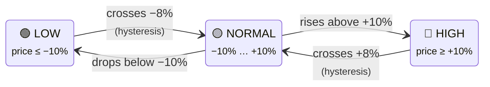

# Ratings & Levels

> **Entity ID tip:** `<home_name>` is a placeholder for your Tibber home display name in Home Assistant. Entity IDs are derived from the displayed name (localized), so the exact slug may differ. **Can't find a sensor?** Use the **[Entity Reference (All Languages)](sensor-reference.md)** to search by name in your language.

The integration provides **two** classification systems for electricity prices. Both are useful, but serve different purposes.

## Ratings vs Levels at a Glance

| | Ratings | Levels |
|--|---------|--------|
| **Source** | Calculated by integration | Provided by Tibber API |
| **Scale** | 3 levels (LOW, NORMAL, HIGH) | 5 levels (VERY_CHEAP → VERY_EXPENSIVE) |
| **Basis** | Trailing 24h average | Daily min/max range |
| **Best for** | Automations (simple thresholds) | Dashboard displays (fine granularity) |
| **Configurable** | Yes (thresholds) | Gap tolerance only |
| **Automation attribute** | `rating_level` (always lowercase English) | `level` (always uppercase English) |

**Which to use?**

- **Automations**: Use **ratings** (3 simple states, configurable thresholds, hysteresis)
- **Dashboards**: Use **levels** (5 color-coded states, more visual granularity)
- **Advanced automations**: Combine both (e.g., "LOW rating AND VERY_CHEAP level")

---

## Rating Sensors

Rating sensors classify prices relative to the **trailing 24-hour average**, answering: "Is the current price cheap, normal, or expensive compared to recent history?"

### How Ratings Work

The integration calculates a **percentage difference** between the current price and the trailing 24-hour average:

```
difference = ((current_price - trailing_avg) / abs(trailing_avg)) × 100%
```

This percentage is then classified:

| Rating | Condition (default) | Meaning |
|--------|---------------------|---------|
| **LOW** | difference ≤ -10% | Significantly below recent average |
| **NORMAL** | -10% < difference < +10% | Within normal range |
| **HIGH** | difference ≥ +10% | Significantly above recent average |

**Hysteresis** (default 2%) prevents flickering: once a rating enters LOW, it must cross -8% (not -10%) to return to NORMAL. This avoids rapid switching at threshold boundaries.



> **The 2% gap** between entering (−10%) and leaving (−8%) a state prevents the sensor from flickering back and forth when prices hover near a threshold.

### Available Rating Sensors

| Sensor | Scope | Description |
|--------|-------|-------------|
| <EntityRef id="current_interval_price_rating">Current Price Rating</EntityRef> | Current interval | Rating of the current 15-minute price |
| <EntityRef id="next_interval_price_rating">Next Price Rating</EntityRef> | Next interval | Rating for the upcoming 15-minute price |
| <EntityRef id="previous_interval_price_rating">Previous Price Rating</EntityRef> | Previous interval | Rating for the past 15-minute price |
| <EntityRef id="current_hour_price_rating">Current Hour Price Rating</EntityRef> | Rolling 5-interval | Smoothed rating around the current hour |
| <EntityRef id="next_hour_price_rating">Next Hour Price Rating</EntityRef> | Rolling 5-interval | Smoothed rating around the next hour |
| <EntityRef id="yesterday_price_rating">Yesterday's Price Rating</EntityRef> | Calendar day | Aggregated rating for yesterday |
| <EntityRef id="today_price_rating">Today's Price Rating</EntityRef> | Calendar day | Aggregated rating for today |
| <EntityRef id="tomorrow_price_rating">Tomorrow's Price Rating</EntityRef> | Calendar day | Aggregated rating for tomorrow |

### Key Attributes

| Attribute | Description | Example |
|-----------|-------------|---------|
| `rating_level` | Language-independent rating (always lowercase) | `low` |
| `difference` | Percentage difference from trailing average | `-12.5` |
| `trailing_avg_24h` | The reference average used for classification | `22.3` |

### Usage in Automations

**Best Practice:** Always use the `rating_level` attribute (lowercase English) instead of the sensor state (which is translated to your HA language):

```yaml
# ✅ Correct — language-independent
condition:
    - condition: template
      value_template: >
          {{ state_attr('sensor.<home_name>_current_price_rating', 'rating_level') == 'low' }}

# ❌ Avoid — breaks when HA language changes
condition:
    - condition: state
      entity_id: sensor.<home_name>_current_price_rating
      state: "Low"  # "Niedrig" in German, "Lav" in Norwegian...
```

### Configuration

Rating thresholds can be adjusted in the options flow:

1. Go to **Settings → Devices & Services → Tibber Prices → Configure**
2. Navigate to **Price Rating Thresholds**
3. Adjust LOW/HIGH thresholds, hysteresis, and gap tolerance

See [Configuration](configuration.md#step-3-price-rating-thresholds) for details.

---

## Level Sensors

Level sensors show the **Tibber API's own price classification** with a 5-level scale:

| Level | Meaning | Numeric Value |
|-------|---------|---------------|
| **VERY_CHEAP** | Exceptionally low | -2 |
| **CHEAP** | Below average | -1 |
| **NORMAL** | Typical range | 0 |
| **EXPENSIVE** | Above average | +1 |
| **VERY_EXPENSIVE** | Exceptionally high | +2 |

### Available Level Sensors

| Sensor | Scope |
|--------|-------|
| <EntityRef id="current_interval_price_level">Current Price Level</EntityRef> | Current interval |
| <EntityRef id="next_interval_price_level">Next Price Level</EntityRef> | Next interval |
| <EntityRef id="previous_interval_price_level">Previous Price Level</EntityRef> | Previous interval |
| <EntityRef id="current_hour_price_level">Current Hour Price Level</EntityRef> | Rolling 5-interval window |
| <EntityRef id="next_hour_price_level">Next Hour Price Level</EntityRef> | Rolling 5-interval window |
| <EntityRef id="yesterday_price_level">Yesterday's Price Level</EntityRef> | Calendar day (aggregated) |
| <EntityRef id="today_price_level">Today's Price Level</EntityRef> | Calendar day (aggregated) |
| <EntityRef id="tomorrow_price_level">Tomorrow's Price Level</EntityRef> | Calendar day (aggregated) |

**Gap tolerance** smoothing is applied to prevent isolated level flickers (e.g., a single NORMAL between two CHEAPs → corrected to CHEAP). Configure in [options flow](configuration.md#step-4-price-level-gap-tolerance).
