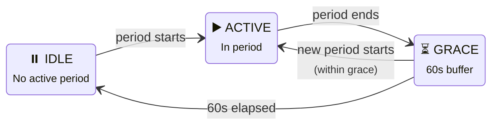

# Timing Sensors

:::tip Entity ID tip
`<home_name>` is a placeholder for your Tibber home display name in Home Assistant. Entity IDs are derived from the displayed name (localized), so the exact slug may differ. **Can't find a sensor?** Use the **[Entity Reference (All Languages)](sensor-reference.md)** to search by name in your language.
:::

Timing sensors provide **real-time information about Best Price and Peak Price periods**: when they start, end, how long they last, and your progress through them.



**IDLE** = waiting for next period (shows countdown via `next_in_minutes`). **ACTIVE** = inside a period (shows `progress` 0–100% and `remaining_minutes`). **GRACE** = short buffer after a period ends, allowing back-to-back periods to merge seamlessly.

## Available Timing Sensors

For each period type (Best Price and Peak Price):

| Sensor | When Period Active | When No Active Period |
|--------|-------------------|----------------------|
| <EntityRef id="best_price_end_time" also="peak_price_end_time">End Time</EntityRef> | Current period's end time | Next period's end time |
| <EntityRef id="best_price_period_duration" also="peak_price_period_duration">Period Duration</EntityRef> | Current period length (minutes) | Next period length |
| <EntityRef id="best_price_remaining_minutes" also="peak_price_remaining_minutes">Remaining Minutes</EntityRef> | Minutes until current period ends | 0 |
| <EntityRef id="best_price_progress" also="peak_price_progress">Progress</EntityRef> | 0–100% through current period | 0 |
| <EntityRef id="best_price_next_start_time" also="peak_price_next_start_time">Next Start Time</EntityRef> | When next-next period starts | When next period starts |
| <EntityRef id="best_price_next_in_minutes" also="peak_price_next_in_minutes">Next In Minutes</EntityRef> | Minutes to next-next period | Minutes to next period |

## Usage Examples

### Show Countdown to Next Cheap Window

```yaml
type: custom:mushroom-entity-card
entity: sensor.<home_name>_best_price_next_in_minutes
name: Next Cheap Window
icon: mdi:clock-fast
```

### Display Period Progress Bar

<details>
<summary>Show YAML: Bar card for period progress</summary>

```yaml
type: custom:bar-card
entity: sensor.<home_name>_best_price_progress
name: Best Price Progress
min: 0
max: 100
severity:
    - from: 0
      to: 50
      color: green
    - from: 50
      to: 80
      color: orange
    - from: 80
      to: 100
      color: red
```

</details>

### Notify When Period Is Almost Over

<details>
<summary>Show YAML: Automation — notify when best price period is ending</summary>

```yaml
automation:
    - alias: "Warn: Best Price Ending Soon"
      trigger:
          - platform: numeric_state
            entity_id: sensor.<home_name>_best_price_remaining_minutes
            below: 15
      condition:
          - condition: numeric_state
            entity_id: sensor.<home_name>_best_price_remaining_minutes
            above: 0
      action:
          - service: notify.mobile_app
            data:
                title: "Best Price Ending Soon"
                message: "Only {{ states('sensor.<home_name>_best_price_remaining_minutes') }} minutes left!"
```

</details>
