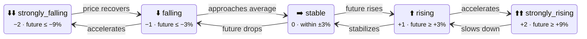

# Trend Sensors

:::tip Entity ID tip
`<home_name>` is a placeholder for your Tibber home display name in Home Assistant. Entity IDs are derived from the displayed name (localized), so the exact slug may differ. **Can't find a sensor?** Use the **[Entity Reference (All Languages)](sensor-reference.md)** to search by name in your language.
:::

Trend sensors help you understand **whether to act now or wait**. The integration provides two complementary families:

- **Price Outlook Sensors (1h–12h):** Compare current price vs. future window average — "Is now cheaper than the next Nh on average?"
- **Price Trajectory Sensors (2h–12h):** Compare first half vs. second half of the window — "Are prices rising or falling *within* the window?"

---

## Price Outlook Sensors (1h–12h)

These sensors compare the **current price** with the **average price** of the next N hours:

| Sensor | Compares Against |
|--------|-----------------|
| **Price Outlook (1h)** (`price_outlook_1h`) | Average of next 1 hour |
| **Price Outlook (2h)** (`price_outlook_2h`) | Average of next 2 hours |
| **Price Outlook (3h)** (`price_outlook_3h`) | Average of next 3 hours |
| **Price Outlook (4h)** (`price_outlook_4h`) | Average of next 4 hours |
| **Price Outlook (5h)** (`price_outlook_5h`) | Average of next 5 hours |
| **Price Outlook (6h)** (`price_outlook_6h`) | Average of next 6 hours |
| **Price Outlook (8h)** (`price_outlook_8h`) | Average of next 8 hours |
| **Price Outlook (12h)** (`price_outlook_12h`) | Average of next 12 hours |

:::info Same Starting Point — All Outlook Sensors Use Your Current Price
All outlook sensors share the **same base: your current 15-minute price**. They differ only in how far ahead they average. The windows **overlap** — the 3h average includes ALL intervals from the 1h and 2h windows, plus one more hour.

**This means:**
- `price_outlook_3h` shows "current price vs. average of the **entire** next 3 hours" — **not** "what happens between hour 2 and hour 3"
- If 1h shows `falling` but 6h shows `rising`: near-term prices are below your current price, but looking at the full 6h window (which includes expensive evening hours), the overall average is above your current price
- Larger windows smooth out short-term fluctuations — a 30-minute price spike affects the 1h average more than the 6h average

**⚠️ At a price minimum, outlook sensors can be misleading!** If you're at the minimum and prices are about to rise, `price_outlook_3h` may still show `strongly_falling` because the cheap minimum pulls the 3h average below your current high price. Use `price_trajectory_3h` to see the direction *within* the window.
:::

**States:** Each sensor has one of five states:



| State | Meaning | `trend_value` |
|-------|---------|---------------|
| `strongly_falling` | Prices will drop significantly | -2 |
| `falling` | Prices will drop | -1 |
| `stable` | Prices staying roughly the same | 0 |
| `rising` | Prices will increase | +1 |
| `strongly_rising` | Prices will increase significantly | +2 |

**Key attributes:**

| Attribute | Description | Example |
|-----------|-------------|---------|
| `trend_value` | Numeric value for automations (-2 to +2) | `-1` |
| `trend_Nh_%` | Percentage difference from current price | `-12.3` |
| `next_Nh_avg` | Average price in the future window | `18.5` |
| `second_half_Nh_avg` | Average price in later half of window | `16.2` |
| `threshold_rising_%` | Active rising threshold after volatility adjustment | `3.0` |
| `threshold_rising_strongly_%` | Active strongly-rising threshold after volatility adjustment | `4.8` |
| `threshold_falling_%` | Active falling threshold after volatility adjustment | `-3.0` |
| `threshold_falling_strongly_%` | Active strongly-falling threshold after volatility adjustment | `-4.8` |
| `volatility_factor` | Applied multiplier (0.6 = low, 1.0 = moderate, 1.4 = high volatility) | `0.8` |

**Tip:** The `trend_value` attribute (`-2` to `+2`) is ideal for automations — use numeric comparisons instead of matching translated state strings.

---

## Price Trajectory Sensors (2h–12h)

These sensors compare the **first half** of the future window against the **second half** — revealing the price *direction within* the window.

| Sensor | Compares |
|--------|----------|
| **Price Trajectory (2h)** (`price_trajectory_2h`) | Avg of hour 1 vs avg of hour 2 |
| **Price Trajectory (3h)** (`price_trajectory_3h`) | Avg of first 1.5h vs avg of second 1.5h |
| **Price Trajectory (4h)** (`price_trajectory_4h`) | Avg of first 2h vs avg of second 2h |
| **Price Trajectory (5h)** (`price_trajectory_5h`) | Avg of first 2.5h vs avg of second 2.5h |
| **Price Trajectory (6h)** (`price_trajectory_6h`) | Avg of first 3h vs avg of second 3h |
| **Price Trajectory (8h)** (`price_trajectory_8h`) | Avg of first 4h vs avg of second 4h |
| **Price Trajectory (12h)** (`price_trajectory_12h`) | Avg of first 6h vs avg of second 6h |

**States:** Same 5-level scale as outlook sensors (`strongly_falling` → `strongly_rising`).

:::info Why trajectory sensors complement outlook sensors
**At a price minimum** — the exact moment you should act — `price_outlook_3h` may show `strongly_falling` because the cheap minimum pulls the entire 3h average below your current high price. But `price_trajectory_3h` shows `rising` because the second half (after the minimum) is more expensive than the first half.

| Combination | Interpretation |
|-------------|----------------|
| Outlook `falling` + Trajectory `rising` | **You're AT the minimum** — act now |
| Outlook `falling` + Trajectory `falling` | Prices still dropping — wait |
| Outlook `rising` + Trajectory `rising` | Strong signal to act now |
| Outlook `rising` + Trajectory `falling` | Short spike, then cheaper — wait |
:::

**Key attributes:**

| Attribute | Description | Example |
|-----------|-------------|---------|
| `trend_value` | Numeric value for automations (-2 to +2) | `1` |
| `first_half_avg` | Average price in first half of window | `12.4` |
| `second_half_avg` | Average price in second half of window | `18.1` |
| `half_diff_%` | Percentage difference (second vs first half) | `46.0` |

---

## Current Price Trend

**Entity ID:** `sensor.<home_name>_current_price_trend`

This sensor shows the **currently active trend direction** based on a 3-hour future outlook with volatility-adaptive thresholds.

Unlike the simple trend sensors that always compare current price vs future average, the current price trend represents the **ongoing trend** — it remains stable between updates and only changes when the underlying price direction actually shifts.

**States:** Same 5-level scale as simple trends.

**Key attributes:**

| Attribute | Description | Example |
|-----------|-------------|---------|
| `previous_direction` | Price direction before the current trend started | `falling` |
| `price_direction_duration_minutes` | How long prices have been moving in this direction | `45` |
| `price_direction_since` | Timestamp when prices started moving in this direction | `2025-11-08T14:00:00+01:00` |

---

## Next Price Trend Change

**Entity ID:** `sensor.<home_name>_next_price_trend_change`

This sensor predicts **when the current trend will change** by scanning future intervals. It requires 3 consecutive intervals (configurable: 2–6) confirming the new trend before reporting a change (hysteresis), which prevents false alarms from short-lived price spikes.

**Important:** Only **direction changes** count as trend changes. The five states are grouped into three directions:

| Direction | States |
|-----------|--------|
| **falling** | `strongly_falling`, `falling` |
| **stable** | `stable` |
| **rising** | `rising`, `strongly_rising` |

A change from `rising` to `strongly_rising` (same direction) is **not** reported as a trend change — only actual reversals like `rising` → `stable` or `falling` → `rising`.

**State:** Timestamp of the next trend change (or unavailable if no change predicted).

**Key attributes:**

| Attribute | Description | Example |
|-----------|-------------|---------|
| `direction` | What the trend will change TO | `rising` |
| `from_direction` | Current trend (will change FROM) | `falling` |
| `minutes_until_change` | Minutes until trend changes | `90` |
| `price_at_change` | Price at the change point | `13.8` |
| `price_avg_after_change` | Average price after change | `18.1` |
| `threshold_rising_%` | Active rising threshold after volatility adjustment | `3.0` |
| `threshold_rising_strongly_%` | Active strongly-rising threshold after volatility adjustment | `4.8` |
| `threshold_falling_%` | Active falling threshold after volatility adjustment | `-3.0` |
| `threshold_falling_strongly_%` | Active strongly-falling threshold after volatility adjustment | `-4.8` |
| `volatility_factor` | Applied multiplier (0.6 = low, 1.0 = moderate, 1.4 = high volatility) | `0.8` |

---

## Next Price Trend Change In (Countdown)

**Entity ID:** `sensor.<home_name>_next_price_trend_change_in`

A **countdown timer** companion to the Next Price Trend Change sensor above. Instead of a timestamp, it shows **how many minutes** remain until the trend changes direction.

**State:** Duration in minutes until the next trend change (displayed in hours via HA unit conversion). Unavailable if no change is predicted.

**Use cases:**
- Dashboard countdown: "Trend changes in 1.5 h"
- Automation trigger: "If trend change is less than 15 minutes away, prepare for price direction change"

**Example automation:**

<details>
<summary>Show YAML: Example automation</summary>

```yaml
trigger:
  - platform: numeric_state
    entity_id: sensor.<home_name>_next_price_trend_change_in
    below: 0.25  # 15 minutes (displayed in hours)
action:
  - service: notify.mobile_app
    data:
      message: "Price trend is about to change direction!"
```

</details>

**Tip:** Use this sensor for "HOW LONG" and the Next Price Trend Change sensor (timestamp) for "WHEN".

---

## How to Use Trend Sensors for Decisions

:::danger Common Misconception — Don't "Wait for Stable"!
A natural intuition is to treat trend states like a stock ticker:

- ❌ "It's **falling** → I'll wait until it reaches **stable** (the bottom)"
- ❌ "It's **rising** → too late, I missed the best price"
- ❌ "It's **stable** → now is the perfect time to act!"

**This is wrong.** Trend sensors don't show a trajectory — they show a **comparison** between your current price and future prices. The correct interpretation is the opposite:

| State | What the Sensor Calculates | ✅ Correct Action |
|-------|---------------------------|-------------------|
| `falling` | Current price **higher** than future average | **WAIT** — cheaper prices are coming |
| `strongly_falling` | Current price **much higher** than future average | **DEFINITELY WAIT** — significant savings ahead |
| `stable` | Current price **≈ equal** to future average | **Timing doesn't matter** — start whenever convenient |
| `rising` | Current price **lower** than future average | **ACT NOW** — it only gets more expensive |
| `strongly_rising` | Current price **much lower** than future average | **ACT IMMEDIATELY** — best price right now |

**"Rising" is NOT "too late" — it means NOW is the best time because prices will be higher later.**
:::

### Basic Automation Pattern

For most appliances (dishwasher, washing machine, dryer), a single outlook sensor is enough:

<details>
<summary>Show YAML: Basic Automation Pattern</summary>

```yaml
# Example: Start dishwasher when prices are favorable
trigger:
  - platform: state
    entity_id: sensor.my_home_price_outlook_3h
condition:
  - condition: numeric_state
    entity_id: sensor.my_home_price_outlook_3h
    attribute: trend_value
    # rising (1) or strongly_rising (2) = act now
    above: 0
action:
  - service: switch.turn_on
    target:
      entity_id: switch.dishwasher
```

</details>

### Combining Multiple Windows

When short-term and long-term trends disagree, you get richer insight:

| 1h Outlook | 6h Outlook | Interpretation | Recommendation |
|----------|----------|---------------|----------------|
| `rising` | `rising` | Prices going up across the board | **Start now** |
| `falling` | `falling` | Prices dropping across the board | **Wait** |
| `falling` | `rising` | Brief dip, then expensive evening | **Wait briefly**, then start during the dip |
| `rising` | `falling` | Short spike, but cheaper hours ahead | **Wait** if you can — better prices coming |
| `stable` | any | Short-term doesn't matter | Use the **longer window** for your decision |

### Dashboard Quick-Glance

On your dashboard, trend sensors give an instant overview:

- 🟢 All **falling/strongly_falling** → "Relax, prices are dropping — wait"
- 🔴 All **rising/strongly_rising** → "Start everything you can — it only gets more expensive"
- 🟡 **Mixed** → Compare short-term vs. long-term sensors, or check the Best Price Period sensor

---

## Outlook & Trajectory vs Average Sensors

Both sensor families provide future price information, but serve different purposes:

| | Outlook/Trajectory Sensors | Average Sensors |
|--|---------------------------|-----------------|
| **Purpose** | Dashboard display, quick visual overview | Automations, precise numeric comparisons |
| **Output** | Classification (falling/stable/rising) | Exact price values (ct/kWh) |
| **Best for** | "Should I worry about prices?" | "Is the future average below 15 ct?" |
| **Use in** | Dashboard icons, status displays | Template conditions, numeric thresholds |

**Design principle:** Use **trend sensors** (enum) for visual feedback at a glance, use **average sensors** (numeric) for precise decision-making in automations.

## Configuration

Trend thresholds can be adjusted in the options flow:

1. Go to **Settings → Devices & Services → Tibber Prices**
2. Click **Configure** on your home
3. Navigate to **📈 Price Trend Thresholds**
4. Adjust the rising/falling and strongly rising/falling percentages

The thresholds are **volatility-adaptive**: on days with high price volatility, thresholds are widened automatically to prevent constant state changes. This means the trend sensors give more stable readings during volatile market conditions.
