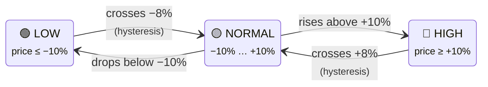
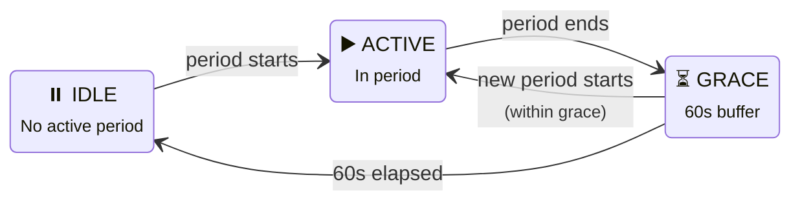
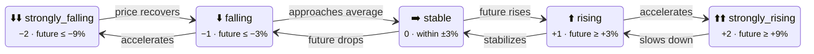

# Sensors

> **Tip:** Many sensors have dynamic icons and colors! See the **[Dynamic Icons Guide](dynamic-icons.md)** and **[Dynamic Icon Colors Guide](icon-colors.md)** to enhance your dashboards.

> **Entity ID tip:** `<home_name>` is a placeholder for your Tibber home display name in Home Assistant. Entity IDs are derived from the displayed name (localized), so the exact slug may differ. Example suffixes below use the English display names (en.json) as a baseline. You can find the real ID in **Settings → Devices & Services → Entities** (or **Developer Tools → States**).

## Binary Sensors

### Best Price Period & Peak Price Period

These binary sensors indicate when you're in a detected best or peak price period. See the **[Period Calculation Guide](period-calculation.md)** for a detailed explanation of how these periods are calculated and configured.

**Quick overview:**

-   **Best Price Period**: Turns ON during periods with significantly lower prices than the daily average
-   **Peak Price Period**: Turns ON during periods with significantly higher prices than the daily average

Both sensors include rich attributes with period details, intervals, relaxation status, and more.

## Core Price Sensors

### Average Price Sensors

The integration provides several sensors that calculate average electricity prices over different time windows. These sensors show a **typical** price value that represents the overall price level, helping you make informed decisions about when to use electricity.

#### Available Average Sensors

| Sensor | Description | Time Window |
|--------|-------------|-------------|
| **Average Price Today** | Typical price for current calendar day | 00:00 - 23:59 today |
| **Average Price Tomorrow** | Typical price for next calendar day | 00:00 - 23:59 tomorrow |
| **Trailing Price Average** | Typical price for last 24 hours | Rolling 24h backward |
| **Leading Price Average** | Typical price for next 24 hours | Rolling 24h forward |
| **Current Hour Average** | Smoothed price around current time | 5 intervals (~75 min) |
| **Next Hour Average** | Smoothed price around next hour | 5 intervals (~75 min) |
| **Next N Hours Average** | Future price forecast | 1h, 2h, 3h, 4h, 5h, 6h, 8h, 12h |

#### Configurable Display: Median vs Mean

All average sensors support **two different calculation methods** for the state value:

- **Median** (default): The "middle value" when all prices are sorted. Resistant to extreme price spikes, shows the **typical** price level you experienced.
- **Arithmetic Mean**: The mathematical average including all prices. Better for **cost calculations** but affected by extreme spikes.

**Why two values matter:**

```yaml
# Example price data for one day:
# Prices: 10, 12, 13, 15, 80 ct/kWh (one extreme spike)
#
# Median = 13 ct/kWh    ← "Typical" price level (middle value)
# Mean = 26 ct/kWh      ← Mathematical average (affected by spike)
```

The median shows you what price level was **typical** during that period, while the mean shows the actual **average cost** if you consumed evenly throughout the period.

#### Configuring the Display

You can choose which value is displayed in the sensor state:

1. Go to **Settings → Devices & Services → Tibber Prices**
2. Click **Configure** on your home
3. Navigate to **Step 6: Average Sensor Display Settings**
4. Choose between:
   - **Median** (default) - Shows typical price level, resistant to spikes
   - **Arithmetic Mean** - Shows actual mathematical average

**Important:** Both values are **always available** as sensor attributes, regardless of your choice! This ensures your automations continue to work if you change the display setting.

#### Using Both Values in Automations

Both `price_mean` and `price_median` are always available as attributes:

```yaml
# Example: Get both values regardless of display setting
sensor:
  - platform: template
    sensors:
      daily_price_analysis:
        friendly_name: "Daily Price Analysis"
        value_template: >
          
          
          

          
            Below typical ({{ ((1 - current/median) * 100) | round(1) }}% cheaper)
          
            Typical price range
          
            Above average ({{ ((current/mean - 1) * 100) | round(1) }}% more expensive)
          
```

#### Practical Examples

**Example 1: Smart dishwasher control**

Run dishwasher only when price is significantly below the daily typical level:

<details>
<summary>Show YAML: Automation — start dishwasher when cheap</summary>

```yaml
automation:
  - alias: "Start Dishwasher When Cheap"
    trigger:
      - platform: state
        entity_id: binary_sensor.<home_name>_best_price_period
        to: "on"
    condition:
      # Only if current price is at least 20% below typical (median)
      - condition: template
        value_template: >
          
          
          {{ current < (median * 0.8) }}
    action:
      - service: switch.turn_on
        entity_id: switch.dishwasher
```

</details>

**Example 2: Cost-aware heating control**

Use mean for actual cost calculations:

<details>
<summary>Show YAML: Automation — cost-aware heating control</summary>

```yaml
automation:
  - alias: "Heating Budget Control"
    trigger:
      - platform: time
        at: "06:00:00"
    action:
      # Calculate expected daily heating cost
      - variables:
          mean_price: "{{ state_attr('sensor.<home_name>_price_today', 'price_mean') | float }}"
          heating_kwh_per_day: 15  # Estimated consumption
          daily_cost: "{{ (mean_price * heating_kwh_per_day / 100) | round(2) }}"
      - service: notify.mobile_app
        data:
          title: "Heating Cost Estimate"
          message: "Expected cost today: €{{ daily_cost }} (avg price: {{ mean_price }} ct/kWh)"
```

</details>

**Example 3: Smart charging based on rolling average**

Use trailing average to understand recent price trends:

<details>
<summary>Show YAML: Automation — EV charging based on rolling average</summary>

```yaml
automation:
  - alias: "EV Charging - Price Trend Based"
    trigger:
      - platform: state
        entity_id: sensor.ev_battery_level
    condition:
      # Start charging if current price < 90% of recent 24h average
      - condition: template
        value_template: >
          
          
          {{ current < (trailing_avg * 0.9) }}
      # And battery < 80%
      - condition: numeric_state
        entity_id: sensor.ev_battery_level
        below: 80
    action:
      - service: switch.turn_on
        entity_id: switch.ev_charger
```

</details>

#### Key Attributes

All average sensors provide these attributes:

| Attribute | Description | Example |
|-----------|-------------|---------|
| `price_mean` | Arithmetic mean (always available) | 25.3 ct/kWh |
| `price_median` | Median value (always available) | 22.1 ct/kWh |
| `interval_count` | Number of intervals included | 96 |
| `timestamp` | Reference time for calculation | 2025-12-18T00:00:00+01:00 |

**Note:** The `price_mean` and `price_median` attributes are **always present** regardless of which value you configured for display. This ensures automation compatibility when changing the display setting.

#### When to Use Which Value

**Use Median for:**
- ✅ Comparing "typical" price levels across days
- ✅ Determining if current price is unusually high/low
- ✅ User-facing displays ("What was today like?")
- ✅ Volatility analysis (comparing typical vs extremes)

**Use Mean for:**
- ✅ Cost calculations and budgeting
- ✅ Energy cost estimations
- ✅ Comparing actual average costs between periods
- ✅ Financial planning and forecasting

**Both values tell different stories:**
- High median + much higher mean = Expensive spikes occurred
- Low median + higher mean = Generally cheap with occasional spikes
- Similar median and mean = Stable prices (low volatility)


## Volatility Sensors

Volatility sensors help you understand how much electricity prices fluctuate over a given period. Instead of just looking at the absolute price, they measure the **relative price variation**, which is a great indicator of whether it's a good day for price-based energy optimization.

The calculation is based on the **Coefficient of Variation (CV)**, a standardized statistical measure defined as:

`CV = (Standard Deviation / aAithmetic Mean) * 100%`

This results in a percentage that shows how much prices deviate from the average. A low CV means stable prices, while a high CV indicates significant price swings and thus, a high potential for saving money by shifting consumption.

The sensor's state can be `low`, `moderate`, `high`, or `very_high`, based on configurable thresholds.

### Available Volatility Sensors

| Sensor | Description | Time Window |
|---|---|---|
| **Today's Price Volatility** | Volatility for the current calendar day | 00:00 - 23:59 today |
| **Tomorrow's Price Volatility** | Volatility for the next calendar day | 00:00 - 23:59 tomorrow |
| **Next 24h Price Volatility** | Volatility for the next 24 hours from now | Rolling 24h forward |
| **Today + Tomorrow Price Volatility** | Volatility across both today and tomorrow | Up to 48 hours |

### Configuration

You can adjust the CV thresholds that determine the volatility level:
1. Go to **Settings → Devices & Services → Tibber Prices**.
2. Click **Configure**.
3. Go to the **Price Volatility Thresholds** step.

Default thresholds are:
- **Moderate:** 15%
- **High:** 30%
- **Very High:** 50%

### Key Attributes

All volatility sensors provide these attributes:

| Attribute | Description | Example |
|---|---|---|
| `price_coefficient_variation_%` | The calculated Coefficient of Variation | `23.5` |
| `price_spread` | The difference between the highest and lowest price | `12.3` |
| `price_min` | The lowest price in the period | `10.2` |
| `price_max` | The highest price in the period | `22.5` |
| `price_mean` | The arithmetic mean of all prices in the period | `15.1` |
| `interval_count` | Number of price intervals included in the calculation | `96` |

### Usage in Automations & Best Practices

You can use the volatility sensor to decide if a price-based optimization is worth it. For example, if your solar battery has conversion losses, you might only want to charge and discharge it on days with high volatility.

**Best Practice: Use the `price_volatility` Attribute**

For automations, it is strongly recommended to use the `price_volatility` attribute instead of the sensor's main state.

- **Why?** The main `state` of the sensor is translated into your Home Assistant language (e.g., "Hoch" in German). If you change your system language, automations based on this state will break. The `price_volatility` attribute is **always in lowercase English** (`"low"`, `"moderate"`, `"high"`, `"very_high"`) and therefore provides a stable, language-independent value.

**Good Example (Robust Automation):**
This automation triggers only if the volatility is classified as `high` or `very_high`, respecting your central settings and working independently of the system language.
```yaml
automation:
  - alias: "Enable battery optimization only on volatile days"
    trigger:
      - platform: template
        value_template: >
          {{ state_attr('sensor.<home_name>_today_s_price_volatility', 'price_volatility') in ['high', 'very_high'] }}
    action:
      - service: input_boolean.turn_on
        entity_id: input_boolean.battery_optimization_enabled
```

---

**Avoid Hard-Coding Numeric Thresholds**

You might be tempted to use the numeric `price_coefficient_variation_%` attribute directly in your automations. This is not recommended.

- **Why?** The integration provides central configuration options for the volatility thresholds. By using the classified `price_volatility` attribute, your automations automatically adapt if you decide to change what you consider "high" volatility (e.g., changing the threshold from 30% to 35%). Hard-coding values means you would have to find and update them in every single automation.

**Bad Example (Brittle Automation):**
This automation uses a hard-coded value. If you later change the "High" threshold in the integration's options to 35%, this automation will not respect that change and might trigger at the wrong time.
```yaml
automation:
  - alias: "Brittle - Enable battery optimization"
    trigger:
      #
      # BAD: Avoid hard-coding numeric values
      #
      - platform: numeric_state
        entity_id: sensor.<home_name>_today_s_price_volatility
        attribute: price_coefficient_variation_%
        above: 30
    action:
      - service: input_boolean.turn_on
        entity_id: input_boolean.battery_optimization_enabled
```

By following the "Good Example", your automations become simpler, more readable, and much easier to maintain.

## Rating Sensors

Rating sensors classify prices relative to the **trailing 24-hour average**, answering: "Is the current price cheap, normal, or expensive compared to recent history?"

### How Ratings Work

The integration calculates a **percentage difference** between the current price and the trailing 24-hour average:

```
difference = ((current_price - trailing_avg) / abs(trailing_avg)) × 100%
```

This percentage is then classified:

| Rating | Condition (default) | Meaning |
|--------|---------------------|---------|
| **LOW** | difference ≤ -10% | Significantly below recent average |
| **NORMAL** | -10% < difference < +10% | Within normal range |
| **HIGH** | difference ≥ +10% | Significantly above recent average |

**Hysteresis** (default 2%) prevents flickering: once a rating enters LOW, it must cross -8% (not -10%) to return to NORMAL. This avoids rapid switching at threshold boundaries.



> **The 2% gap** between entering (−10%) and leaving (−8%) a state prevents the sensor from flickering back and forth when prices hover near a threshold.

### Available Rating Sensors

| Sensor | Scope | Description |
|--------|-------|-------------|
| **Current Price Rating** | Current interval | Rating of the current 15-minute price |
| **Next Price Rating** | Next interval | Rating for the upcoming 15-minute price |
| **Previous Price Rating** | Previous interval | Rating for the past 15-minute price |
| **Current Hour Price Rating** | Rolling 5-interval | Smoothed rating around the current hour |
| **Next Hour Price Rating** | Rolling 5-interval | Smoothed rating around the next hour |
| **Yesterday's Price Rating** | Calendar day | Aggregated rating for yesterday |
| **Today's Price Rating** | Calendar day | Aggregated rating for today |
| **Tomorrow's Price Rating** | Calendar day | Aggregated rating for tomorrow |

### Ratings vs Levels

The integration provides **two** classification systems that serve different purposes:

| | Ratings | Levels |
|--|---------|--------|
| **Source** | Calculated by integration | Provided by Tibber API |
| **Scale** | 3 levels (LOW, NORMAL, HIGH) | 5 levels (VERY_CHEAP → VERY_EXPENSIVE) |
| **Basis** | Trailing 24h average | Daily min/max range |
| **Best for** | Automations (simple thresholds) | Dashboard displays (fine granularity) |
| **Configurable** | Yes (thresholds) | Gap tolerance only |
| **Automation attribute** | `rating_level` (always lowercase English) | `level` (always uppercase English) |

**Which to use?**

- **Automations**: Use **ratings** (3 simple states, configurable thresholds, hysteresis)
- **Dashboards**: Use **levels** (5 color-coded states, more visual granularity)
- **Advanced automations**: Combine both (e.g., "LOW rating AND VERY_CHEAP level")

### Key Attributes

| Attribute | Description | Example |
|-----------|-------------|---------|
| `rating_level` | Language-independent rating (always lowercase) | `low` |
| `difference` | Percentage difference from trailing average | `-12.5` |
| `trailing_avg_24h` | The reference average used for classification | `22.3` |

### Usage in Automations

**Best Practice:** Always use the `rating_level` attribute (lowercase English) instead of the sensor state (which is translated to your HA language):

```yaml
# ✅ Correct — language-independent
condition:
    - condition: template
      value_template: >
          {{ state_attr('sensor.<home_name>_current_price_rating', 'rating_level') == 'low' }}

# ❌ Avoid — breaks when HA language changes
condition:
    - condition: state
      entity_id: sensor.<home_name>_current_price_rating
      state: "Low"  # "Niedrig" in German, "Lav" in Norwegian...
```

### Configuration

Rating thresholds can be adjusted in the options flow:

1. Go to **Settings → Devices & Services → Tibber Prices → Configure**
2. Navigate to **Price Rating Thresholds**
3. Adjust LOW/HIGH thresholds, hysteresis, and gap tolerance

See [Configuration](configuration.md#step-3-price-rating-thresholds) for details.

## Level Sensors

Level sensors show the **Tibber API's own price classification** with a 5-level scale:

| Level | Meaning | Numeric Value |
|-------|---------|---------------|
| **VERY_CHEAP** | Exceptionally low | -2 |
| **CHEAP** | Below average | -1 |
| **NORMAL** | Typical range | 0 |
| **EXPENSIVE** | Above average | +1 |
| **VERY_EXPENSIVE** | Exceptionally high | +2 |

### Available Level Sensors

| Sensor | Scope |
|--------|-------|
| **Current Price Level** | Current interval |
| **Next Price Level** | Next interval |
| **Previous Price Level** | Previous interval |
| **Current Hour Price Level** | Rolling 5-interval window |
| **Next Hour Price Level** | Rolling 5-interval window |
| **Yesterday's Price Level** | Calendar day (aggregated) |
| **Today's Price Level** | Calendar day (aggregated) |
| **Tomorrow's Price Level** | Calendar day (aggregated) |

**Gap tolerance** smoothing is applied to prevent isolated level flickers (e.g., a single NORMAL between two CHEAPs → corrected to CHEAP). Configure in [options flow](configuration.md#step-4-price-level-gap-tolerance).

## Min/Max Sensors

These sensors show the lowest and highest prices for calendar days and rolling windows:

### Daily Min/Max

| Sensor | Description |
|--------|-------------|
| **Today's Lowest Price** | Minimum price today (00:00–23:59) |
| **Today's Highest Price** | Maximum price today (00:00–23:59) |
| **Tomorrow's Lowest Price** | Minimum price tomorrow |
| **Tomorrow's Highest Price** | Maximum price tomorrow |

### 24-Hour Rolling Min/Max

| Sensor | Description |
|--------|-------------|
| **Trailing Price Min** | Lowest price in the last 24 hours |
| **Trailing Price Max** | Highest price in the last 24 hours |
| **Leading Price Min** | Lowest price in the next 24 hours |
| **Leading Price Max** | Highest price in the next 24 hours |

### Key Attributes

All min/max sensors include:

| Attribute | Description |
|-----------|-------------|
| `timestamp` | When the extreme price occurs/occurred |
| `price_diff_from_daily_min` | Difference from daily minimum |
| `price_diff_from_daily_min_%` | Percentage difference |

## Energy Price & Tax Breakdown

Many price sensors expose the **raw energy price** (spot price) and the **tax component** as additional attributes. These are sourced directly from the Tibber API's `energy` and `tax` fields, which together make up the `total` price you see in the sensor state:

`total = energy + tax`

### Where These Attributes Appear

| Sensor Group | Attributes | Description |
|---|---|---|
| **Current/Next/Previous Interval Price** | `energy_price`, `tax` | Raw values for that specific 15-minute interval |
| **Today's/Tomorrow's Min/Max Price** | `energy_price`, `tax` | Values from the interval with the extreme price |
| **Today's/Tomorrow's Average Price** | `energy_price_mean`, `energy_price_median`, `tax_mean`, `tax_median` | Mean and median values across all intervals of the day |

:::note Transition After Update
After updating the integration, the `energy_price` and `tax` attributes will appear gradually as new price data is fetched from the Tibber API. Existing cached intervals (up to ~2 days old) won't have these fields yet — the attributes will simply be absent until fresh data replaces them. No action needed.
:::

### Use Cases

#### Solar Feed-In & Net Metering (Saldering)

In countries like the Netherlands, solar feed-in compensation is based on the **raw energy/spot price**, not the total consumer price. The `energy_price` attribute gives you exactly this value — no more reverse-engineering from the total price with fragile template calculations.

<details>
<summary>Show YAML: Automation — solar export or consume decision</summary>

```yaml
# Example: Decide whether to export solar power or consume it
# Compare energy price (what you'd earn by exporting) vs. total price (what you'd pay)
automation:
    - alias: "Solar: Export or Consume"
      trigger:
          - platform: numeric_state
            entity_id: sensor.solar_production_power
            above: 2000  # Producing more than 2 kW
      condition:
          - condition: template
            value_template: >
                
                
                {# Export when energy price is high relative to total — you earn more #}
                {{ energy is not none and energy > (total * 0.4) }}
      action:
          - service: switch.turn_off
            entity_id: switch.battery_charging  # Don't charge battery, export instead
```

</details>

#### Price Composition Analysis

Understand how your electricity price is structured — useful for comparing across days or spotting trends in market prices vs. fees:

<details>
<summary>Show YAML: Template sensor — electricity tax share percentage</summary>

```yaml
# Template sensor showing tax share
template:
    - sensor:
          - name: "Electricity Tax Share"
            unit_of_measurement: "%"
            state: >
                
                
                
                  {{ ((tax / total) * 100) | round(1) }}
                
                  unavailable
                
```

</details>

#### Dashboard: Daily Cost Breakdown

Show users how today's average price splits into energy vs. tax:

```yaml
# Mushroom chips card showing the split
type: custom:mushroom-chips-card
chips:
    - type: template
      icon: mdi:flash
      content: >
          ⚡ {{ state_attr('sensor.<home_name>_price_today', 'energy_price_mean') | round(1) }} ct
    - type: template
      icon: mdi:receipt-text
      content: >
          🏛️ {{ state_attr('sensor.<home_name>_price_today', 'tax_mean') | round(1) }} ct
```

### Country-Specific Calculations

The composition of the `tax` field varies by country (Norway, Sweden, Germany, Netherlands each have different fee structures). For detailed examples of how to build country-specific calculations using `input_number` helpers and template sensors — including **Dutch solar feed-in compensation (saldering)** — see the **[Community Examples](community-examples.md#country-specific-price-calculations)** page.

### In Chart Data Actions

The `energy_price` and `tax` fields are also available in the `get_chartdata` action. See [Actions — Energy & Tax Fields](./actions.md#energy--tax-fields-in-get_chartdata) for details.

## Timing Sensors

Timing sensors provide **real-time information about Best Price and Peak Price periods**: when they start, end, how long they last, and your progress through them.



**IDLE** = waiting for next period (shows countdown via `next_in_minutes`). **ACTIVE** = inside a period (shows `progress` 0–100% and `remaining_minutes`). **GRACE** = short buffer after a period ends, allowing back-to-back periods to merge seamlessly.

### Available Timing Sensors

For each period type (Best Price and Peak Price):

| Sensor | When Period Active | When No Active Period |
|--------|-------------------|----------------------|
| **End Time** | Current period's end time | Next period's end time |
| **Period Duration** | Current period length (minutes) | Next period length |
| **Remaining Minutes** | Minutes until current period ends | 0 |
| **Progress** | 0–100% through current period | 0 |
| **Next Start Time** | When next-next period starts | When next period starts |
| **Next In Minutes** | Minutes to next-next period | Minutes to next period |

### Usage Examples

**Show countdown to next cheap window:**

```yaml
type: custom:mushroom-entity-card
entity: sensor.<home_name>_best_price_next_in_minutes
name: Next Cheap Window
icon: mdi:clock-fast
```

**Display period progress bar:**

<details>
<summary>Show YAML: Bar card for period progress</summary>

```yaml
type: custom:bar-card
entity: sensor.<home_name>_best_price_progress
name: Best Price Progress
min: 0
max: 100
severity:
    - from: 0
      to: 50
      color: green
    - from: 50
      to: 80
      color: orange
    - from: 80
      to: 100
      color: red
```

</details>

**Automation: notify when period is almost over:**

<details>
<summary>Show YAML: Automation — notify when best price period is ending</summary>

```yaml
automation:
    - alias: "Warn: Best Price Ending Soon"
      trigger:
          - platform: numeric_state
            entity_id: sensor.<home_name>_best_price_remaining_minutes
            below: 15
      condition:
          - condition: numeric_state
            entity_id: sensor.<home_name>_best_price_remaining_minutes
            above: 0
      action:
          - service: notify.mobile_app
            data:
                title: "Best Price Ending Soon"
                message: "Only {{ states('sensor.<home_name>_best_price_remaining_minutes') }} minutes left!"
```

</details>

## Trend Sensors

Trend sensors help you understand **whether to act now or wait**. The integration provides two complementary families:

- **Price Outlook Sensors (1h–12h):** Compare current price vs. future window average — "Is now cheaper than the next Nh on average?"
- **Price Trajectory Sensors (2h–12h):** Compare first half vs. second half of the window — "Are prices rising or falling *within* the window?"

### Price Outlook Sensors (1h–12h)

These sensors compare the **current price** with the **average price** of the next N hours:

| Sensor | Compares Against |
|--------|-----------------|
| **Price Outlook (1h)** | Average of next 1 hour |
| **Price Outlook (2h)** | Average of next 2 hours |
| **Price Outlook (3h)** | Average of next 3 hours |
| **Price Outlook (4h)** | Average of next 4 hours |
| **Price Outlook (5h)** | Average of next 5 hours |
| **Price Outlook (6h)** | Average of next 6 hours |
| **Price Outlook (8h)** | Average of next 8 hours |
| **Price Outlook (12h)** | Average of next 12 hours |

:::info Same Starting Point — All Outlook Sensors Use Your Current Price
All outlook sensors share the **same base: your current 15-minute price**. They differ only in how far ahead they average. The windows **overlap** — the 3h average includes ALL intervals from the 1h and 2h windows, plus one more hour.

**This means:**
- `price_outlook_3h` shows "current price vs. average of the **entire** next 3 hours" — **not** "what happens between hour 2 and hour 3"
- If 1h shows `falling` but 6h shows `rising`: near-term prices are below your current price, but looking at the full 6h window (which includes expensive evening hours), the overall average is above your current price
- Larger windows smooth out short-term fluctuations — a 30-minute price spike affects the 1h average more than the 6h average

**⚠️ At a price minimum, outlook sensors can be misleading!** If you're at the minimum and prices are about to rise, `price_outlook_3h` may still show `strongly_falling` because the cheap minimum pulls the 3h average below your current high price. Use `price_trajectory_3h` to see the direction *within* the window.
:::

**States:** Each sensor has one of five states:



| State | Meaning | `trend_value` |
|-------|---------|---------------|
| `strongly_falling` | Prices will drop significantly | -2 |
| `falling` | Prices will drop | -1 |
| `stable` | Prices staying roughly the same | 0 |
| `rising` | Prices will increase | +1 |
| `strongly_rising` | Prices will increase significantly | +2 |

**Key attributes:**

| Attribute | Description | Example |
|-----------|-------------|---------|
| `trend_value` | Numeric value for automations (-2 to +2) | `-1` |
| `trend_Nh_%` | Percentage difference from current price | `-12.3` |
| `next_Nh_avg` | Average price in the future window | `18.5` |
| `second_half_Nh_avg` | Average price in later half of window | `16.2` |
| `threshold_rising_%` | Active rising threshold after volatility adjustment | `3.0` |
| `threshold_rising_strongly_%` | Active strongly-rising threshold after volatility adjustment | `4.8` |
| `threshold_falling_%` | Active falling threshold after volatility adjustment | `-3.0` |
| `threshold_falling_strongly_%` | Active strongly-falling threshold after volatility adjustment | `-4.8` |
| `volatility_factor` | Applied multiplier (0.6 = low, 1.0 = moderate, 1.4 = high volatility) | `0.8` |

**Tip:** The `trend_value` attribute (`-2` to `+2`) is ideal for automations — use numeric comparisons instead of matching translated state strings.

### Price Trajectory Sensors (2h–12h)

These sensors compare the **first half** of the future window against the **second half** — revealing the price *direction within* the window.

| Sensor | Compares |
|--------|----------|
| **Price Trajectory (2h)** | Avg of hour 1 vs avg of hour 2 |
| **Price Trajectory (3h)** | Avg of first 1.5h vs avg of second 1.5h |
| **Price Trajectory (4h)** | Avg of first 2h vs avg of second 2h |
| **Price Trajectory (5h)** | Avg of first 2.5h vs avg of second 2.5h |
| **Price Trajectory (6h)** | Avg of first 3h vs avg of second 3h |
| **Price Trajectory (8h)** | Avg of first 4h vs avg of second 4h |
| **Price Trajectory (12h)** | Avg of first 6h vs avg of second 6h |

**States:** Same 5-level scale as outlook sensors (`strongly_falling` → `strongly_rising`).

:::info Why trajectory sensors complement outlook sensors
**At a price minimum** — the exact moment you should act — `price_outlook_3h` may show `strongly_falling` because the cheap minimum pulls the entire 3h average below your current high price. But `price_trajectory_3h` shows `rising` because the second half (after the minimum) is more expensive than the first half.

| Combination | Interpretation |
|-------------|----------------|
| Outlook `falling` + Trajectory `rising` | **You're AT the minimum** — act now |
| Outlook `falling` + Trajectory `falling` | Prices still dropping — wait |
| Outlook `rising` + Trajectory `rising` | Strong signal to act now |
| Outlook `rising` + Trajectory `falling` | Short spike, then cheaper — wait |
:::

**Key attributes:**

| Attribute | Description | Example |
|-----------|-------------|---------|
| `trend_value` | Numeric value for automations (-2 to +2) | `1` |
| `first_half_avg` | Average price in first half of window | `12.4` |
| `second_half_avg` | Average price in second half of window | `18.1` |
| `half_diff_%` | Percentage difference (second vs first half) | `46.0` |

### Current Price Trend

**Entity ID:** `sensor.<home_name>_current_price_trend`

This sensor shows the **currently active trend direction** based on a 3-hour future outlook with volatility-adaptive thresholds.

Unlike the simple trend sensors that always compare current price vs future average, the current price trend represents the **ongoing trend** — it remains stable between updates and only changes when the underlying price direction actually shifts.

**States:** Same 5-level scale as simple trends.

**Key attributes:**

| Attribute | Description | Example |
|-----------|-------------|---------|
| `previous_direction` | Price direction before the current trend started | `falling` |
| `price_direction_duration_minutes` | How long prices have been moving in this direction | `45` |
| `price_direction_since` | Timestamp when prices started moving in this direction | `2025-11-08T14:00:00+01:00` |

### Next Price Trend Change

**Entity ID:** `sensor.<home_name>_next_price_trend_change`

This sensor predicts **when the current trend will change** by scanning future intervals. It requires 3 consecutive intervals (configurable: 2–6) confirming the new trend before reporting a change (hysteresis), which prevents false alarms from short-lived price spikes.

**Important:** Only **direction changes** count as trend changes. The five states are grouped into three directions:

| Direction | States |
|-----------|--------|
| **falling** | `strongly_falling`, `falling` |
| **stable** | `stable` |
| **rising** | `rising`, `strongly_rising` |

A change from `rising` to `strongly_rising` (same direction) is **not** reported as a trend change — only actual reversals like `rising` → `stable` or `falling` → `rising`.

**State:** Timestamp of the next trend change (or unavailable if no change predicted).

**Key attributes:**

| Attribute | Description | Example |
|-----------|-------------|---------|
| `direction` | What the trend will change TO | `rising` |
| `from_direction` | Current trend (will change FROM) | `falling` |
| `minutes_until_change` | Minutes until trend changes | `90` |
| `price_at_change` | Price at the change point | `13.8` |
| `price_avg_after_change` | Average price after change | `18.1` |
| `threshold_rising_%` | Active rising threshold after volatility adjustment | `3.0` |
| `threshold_rising_strongly_%` | Active strongly-rising threshold after volatility adjustment | `4.8` |
| `threshold_falling_%` | Active falling threshold after volatility adjustment | `-3.0` |
| `threshold_falling_strongly_%` | Active strongly-falling threshold after volatility adjustment | `-4.8` |
| `volatility_factor` | Applied multiplier (0.6 = low, 1.0 = moderate, 1.4 = high volatility) | `0.8` |

### How to Use Trend Sensors for Decisions

:::danger Common Misconception — Don't "Wait for Stable"!
A natural intuition is to treat trend states like a stock ticker:

- ❌ "It's **falling** → I'll wait until it reaches **stable** (the bottom)"
- ❌ "It's **rising** → too late, I missed the best price"
- ❌ "It's **stable** → now is the perfect time to act!"

**This is wrong.** Trend sensors don't show a trajectory — they show a **comparison** between your current price and future prices. The correct interpretation is the opposite:

| State | What the Sensor Calculates | ✅ Correct Action |
|-------|---------------------------|-------------------|
| `falling` | Current price **higher** than future average | **WAIT** — cheaper prices are coming |
| `strongly_falling` | Current price **much higher** than future average | **DEFINITELY WAIT** — significant savings ahead |
| `stable` | Current price **≈ equal** to future average | **Timing doesn't matter** — start whenever convenient |
| `rising` | Current price **lower** than future average | **ACT NOW** — it only gets more expensive |
| `strongly_rising` | Current price **much lower** than future average | **ACT IMMEDIATELY** — best price right now |

**"Rising" is NOT "too late" — it means NOW is the best time because prices will be higher later.**
:::

#### Basic Automation Pattern

For most appliances (dishwasher, washing machine, dryer), a single outlook sensor is enough:

```yaml
# Example: Start dishwasher when prices are favorable
trigger:
  - platform: state
    entity_id: sensor.my_home_price_outlook_3h
condition:
  - condition: numeric_state
    entity_id: sensor.my_home_price_outlook_3h
    attribute: trend_value
    # rising (1) or strongly_rising (2) = act now
    above: 0
action:
  - service: switch.turn_on
    target:
      entity_id: switch.dishwasher
```

#### Combining Multiple Windows

When short-term and long-term trends disagree, you get richer insight:

| 1h Outlook | 6h Outlook | Interpretation | Recommendation |
|----------|----------|---------------|----------------|
| `rising` | `rising` | Prices going up across the board | **Start now** |
| `falling` | `falling` | Prices dropping across the board | **Wait** |
| `falling` | `rising` | Brief dip, then expensive evening | **Wait briefly**, then start during the dip |
| `rising` | `falling` | Short spike, but cheaper hours ahead | **Wait** if you can — better prices coming |
| `stable` | any | Short-term doesn't matter | Use the **longer window** for your decision |

#### Dashboard Quick-Glance

On your dashboard, trend sensors give an instant overview:

- 🟢 All **falling/strongly_falling** → "Relax, prices are dropping — wait"
- 🔴 All **rising/strongly_rising** → "Start everything you can — it only gets more expensive"
- 🟡 **Mixed** → Compare short-term vs. long-term sensors, or check the Best Price Period sensor

### Outlook & Trajectory Sensors vs Average Sensors

Both sensor families provide future price information, but serve different purposes:

| | Outlook/Trajectory Sensors | Average Sensors |
|--|---------------------------|-----------------|
| **Purpose** | Dashboard display, quick visual overview | Automations, precise numeric comparisons |
| **Output** | Classification (falling/stable/rising) | Exact price values (ct/kWh) |
| **Best for** | "Should I worry about prices?" | "Is the future average below 15 ct?" |
| **Use in** | Dashboard icons, status displays | Template conditions, numeric thresholds |

**Design principle:** Use **trend sensors** (enum) for visual feedback at a glance, use **average sensors** (numeric) for precise decision-making in automations.

### Configuration

Trend thresholds can be adjusted in the options flow:

1. Go to **Settings → Devices & Services → Tibber Prices**
2. Click **Configure** on your home
3. Navigate to **📈 Price Trend Thresholds**
4. Adjust the rising/falling and strongly rising/falling percentages

The thresholds are **volatility-adaptive**: on days with high price volatility, thresholds are widened automatically to prevent constant state changes. This means the trend sensors give more stable readings during volatile market conditions.

## Diagnostic Sensors

### Chart Metadata

**Entity ID:** `sensor.<home_name>_chart_metadata`

> **✨ New Feature**: This sensor provides dynamic chart configuration metadata for optimal visualization. Perfect for use with the `get_apexcharts_yaml` action!

This diagnostic sensor provides essential chart configuration values as sensor attributes, enabling dynamic Y-axis scaling and optimal chart appearance in rolling window modes.

**Key Features:**

-   **Dynamic Y-Axis Bounds**: Automatically calculates optimal `yaxis_min` and `yaxis_max` for your price data
-   **Automatic Updates**: Refreshes when price data changes (coordinator updates)
-   **Lightweight**: Metadata-only mode (no data processing) for fast response
-   **State Indicator**: Shows `pending` (initialization), `ready` (data available), or `error` (service call failed)

**Attributes:**

-   **`timestamp`**: When the metadata was last fetched
-   **`yaxis_min`**: Suggested minimum value for Y-axis (optimal scaling)
-   **`yaxis_max`**: Suggested maximum value for Y-axis (optimal scaling)
-   **`currency`**: Currency code (e.g., "EUR", "NOK")
-   **`resolution`**: Interval duration in minutes (usually 15)
-   **`error`**: Error message if service call failed

**Usage:**

The `tibber_prices.get_apexcharts_yaml` action **automatically uses this sensor** for dynamic Y-axis scaling in `rolling_window` and `rolling_window_autozoom` modes! No manual configuration needed - just enable the action's result with `config-template-card` and the sensor provides optimal Y-axis bounds automatically.

See the **[Chart Examples Guide](chart-examples.md)** for practical examples!

---

### Chart Data Export

**Entity ID:** `sensor.<home_name>_chart_data_export`
**Default State:** Disabled (must be manually enabled)

> **⚠️ Legacy Feature**: This sensor is maintained for backward compatibility. For new integrations, use the **`tibber_prices.get_chartdata`** service instead, which offers more flexibility and better performance.

This diagnostic sensor provides cached chart-friendly price data that can be consumed by chart cards (ApexCharts, custom cards, etc.).

**Key Features:**

-   **Configurable via Options Flow**: Service parameters can be configured through the integration's options menu (Step 7 of 7)
-   **Automatic Updates**: Data refreshes on coordinator updates (every 15 minutes)
-   **Attribute-Based Output**: Chart data is stored in sensor attributes for easy access
-   **State Indicator**: Shows `pending` (before first call), `ready` (data available), or `error` (service call failed)

**Important Notes:**

-   ⚠️ Disabled by default - must be manually enabled in entity settings
-   ⚠️ Consider using the service instead for better control and flexibility
-   ⚠️ Configuration updates require HA restart

**Attributes:**

The sensor exposes chart data with metadata in attributes:

-   **`timestamp`**: When the data was last fetched
-   **`error`**: Error message if service call failed
-   **`data`** (or custom name): Array of price data points in configured format

**Configuration:**

To configure the sensor's output format:

1. Go to **Settings → Devices & Services → Tibber Prices**
2. Click **Configure** on your Tibber home
3. Navigate through the options wizard to **Step 7: Chart Data Export Settings**
4. Configure output format, filters, field names, and other options
5. Save and restart Home Assistant

**Available Settings:**

See the `tibber_prices.get_chartdata` service documentation below for a complete list of available parameters. All service parameters can be configured through the options flow.

**Example Usage:**

```yaml
# ApexCharts card consuming the sensor
type: custom:apexcharts-card
series:
    - entity: sensor.<home_name>_chart_data_export
      data_generator: |
          return entity.attributes.data;
```

**Migration Path:**

If you're currently using this sensor, consider migrating to the service:

```yaml
# Old approach (sensor)
- service: apexcharts_card.update
  data:
      entity: sensor.<home_name>_chart_data_export

# New approach (service)
- service: tibber_prices.get_chartdata
  data:
      entry_id: YOUR_ENTRY_ID
      day: ["today", "tomorrow"]
      output_format: array_of_objects
  response_variable: chart_data
```
